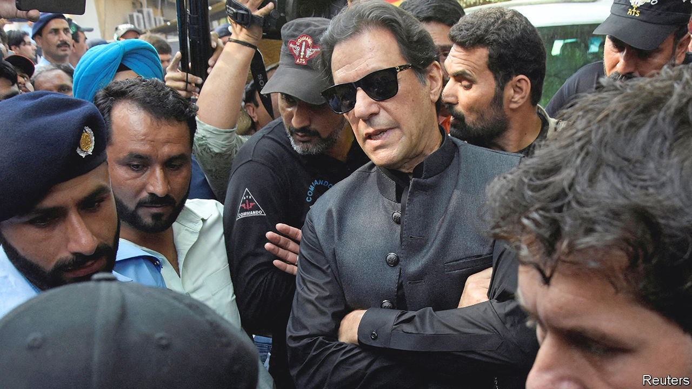

###### One-man party

# Imran Khan appears to be more popular than ever 

##### But he will struggle to force the early election he wants 

 

> Oct 20th 2022 

It’s always election season in Pakistan. The country has been holding by-elections every couple of months ever since 131 lawmakers from the Pakistan Tehreek-e-Insaf (PTI) party resigned en masse in April, when their leader, Imran Khan,  as prime minister in a vote of no confidence. Yet the latest round of polls on October 16th, with eight parliamentary seats up for grabs, was unlike any other: seven featured the same PTI candidate, Mr Khan himself, who painted it as a referendum on his popularity. He won six. 

Mr Khan has made his point. When he was forced out by a coalition of opposition parties with the blessing of the army, which runs things behind the scenes, it seemed as though Mr Khan’s political career was over. But instead of going quietly, he  and held rallies in which he alleged, without evidence, that America and the opposition had conspired to topple him because he refused to give in to their foreign-policy demands. His supporters find this a perfectly reasonable argument and turn out in huge numbers at his events. Mr Khan has spent the past several months demanding early elections (the next one is due by November 2023). He is now threatening to march with his supporters on Islamabad, the capital, to force the government into holding one.

That is a recipe for more political instability in an already crisis-ridden country. The big worry is that his threatened march will force a showdown on the streets of the capital. Still, it will not easily translate into getting him his election. It is the prerogative of the prime minister, Shehbaz Sharif, to dissolve the House. He is adamant that parliament will complete its term, hoping that this will allow his ruling Pakistan Democratic Movement alliance to stabilise the economy with the help of an IMF programme that Mr Khan sabotaged on his way out of office by announcing extravagant fuel subsidies. 

The task is daunting. Mr Sharif has just replaced his finance minister of barely five months in an attempt to tackle soaring inflation, which remains at more than 20% year on year. The cost of damage from  over the summer has been estimated at $32bn-40bn. The World Bank reckons that the poverty rate could rise by up to 4 percentage points—an additional 9m people—in the coming months. The government is seeking to reschedule $27bn in debt, much of it owed to China, which tends to dislike restructuring loans. The  has receded in the past few months, but it has not entirely disappeared. Meanwhile high global prices for natural gas threaten an energy shortage come the winter.

To soldier on amid those challenges and continuous meddling from Mr Khan, the government is pursuing a plethora of strategies. It has wielded the law against Mr Khan, forcing him to defend himself in various cases that have the potential to disqualify him from electoral politics. Another ace up Mr Sharif’s sleeve is the appointment of a new army chief in late November—a position of enormous power in a country where the armed forces make or break governments. Indeed, Mr Khan lost his job as prime minister in part because he fell out with the incumbent, General Qamar Javed Bajwa.

Secret recordings of conversations in the prime minister’s office, many from Mr Khan’s term, have surfaced online. The leaks appear to be aimed at discrediting Mr Khan and debunking his claim that there was an American-led conspiracy to topple him. The government has ordered an inquiry but is conspicuously unmoved by the breach, which also revealed conversations involving Mr Sharif. Mr Khan, for his part, claims that the government will release forged “dirty videos” to try to damage him. 

Mr Khan has vowed to give Mr Sharif only a few more days to call elections. The interior minister has warned that the government will “hang [Mr Khan] upside down if he takes his long march into Islamabad”. President Joe Biden recently said that Pakistan is “maybe one of the most dangerous nations in the world” as it has “nuclear weapons without any cohesion”. Pakistan’s warring politicians seem to be trying their best to prove him right.■

