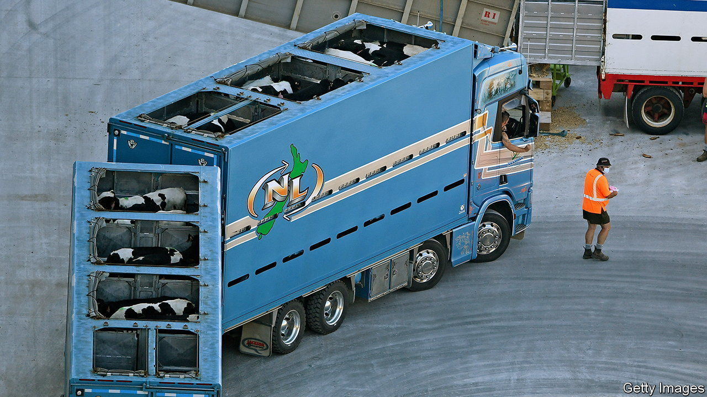

###### Getting real

# New Zealand is toughening up on China 

##### It stands up more to its biggest trading partner than it is given credit for 

 

> Oct 20th 2022 

TO HAVE ONE politician accused of spying for a foreign government may be regarded as misfortune. But to have two is certainly carelessness. In 2017 Yang Jian, a Chinese-born member of New Zealand’s National Party, was revealed to have worked for more than a decade in Chinese military-training centres. He admitted to teaching spies (though not to being one) yet remained in his Kiwi job until 2020, when he retired. Days later, a second Chinese-born mP, Raymond Huo of the Labour government, said he was leaving politics. He too was accused of having links to China’s Communist Party. New Zealand’s intelligence agencies had prodded both parties to remove the men.

Snooping is just one way that China attempts to influence New Zealand’s democracy. Donors  have given money to both its big parties. Chinese companies have hired outgoing Kiwi politicians. All this has earned New Zealand a reputation for being weak on China and security. A report published by Canadian intelligence in 2018 called it “the soft underbelly” of Five Eyes, an intelligence-sharing pact among those two countries and America, Australia and Britain. 

China accounts for about 30% of Kiwi exports, including lots of dairy and meat products. With just 5m people, New Zealand worries about being clobbered with trade bans like those inflicted on Australia. Unlike its bigger neighbour, which  to China’s measures, it does not have piles of iron ore to protect its economy against coercion, officials reason.

Yet the country has lately been toughening up to its biggest trading partner. In recent years, Jacinda Ardern’s Labour government has changed a slew of laws and policies, reflecting “a more clear-eyed view of the challenges that China presents”, as David Capie of Victoria University of Wellington puts it. That includes blocking Huawei, a Chinese telecoms giant, from involvement in New Zealand’s 5G network, and strengthening foreign-investment rules to include a “national-interest assessment” (meaning that deals can be knocked back if they are deemed a threat). Foreign political donations have been banned. The government plans further changes to the electoral act, to make the identities of more donors public. 

In its region, New Zealand has boosted its diplomatic engagement with Pacific island states, which . At home, it is trying to beef up its defences. Signals-intelligence capabilities have been roughly doubled, says Andrew Little, the minister responsible for its intelligence agencies. A defence review is under way in response to what planners now call “challenges of a scope and magnitude not previously seen in our neighbourhood”.

New Zealand used to be timid about overt criticism. But over the past couple of years it has joined in more than 20 international statements criticising China’s actions in Hong Kong, Xinjiang and elsewhere, points out Anne-Marie Brady, of the University of Canterbury, who researches Chinese interference. “The thinking has changed drastically within the government since 2018,” she says. In public, New Zealand still talks up its trading relationship with China. In private, it is encouraging exporters to diversify into other markets. The firmer line does not go down well with China. Its embassy in Wellington warns that “misguided accusations” could throw the relationship off course. 

China-watchers in New Zealand wonder whether this more assertive stance will last. An election is due next year. The National Party, if it won, might take a more timid line, emphasising business over security. John Key, a former National prime minister, says he does not see China “as the aggressor that everybody else sees” and warns against “inflammatory language”. The party would not hesitate to raise its concerns, claims its foreign-affairs spokesman, Gerry Brownlee (who was recently criticised for saying that China was “dealing with a terrorist problem” in Xinjiang). But “let’s not create an enemy where an enemy might not exist.”■

