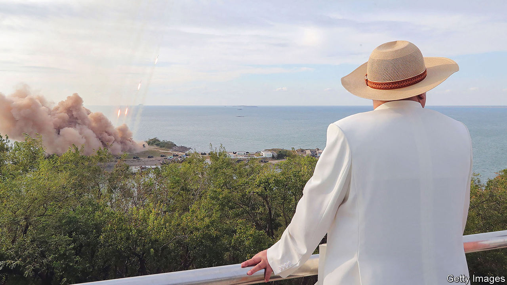
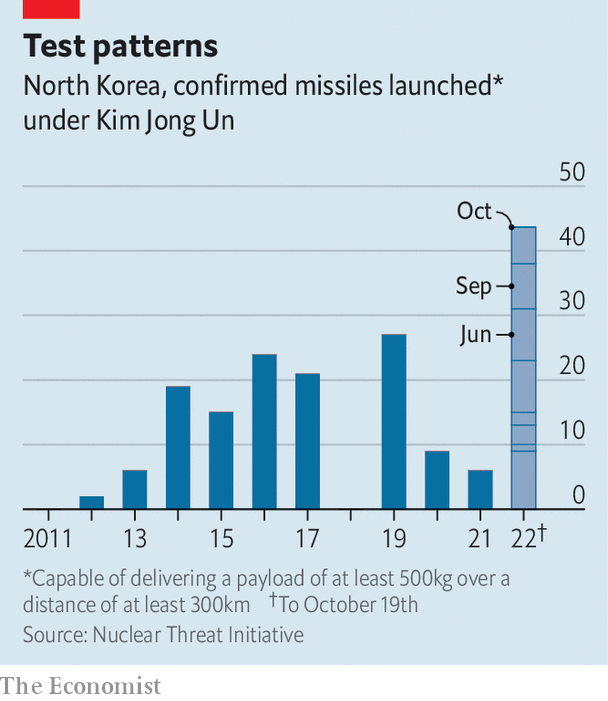

###### Tactical advantage

# North Korea is preparing for another nuclear test—or many 

##### Kim Jong Un is trying to diversify his array of threats 

 

> Oct 18th 2022 

NORTH KOREANS looking skyward on October 8th would have seen some 150 fighter jets thundering overhead, and perhaps for a moment feared the worst. But they are more likely to have shrugged it off as yet another demonstration of their country’s military prowess, returning to the more pressing matter of finding enough food to keep their families alive. 

Such is the frequency with which North Korea has held drills and tests this year (see chart) that shows of strength have become routine. It kicked off the year with an . These included both tests of “hypersonic” missiles designed to evade detection and its first intermediate-range ballistic missile (IRBM) and intercontinental ballistic missile (ICBM) tests since 2017. 

 


It has kept up the pace. In the past month North Korea has launched more than a dozen missiles. On September 25th it launched one from a platform submerged under a lake, later claiming that it is developing underwater launch silos. On October 4th it tested another iRBm, which flew over Japan and covered more than 4,500km, the farthest a North Korean missile has been known to go. And on October 18th it fired hundreds of shells off its coasts in a “grave warning” to the South. 

Earlier in the year generals were testing new technology. But the tests of the past month are different. They had some novel elements, but mostly they have involved weapons already known to work. This suggests North Korea is evaluating its combat-readiness, says Jenny Town of the Stimson Centre, a think-tank in Washington. 

The North says it is merely doing the same as South Korea and America, which held their  in five years over the summer. But a report on October 10th in , North Korea’s paper of record, offered a better explanation. Not only was Kim Jong Un, the dictator, present at the latest tests, giving them a higher profile than the earlier technical trials, but, it said, their purpose was to simulate the use in warlike scenarios of tactical nuclear weapons, referring to low-yield warheads meant for battlefield use rather than annihilating entire cities. 

South Korean spooks believe the North is preparing for a nuclear test—its seventh—which could come within the next few weeks, perhaps before America’s midterm elections on November 8th. South Korea’s deputy defence minister suggested that there might be multiple tests. After nuclear warheads and the ICBMs necessary to deliver them to the American mainland, tactical weapons represent the next stage in North Korea’s nuclear deterrent, which Mr Kim sees as his insurance policy against foreign interference. An arsenal of smaller weapons would help to counter the threat posed by South Korea’s armed forces.

That is a significant sharpening of what Mr Kim calls his “treasured sword” of nuclear weapons. By showing off a range of delivery methods, a variety of test sites and advances in smaller warheads, he is signalling that his nuclear programme is so diverse and well-developed that his enemies cannot be sure to eliminate it with pre-emptive action. Only one nuke would have to survive to give him the potential to cause unthinkable damage. Last month Mr Kim  that a nuclear strike could be triggered “automatically” under certain conditions, including his own assassination. Any move against him, in other words, would be disastrous for everyone. 

America and South Korea’s response has been to stress their “ironclad” alliance and threaten annihilation if the North tries any funny business. On October 5th America briefly deployed an aircraft-carrier to the waters east of the peninsula. South Korea test-fired missiles of its own, scrambled jets and fired artillery in like-for-like drills. Both countries imposed new unilateral sanctions on North Korean individuals and organisations accused of aiding North Korean weapons development. 

Accompanying the displays of economic, rhetorical and literal firepower was the standard offer of talks. This month America restated its willingness to sit down “without preconditions” and expressed a desire to “transition from an era of provocation to an era of pragmatic engagement”.

Yet sticking to a playbook that has failed for decades is a questionable strategy. The defence capabilities of America and South Korea are robust enough to repel an attack, says Jo Bee-yun of the Korea Institute for Defence Analyses, a think-tank in Seoul. But it is not clear that the allies are credibly communicating that “nuclear coercion or nuclear blackmail will not succeed”. They must adapt to the new threat posed by tactical nuclear weapons, she adds.

Yoon Suk-yeol, South Korea’s president, has also stuck to his old line, arguing that North Korea has “nothing to gain from nuclear weapons”. Yet it is clear that Mr Kim does not see things that way. Nuclear weapons bolster his security, give him more leverage and help him build up the stock of chips he could bargain away for concessions. If talks were indeed to happen, the later the better for Mr Kim, so he can continue to work on his weapons. 

Moreover, America’s offer of unconditional talks comes with one big condition: that the eventual aim of negotiations is denuclearisation. Mr Kim has been very clear that the country’s nuclear status is “irreversible”, even going so far as to codify this long-standing policy in law in September. As long as America insists that he gives up his nukes, he has no interest in talking about anything. 

North Korean weapons tests are “especially concerning because we don’t have a plan for how to de-escalate”, says Ms Town. The longer America and South Korea content themselves with ineffective bluster, the stronger North Korea gets. That will only make Mr Kim more confident that he can resist more pressure—and heighten the risk of miscalculation. ■

