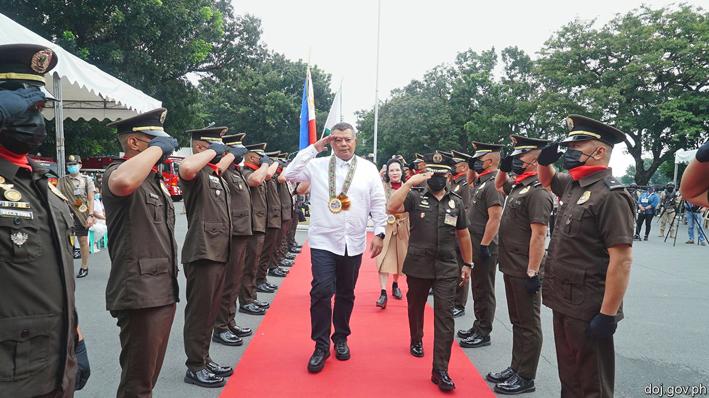

###### Recusal of service

# The Philippine justice minister’s son is ensnared in a drug bust 

##### The minister has promised to be impartial but refused to resign 

 

> Oct 20th 2022 

THE PHILIPPINE Drug Enforcement Agency is usually quick to crow about its more notable drug busts. But it was struck dumb when its agents arrested Juanito Remulla on October 11th and seized 894 grams, or $22,000-worth, of extra-strong cannabis that they suspect him of importing. That is because the most notable aspect of the bust was that the 38-year-old suspect is the eldest son of Jesus Crispin “Boying” Remulla, the justice minister (pictured), who is ultimately responsible for prosecuting such crimes.

When the agency did eventually announce the arrest on October 13th, the minister promised to let justice take its course, issuing a handwritten statement acknowledging that his duty would override his paternal instincts. Yet by staying in post, he failed to quash any lingering doubt about his impartiality. Ferdinand “Bongbong” Marcos, the president, endorsed his decision to stay on. That may turn out to be a miscalculation. 

For Mr Remulla senior, the problem is that only his son’s eventual conviction on all charges would convince sceptics that prosecutors had not granted him favourable treatment. Yet that would entail a grim fate: punishments for drug offences in the Philippines are harsh, even when the drug in question is cannabis, which is much less harmful than the country’s most popular narcotic, methamphetamine, locally known as . Mr Remulla junior faces life imprisonment if found guilty.

The case has broader implications too. Rodrigo Duterte, Mr Marcos’s predecessor as president, oversaw a bloody campaign to wipe out the  trade, which resulted in the extrajudicial killing of more than 6,250 suspects during his six years in office, according to the official count. The Philippine government, under both Mr Duterte and Mr Marcos, has  by the International Criminal Court to investigate the opening stages of the country’s war on drugs. The government argues that its own legal system in general, and the justice ministry in particular, can be trusted to prosecute impartially and punish any wrongdoing. Letting the younger Mr Remulla off lightly would weaken that argument. The president and his justice minister are inclined to protect Mr Duterte because his daughter, Sara Duterte, is  and deputy.

The affair also reflects badly on Mr Marcos, who is trying to rehabilitate the reputation of his family, which was ruined by the violence and corruption of the regime presided over by his dictator father, also called Ferdinand Marcos, until a popular uprising drove him into exile in 1986. The trial of Mr Remulla junior may well have implications for the reputations of all three political families. ■

