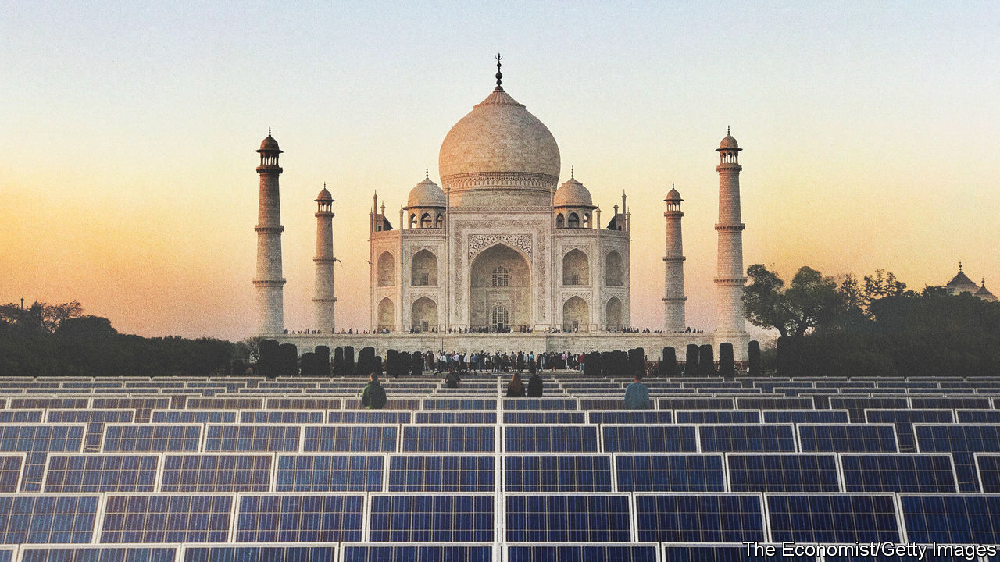
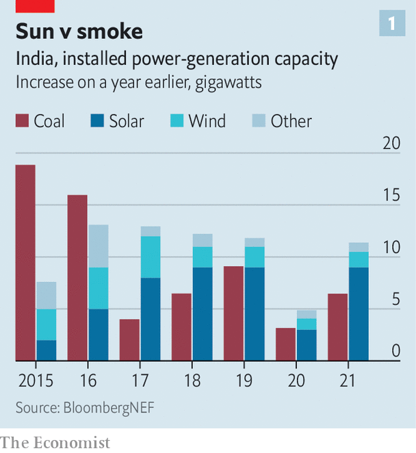
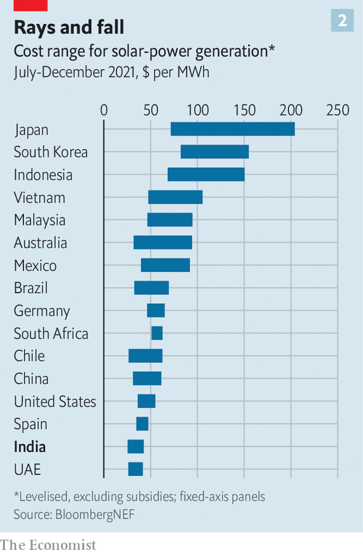
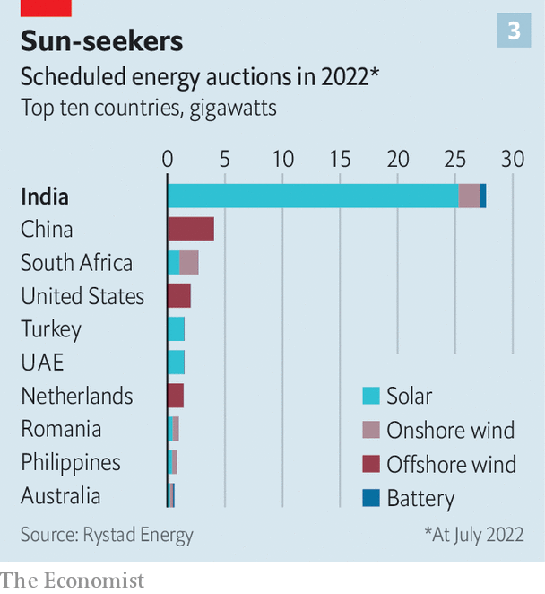
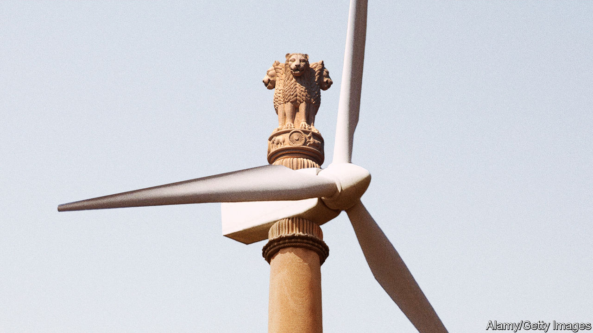

###### Skunk no more

# Will India become a green superpower? 

##### One of the world’s most polluting countries is investing heavily in clean tech 

 

> Oct 20th 2022 

It gets almost three-quarters of its electricity from coal, and has 39 new coal-fired power plants under construction. It digs up and burns more of the stuff than any other country except China. And it is coal’s loudest advocate internationally: at last year’s climate conference in Glasgow, it was the skunk at the garden party, blocking efforts to phase out the fuel most responsible for global warming.

This soot-smeared intransigence, however, distracts from a dramatic countervailing trend. While his underlings defended coal, Narendra Modi, India’s prime minister, made a series of pledges in Glasgow that, if kept, will make his country a green-energy powerhouse. The most eye-catching was the promise that India would achieve “net-zero” emissions of greenhouse gases (ghgs) by 2070—meaning that any emissions that had not been eliminated by then would be offset in some way.

Mr Modi underpinned that goal with two exacting targets for 2030: to slash emissions by a billion tonnes from their current trajectory and, to that end, to increase non-fossil power generation (which includes nuclear and hydro as well as wind and solar) more than three-fold, from roughly 150gw to 500GW.

India is the world’s third-largest emitter of ghgs. If it were to meet Mr Modi’s targets, it would not just revolutionise its own energy mix, but also provide a big boost to global efforts to curb global warming. What is more, Mr Modi has declared it a “national mission” to develop “green hydrogen”, a clean fuel made using renewables which could help decarbonise industries that remain stubborn polluters the world over. But just how plausible are these ambitions?

India’s entire generation capacity, both clean and dirty, is currently only 400GW. So Mr Modi wants to build a whole second grid’s-worth of green power in just eight years. To reach that goal, India will need to invest some $500bn in clean energy and improvements to the grid, according to an estimate by Bloomberg New Energy Finance (bnef), a research firm. 

Such a feat would not be unprecedented. China went from 44GW of solar capacity to 300GW in six years, and from 50GW of wind to 330GW in 11 years. But it was helped both by a huge manufacturing base in renewables and by an economy that excels at steering capital to favoured industries. Those are advantages that India lacks.

 


Renewable power is growing very fast in India. Solar generation capacity has increased 50-fold since 2012, to nearly 50GW at the end of last year. In the first half of 2022 another 7.4GW of solar was added. Indeed, when it comes to building new generating capacity, renewables have already supplanted coal. The capacity of new solar, wind and hydro plants constructed last year was nearly double that of new coal-fired plants (see chart 1). 

Even so, investment in renewables is not proceeding fast enough to meet Mr Modi’s targets. The 11GW of renewable capacity added in 2021 is far less than the annual increment required. Nonetheless, there are good reasons to take India’s new green revolution seriously.

For one thing, reducing emissions is not India’s only motive for overhauling its energy system. Mr Modi also wants both to spur manufacturing and to trim the bill for imported fuel. “How long will we be dependent on others in the field of energy?” he asked during his address on Independence Day in mid-August. India spent more than 4% of gdp on imports of fossil fuels last year, a particularly vexing sum for a country with a persistent current-account deficit.

Greening India’s energy supply would also help reduce air pollution, a deadly scourge for many of its inhabitants. The World Health Organisation reckons that in 93% of the country, the level of air pollution is well above its guidelines. A study published in 2019 by the, a British medical journal, found that more than 1m Indians die each year as a result of the foul air. The choking smog that blankets much of north India especially at this time of year is a perennial political liability for the government.

 


Best of all, a big shift to renewables could help cut the cost of power generation. India’s sunny climate and low labour costs make it one of the cheapest places in the world to produce solar power. In fact, an analysis by the International Energy Agency (IEA), a watchdog-cum-think-tank for energy-consuming countries, concluded that, after stripping out the effects of government subsidies, only the United Arab Emirates could rival it (see chart 2). That means that solar plants are a cheaper option for new electricity generation in India than coal- or gas-fired power stations. Power from windmills in India, although not the cheapest in the world, is also less expensive than that generated by burning fossil fuels.

What is more, India’s government is coming up with all manner of inventive policies to incentivise investment in clean energy. One of the big obstacles to any overhaul of the power industry is the sorry state of the electricity-distribution companies (DISCOMS). Many of these state-controlled entities are all but bankrupt, with collective debts of perhaps $73bn. They do not look like the safest of counterparties for investors seeking to sell clean energy. So Mr Modi’s government has introduced a mechanism that in effect makes India’s federal government the financial backstop for new long-term contracts to provide renewable energy to the grid. It is also allowing solar and wind generators to bypass DISCOMS completely to sell power directly to manufacturers of green hydrogen.

To overcome India’s ever-present problems of red tape and NIMBYism, officials are setting up clean-energy parks with connections to the grid and speedy processing of the necessary permits. The government also uses reverse auctions to maximise investments in renewables at the lowest possible cost: developers state the minimum price they would be prepared to accept for the power they generate, with the lowest bids winning. It has conducted similar auctions for “round-the-clock” green power, meaning renewables coupled with some form of energy storage, to get around the intermittency of wind and sunshine.

 


These policies are working. Investors including Adani Group, one of India’s biggest conglomerates, are rushing to a renewables park in Kutch, a sun-drenched and windswept region of the state of Gujarat, for instance. With a planned output of 30GW, it will be the world’s biggest combined wind and solar farm.

By the same token, India is likely to receive offers to build generation capacity in excess of 25gw at its solar auctions this year. That is over ten times more than any other country (see chart 3). In August it held one of the world’s biggest auctions for grid-scale battery storage. 

Industrious industrialists

Indeed, one of the strongest indications that India’s green ambitions are more than hot air is the enthusiasm of investors. Mukesh Ambani, the boss of Reliance Industries, another sprawling conglomerate, gushed in his latest message to shareholders, “We will have the world’s most affordable green energy within this decade, and these solutions will then be exported to other countries.” 

Mundra, a busy port in Kutch developed by Adani Group, encapsulates the shifting priorities of India’s industrialists. It is one of the world’s busiest coal-handling ports, serving two huge coal-fired power plants nearby. But it is also home to a new solar-panel factory, a pilot plant building 160-meter-tall onshore wind turbines (among the world’s largest) and new buildings where equipment to produce hydrogen will be made.

“We welcome you to a future powered by the SOLAR REVOLUTION” bellows a billboard. Adani is “indigenising the entire supply chain” for clean energy, explains Arun Kumar Sharma, a senior manager. 

Gautam Adani, the group’s founder and chairman (whose personal fortune of well over $100bn makes him one of the world’s richest people), claims his companies will spend $70bn on greenery in India by 2030. With nearly 5GW of solar generation capacity as of mid-2021, Adani Green Energy, one of the group’s divisions, is already on par with Italy’s Enel Green as the world’s leading developer of solar energy. 

Not to be outdone, Mr Ambani plans to spend $80bn on clean energy in India. Reliance, like Adani Group, has made a mint from fossil fuels. But now it is developing a clean-energy cluster in Jamnagar, another port in Gujarat, which also houses the firm’s massive petrochemicals complex. Mr Ambani plans to build 20GW of solar generation capacity by 2025, all of it to be consumed by his group for captive needs. “Once proven at scale,” he says, “we are prepared to double the investment.” Morgan Stanley, an investment bank, describes Mr Ambani’s strategy as “full spectrum”, stretching from the manufacture of solar panels and batteries to the development of devices to make and use green hydrogen.

It is not just India’s behemoths that are embracing Mr Modi’s green vision; smaller companies are investing heavily, too. A firm called Greenko, for instance, is building the world’s biggest network of grid-scale energy storage using a technology called pumped hydro. It will use power from solar panels or windmills to pump water into elevated holding tanks. The water can then be released to turn turbines and generate power whenever electricity is needed. Mahesh Kolli, Greenko’s president, says it will spend $5bn by 2025 to construct 50GW of storage capacity.

ArcelorMittal Nippon Steel, an Indian joint-venture between steel giants from Europe and Japan, has just signed a $600m deal for Greenko to provide round-the-clock clean power to one of its mills. It chose this option not simply because the power will be green, but because it was cheaper than building a coal-fired plant. 

In the longer run Mr Kolli sees his technology as the solution to the intermittency of power generated by windmills and solar panels. He wants to build a nationwide, grid-connected “energy-storage cloud”, akin to Amazon’s data cloud. When the wind drops or the weather clouds over in Gujarat, say, the firm’s pumped-hydro plants in Andhra Pradesh, to the south, could supply a compensating amount of clean power via the national grid to aluminium smelters in Odisha, to the east, run by Hindalco Industries, a big new customer. Unlike America, which has only limited connections between regional grids, India has a much better-integrated national grid, which makes such an idea feasible. The iea projects that it will have more pumped-hydro than any other country by 2026.

India is beginning to develop domestic supply-chains for clean energy. For example, Pune, a city in the state of Maharashtra which is already home to a cluster of car-part manufacturers, is becoming a clean-energy hub as well. Siddharth Mayur, a local and founder of H2E Power and homiHydrogen, has developed batteries for electric motor-scooters and auto-rickshaws that can be quickly swapped for fully charged ones when they run down. He is now making stacks, a component of fuel cells (which can be used to generate electricity from hydrogen), and is helping to foster local production of other parts. “By next year, 98% will be made within 60km of where we are sitting in Pune,” he says. 

Ravi Pandit, chairman of KPIT, an Indian software firm that counts big foreign carmakers as customers, thinks the inexpensive software and engineering talent that fuelled India’s success in information technology a few decades ago will help in green energy today. Thanks in part to the widespread desire not to concentrate too much manufacturing in China, he points out, foreign capital and technology is pouring in.

The focus of a lot of the investment is green hydrogen, which, it is hoped, will allow big industries such as steelmaking and fertilisers to decarbonise. India produces almost none of it at the moment, although it does consume some 7m tonnes a year of ordinary hydrogen, made using fossil fuels. Investors think it will be a good place to make the green sort, since the process requires a lot of clean power, which India’s solar industry can provide cheaply. India also produces very little natural gas, so there are few lobbyists campaigning against the development of a rival industry. The government has promised to provide incentives to green-hydrogen firms in a detailed policy to be unveiled soon.

With help from Stiesdal, a European clean-technology firm, Reliance is building a large factory in Jamnagar to manufacture electrolysers. These devices, powered by clean electricity from Reliance’s planned solar farms, will then be used to manufacture green hydrogen. Mr Ambani asserts that these investments will make India the first country to produce green hydrogen for $1 a kilogram, within a decade. (The current cost is more than $4/kg.) He dismisses doubters, pointing to his recent success in delivering data to mobile telephones at the world’s lowest cost.

Indian Oil, a state-owned energy giant that is the country’s largest consumer of dirty hydrogen, announced in August that it, too, was entering the green hydrogen business. It plans to invest $25bn in that and other clean technologies by 2046, as part of an effort to reach net-zero emissions by that year. “We will make India a green hydrogen hub,” says S.M. Vaidya, the firm’s chairman. 

Foreign investors are also enthusiastic. John Cockerill, a Belgian technology firm, has established a joint-venture with Greenko to produce 2gw-worth of electrolysers a year. Ohmium, a buzzy American startup making electrolysers, has built its only factory in India. It hopes to reach an annual output of 2gw by the end of this year. It recently dispatched to America the first Indian-made electrolysers ever to be exported, and expects to begin sending consignments to Spain soon as well.

 


Goldman Sachs, an American investment bank, has a stake in ReNew Power, a renewables firm which is working with Indian Oil on its green hydrogen plans. TotalEnergies, a giant French oil firm, has bought a quarter of a division of Adani Group that is developing green hydrogen. 

India’s green-hydrogen firms are even venturing abroad. Acme Cleantech Solutions, a solar-generation pioneer, has pivoted to making clean fuels. Together with Scatec, a Norwegian clean-energy firm, it is investing over $6bn to produce green ammonia (a derivative of green hydrogen) in Oman. The project is the first of its kind to be certified as carbon neutral. It also won commercial validation when Yara, a Norwegian fertiliser giant, agreed in July to negotiate a long-term contract to buy its green ammonia.

Rystad forecasts that India will be making more than 8GW of electrolysers a year by 2025 (roughly half the planned output of Europe, the world leader). Sanford C. Bernstein, an investment bank, reckons the hydrogen market in India could be worth $15bn to $20bn a year by 2030. Although it is not quite as bullish as Mr Ambani, Bernstein reckons “under $2/kg seems achievable towards the end of the decade”. 

Much could still go wrong. For a start, India’s tycoons may not keep all their grand promises to lavish billions on the new green revolution. CreditSights, a research firm, has raised concerns about Adani Group’s high levels of debt. Especially with global interest rates rising, Indian conglomerates may struggle to finance vast investments in clean energy.

Even if the billionaires spend as lavishly as they have promised to, the lion’s share of the $500bn needed to meet Mr Modi’s targets will probably come from abroad. But foreign investors do not see India as risk-free. The rupee has depreciated steadily over the years, reducing outsiders’ returns. Mr Modi’s tendency to stoke sectarian tensions creates political risks. And foreign investors, too, may feel the pinch as interests rates rise and the world economy slows.

Yet India’s economy is growing faster than China’s. Demand for electricity is increasing fast enough that the country will need to build as much generating capacity by 2040 as the European Union currently possesses, whether green or not. The $30bn or so that BNEF thinks India will need to invest in renewables each year to meet Mr Modi’s target, although a daunting sum by local standards, is only a tenth of the money put into wind and solar globally last year. 

It is early days for India’s second green revolution, but the first shots have already been fired. Mr Pandit observes that the West had a hundred-year head start in the conventional automotive industry. It has been a long, hard slog for Indian firms to catch up and compete. In many areas of clean technology, by contrast, India suffers no comparable disadvantage. As a result, he predicts, it will excel: “India will do for hydrogen what China did for batteries.” ■


