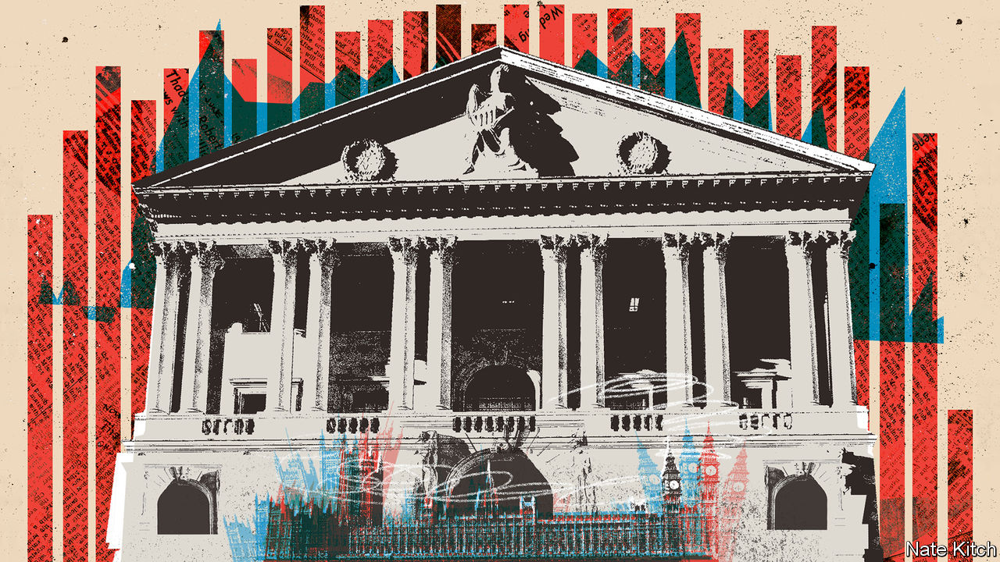
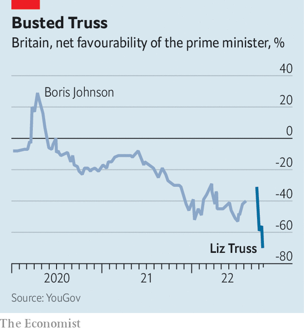

###### Revenge of the institutions

# A brush with the bond markets reorders British politics 

##### Liz Truss plainly no longer runs the country. So who does? 

 

> Oct 20th 2022 


It was only Liz Truss’s third session of prime minister’s questions, and already she was battling to survive. “I’m a fighter and not a quitter,” she cried. Her colleagues were quiet. An opposition mp gently suggested she was facing “mental anguish and despair”. She screwed up her face.

Like a magnet pulled over a box of pins, a brush with the bond markets is reordering British politics. Ms Truss’s ill-starred dash for growth has given way to a singular task of restoring Britain’s fiscal credibility. Institutions that she had ignored or railed against, notably the Treasury, the Bank of England and the Office for Budget Responsibility (OBR), are newly powerful—as are old ideas like sound money. The effects will outlive Ms Truss’s spell at the top of government, which will surely be short. 

 


As went to press, her administration was disintegrating. On October 19th , the home secretary, quit; a Commons vote on fracking turned into a circus. Ms Truss’s net approval rating of minus 70 is the lowest that YouGov has recorded for a major party leader since the pollster was founded in 2000 (see chart). Polls taken in the week since October 13th gave the Labour Party leads of 21 to 36 points. 

Ms Truss’s project of borrowing for growth-boosting tax cuts, which has long circulated on the Tory right, has not survived first contact with lenders to Britain. A mini-budget on September 23rd triggered a sharp sell-off in government debt. That in turn sparked a fire-sale by pension funds, which forced the Bank of England to buy gilts to protect financial stability. 

Ms Truss surrendered on October 14th, the day on which Andrew Bailey, the bank’s governor, insisted its intervention would end. She fired Kwasi Kwarteng, her chancellor, and installed Jeremy Hunt, who promptly cancelled some £30bn ($34bn) of tax cuts in a six-minute tv address. By October 19th, the yield on 30-year government bonds was down to 4%, from a peak of 5% on September 27th before the central bank intervened. Daily movements in gilt yields, for a time measured in fractions of a percentage point, had settled down to being counted in hundredths of them. “The teacher is back in the room, and he’s got the cane back from the children,” remarks a former cabinet minister.

Now the Tories must ditch not just Trussonomics, but also the conviction that their electoral coalition will not accept more austerity.  that were previously beyond reach have been put on the table. Only one scenario is off-limits: the one in which the obr, the government’s fiscal watchdog, declares that Mr Hunt’s medium-term plans fail to meet the rule of seeing the ratio of debt to GDP fall over the medium term. The reactions of focus groups have been subordinated to those of bond markets. 

The gilt sell-off had been fuelled by attacks on the Treasury, the OBR and the central bank by Ms Truss, who spent her campaign to run the Tory party railing against “abacus economics”. The new dash for market credibility has led to the reinforcement of all three institutions. 

“The Treasury has not so much reasserted itself, as been sucked in to fill the void,” says Philip Hammond, a former Conservative chancellor. Mr Kwarteng’s first act in office was to fire Sir Tom Scholar, the Treasury’s top civil servant. But he has been replaced not by a swashbuckling outsider, but by James Bowler, whose career has been spent preparing budgets and running public-spending policy and who, says one colleague, is “steeped in Treasury institutional wisdom”. “The abacus strikes back,” is the verdict of another policymaker. The Treasury has taken control of a vast energy-subsidy scheme from the business department, and is preparing to gut it. 

Mr Hunt admits that Mr Kwarteng’s refusal to commission forecasts from the obr increased the markets’ alarm. The OBR has been powerful since its founding in 2010 but has never been so prominent. Its verdict on the medium-term fiscal plan that Mr Hunt is due to unveil on October 31st looms over the government like a Roman emperor’s thumb. This is uncomfortable terrain for a technocratic and apolitical body, says Ben Clift of the University of Warwick, but one that will buttress it. “I don’t think anyone will push them around any time soon.”

The prime minister had the Bank of England in her sights, too, proposing in the leadership campaign to alter its mandate. Mr Kwarteng declined to show it his draft budget, which threw monetary and fiscal policy into conflict: he just opened the taps and declared it Andrew Bailey’s job to deal with the resulting rise in inflation. 

The stand-off between the bank, the government and the pension funds resembled that between three gunmen in “The Good, the Bad and the Ugly”, says Sir Charles Bean, a former deputy governor of the bank. The bank stood firm. Mr Bailey’s pledge that its intervention would end on time forced pension funds to hurry their deleveraging and pushed Ms Truss to ditch her budget. “The bank has played a blinder: it has called the government’s hand and they’ve been forced by concerns about the market into making the early announcements,” says Sir Charles. Mr Bailey speaks of a “meeting of minds” with Mr Hunt, who in turn insists on the bank’s independence.

The Conservatives are in turmoil. Fiscal disciplinarians feel they have triumphed in a decades-long internal battle against the libertarian right. “For a generation, nobody’s going to try that again,” declared Matt Hancock, a former health secretary. Brexit sovereigntists have lost their footing, too: after a six-year project to enhance Britain’s autonomy, the country is at the mercy of outsiders. Within the Labour Party, Rachel Reeves, the shadow chancellor who has preached fiscal discipline, looks strengthened against the left.

A world in which the limits of the acceptable fiscal deficit are clearly defined by the market will force rival parties to be more candid in their choices on the levels of public spending and the taxation required to fund them, argues Lord Hammond. If Labour wants better public services, and the Tories lower taxes, they will need to confront the trade-offs. When Ms Truss leaves office, she will take with her the idea that politicians can promise the earth and let borrowing take the strain. ■

