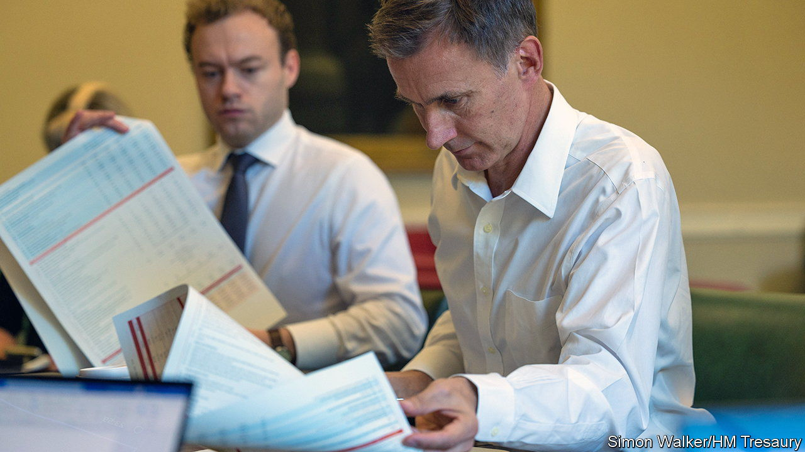
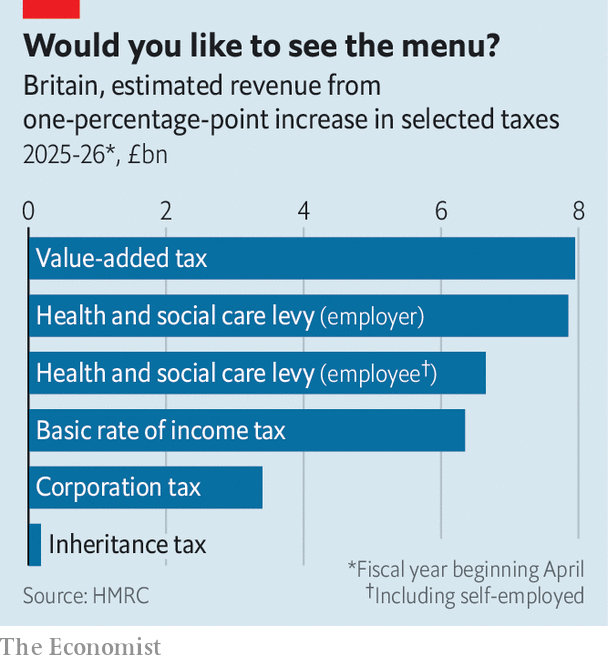

###### Fiscal policy

# As Britain’s government looks to save money, almost nothing is protected 

##### There are no easy options 

 

> Oct 20th 2022 


Not too long ago Liz Truss dismissed the Treasury’s obsession with the balance of taxes and spending as “abacus economics”. The government she leads is now eager to demonstrate its counting skills. On October 7th the Office for Budget Responsibility (OBR), a fiscal watchdog, reportedly told the government that it would need to cut annual borrowing by around £70bn ($78.5bn; 2% of GDP) by the 2027-28 fiscal year or fall foul of its own fiscal rule. As Jeremy Hunt, the new chancellor, works on a plan to be unveiled on October 31st, he has said “nothing is off the table”. But what should be on it? 

Start with the easy stuff. Mr Hunt has already cancelled a swathe of tax cuts attempted by his predecessor, Kwasi Kwarteng. Corporation tax for the most profitable companies will rise to 25% after all; the basic rate of income tax will stay at 20%; and a duty-free shopping scheme will be axed. That adds up to around £30bn of revenue in 2026-27. By pre-announcing those measures, as well as a reduced subsidy for household energy bills starting from next April, Mr Hunt will have tugged down interest rates. The obr estimates that spending is reduced by around £7bn when gilt yields and short-term interest rates fall by half a percentage point. 

That still leaves a hole large enough to make even the most eager number-cruncher squirm, of a little over £30bn. Because the government is trying to rectify a credibility problem, it will struggle to perform the old trick of promising vague cuts to public services in future. Specific targets might include the aid budget, which if kept at 0.5% of GDP rather than the planned level of 0.7% would save around £6bn. Cutting investment spending by 0.5% of GDP could save another £14bn, according to the Institute for Fiscal Studies, a think-tank, though that would make a mockery of the government’s claim to be pro-growth.

Mr Hunt is eyeing up day-to-day spending by government departments, as each 3% cut in non-investment spending outside health and defence would save around £7bn. But after a decade of squeezes and pandemic-related backlogs there is little fat to trim. Nick Davies of the Institute for Government, a think-tank, notes that even based on current plans, most departments had little hope of returning to pre-pandemic performance levels by 2024-25. If the government wants more efficient public services, careful planning rather than quick grabs for cash will be required. 

 


The welfare bill also looks vulnerable. Linking rises in working-age benefits to earnings rather than prices for the next two years would save £13bn, and doing the same to the state pension would save around £6bn, though getting either through Parliament would be tricky. Real-terms cuts to benefits would be regressive and cause great hardship, though Mr Hunt has refused to rule them out. Ditching the “triple-lock”, a formula which would uprate the state pension in line with inflation, is a sensible longer-term goal, but is better done gradually than abruptly in the middle of a cost-of-living crunch. On October 19th Ms Truss promised to protect it. 

Raising taxes is Mr Hunt’s final option. Inequality-busting measures like increasing inheritance tax by ten percentage points and ditching non-domiciled status, which allows foreign citizens to pay lower taxes, would bring in £2bn and £3bn respectively. Going ahead with the health and social care levy, a payroll tax of 1.25% paid by employers and employees, would raise over £14bn (see chart). But it would be better to raise income tax, which is more progressive and applies to a broader range of income. Raising the basic and additional rates of income tax by two percentage points each would raise more than £16bn. One percentage point on value-added tax, a sales tax, would raise some £8bn, but at the risk of exacerbating short-term inflation.

Mr Hunt could attempt more radical tax grabs. He could look into reducing the interest rate the Bank of England pays on bank reserves, in effect a tax on the banking sector. He could merge the income tax and national-insurance systems to expand the scope of the latter, or even fix Britain’s absurd system of property taxation, which is based on home values last assessed in 1991, and apply a land-value tax. But doing any of those well would take more time than Mr Hunt has to spend. ■

