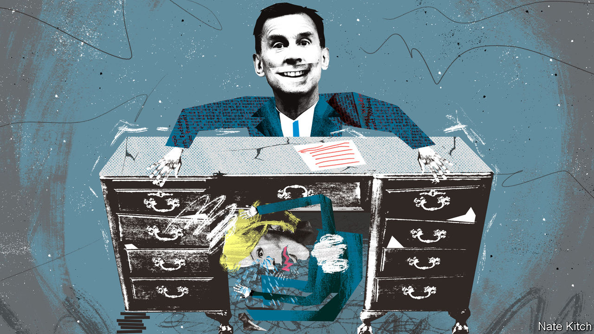

###### Bagehot

# How Jeremy Hunt became the most powerful person in Britain 

##### The new chancellor of the exchequer promises orthodoxy and competence 

 

> Oct 18th 2022 


The most powerful person in Britain entered the House of Commons on October 17th to a chorus of respectful grunts. Addressing mps—as well as a wider audience of investors who buy gilts and sterling—he began soberly: “We are a country that funds our promises and pays our debts.” , the new chancellor, delivered the message like a doctor with a grim diagnosis. Next to him sat , the actual prime minister. She stared into the middle-distance while Mr Hunt set about running the country. 

Mr Hunt is chancellor in name but prime minister in practice. In his first week he has undone about £30bn ($34bn, or over 1% of gdp) of  and reforms that Ms Truss was elected by Tory party members to carry out; her measures had sparked  and a plunge in the polls. By the end of his first month in the job Mr Hunt will reveal tax rises and spending cuts worth tens of billions more. Britain has long had a constitutional monarch, a ceremonial figurehead who is ultimately powerless, says one wag. Now it has a constitutional prime minister.

Becoming Britain’s de facto leader caps a meandering career for Mr Hunt. At its start he was most famous for an unfortunate slip of the tongue by a broadcaster saying his surname. Six years as health secretary, the hardest job in a Conservative government, proved he had competence and political nous. A year as foreign secretary, the easiest job in any government, turned him into the closest thing the party has to a statesman. When Kwasi Kwarteng was defenestrated as chancellor on October 14th, Mr Hunt was one of only a few obvious successors. 

Mr Hunt’s task is clear, if difficult. After the blunders of Mr Kwarteng and Ms Truss, Britain now pays a “moron risk premium” on its debt, in the words of Dario Perkins, a strategist at TS Lombard. Mr Hunt’s job is to remove it, and perhaps win a technocrat discount. Colleagues argue he is qualified. For starters, he is not a moron; he is intelligent and, best of all, reassuringly dull. One former cabinet colleague compared him to a “more ambitious Philip Hammond”, a dour but dependable former chancellor. Is that praise? “When gilt yields are above the Greeks’, it’s praise.”

Mr Kwarteng picked fights with Britain’s technocratic institutions; Mr Hunt has built his career on working with them. Health secretaries enjoy only indirect control over the country’s health-care systems. NHS England, which was run for most of Mr Hunt’s tenure by Sir Simon Stevens, is in effect the country’s biggest quango. Ministers may set the strategic direction, but are in theory removed from day-to-day policy. Sir Simon, a very capable and very political official, took charge. Mr Hunt, for the most part, let him, focusing instead on a few topics, such as patient safety and junior doctors’ pay and conditions. The arrangement worked well.

A similar approach is under way now that Mr Hunt has moved into 11 Downing Street. Mr Kwarteng promised to smash the Treasury orthodoxy of sound money and balanced books; Mr Hunt will reinforce it. Mr Kwarteng tried to ignore the Office for Budget Responsibility, which comes up with economic forecasts; Mr Hunt will treat its word as gospel. Mr Kwarteng tried to bully the Bank of England; Mr Hunt will work in concert with Threadneedle Street. Brexit was supposed to turn Britain into an economic laboratory. Under Mr Hunt, there will be no experiments. 

Fights will take place elsewhere in government. Most politicians are inveterate people-pleasers. As foreign secretary Boris Johnson proved averse to displeasing anyone, offering kind words to people who required diplomatic bollockings. Mr Hunt is happy to deliver hard truths, whether lecturing eastern European allies about media freedom or scrapping with doctors and nurses, an always powerful lobby. Raising taxes or slashing spending will be deeply unpopular, but Mr Hunt will not mind.

In the patronising vernacular of Westminster, Mr Hunt is a “grown up”. He was not always. Mr Hunt had a reputation as an oddball when he became culture secretary in 2010. At one point he had to deny hiding behind a tree to avoid journalists who had spotted him attending a party with James Murdoch, a media executive and son of Rupert. He is prone to occasionally wild statements. As foreign secretary Mr Hunt performed a volte face on the eu, going from campaigning to stay in the club to comparing it to the Soviet Union in a little over two years.

Mr Hunt may today be a picture of fiscal piety. But when he campaigned for the Conservative leadership in 2019, he suggested slashing Britain’s corporation tax rate to 12.5%. Although painted as a moderate centrist—to use the jargon, a “wet” Tory—Mr Hunt’s political sympathies are for the red-blooded Thatcherism that Ms Truss would applaud. But he is clever enough to know when such schemes are feasible. It is not that Mr Hunt became normal; the Conservative Party became weird.

A punt on Hunt 

Ultimately, Mr Hunt represents a return to the era of David Cameron and George Osborne, who ran the country from 2010 to 2016, when he started his own ministerial career. Among Mr Hunt’s first acts as chancellor was to place Rupert Harrison, an influential former aide to Mr Osborne, on an advisory economic council. Brutal spending cuts are again coming to departments that were already hacked to bits during those years of austerity. 

Few voters will welcome that. But what people may appreciate is the new chancellor’s manner. British politics has suddenly woken up to the virtues of dullness, personified by the return of Mr Hunt. In 2015 a revolutionary fervour enveloped British politics, with all sides of politics competing to offer radical solutions. Leaders from across the spectrum promised disruption, whether in the form of Jeremy Corbyn’s socialism, Mr Johnson’s Brexit or Ms Truss’s ill-fated free-market experiment. None of them worked well. Mr Hunt offers nothing but technocracy, orthodoxy and competence. That will do for now. ■


