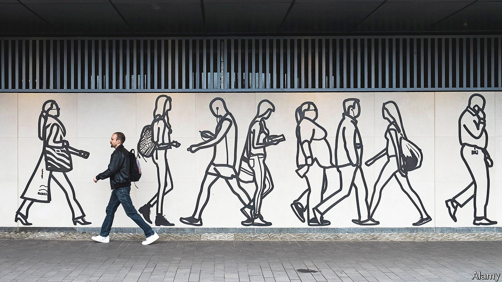
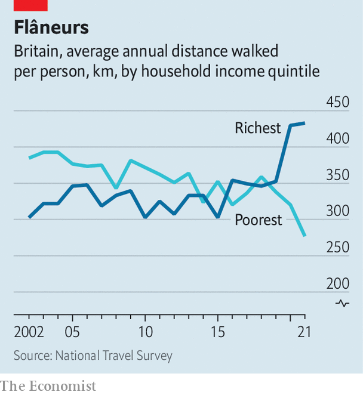

###### Walking in cities

# In Britain, the least sexy form of travel is getting some attention 

##### Pedestrians are posher, which helps 

 

> Oct 20th 2022 

“You can taste the pollution here,” says Lisa Trickett, a councillor representing King’s Heath in Birmingham. The main street that runs through the trendy suburb is a less-than-ideal environment for walking. Cars and lorries trundle up the road, emitting fumes and noise; the pavement is obstructed by bus shelters and monolithic digital advertising boards. But power in King’s Heath, and across Britain, is shifting to pedestrians. It is one of the great changes wrought by the pandemic. 

Pavements used to be full of walkers, sometimes travelling far. In “David Copperfield”, Charles Dickens’s hero walks from central London to Highgate—a distance of 7km (4.5 miles) ending in a nasty hill—to see if his friend is at home. Public transport and cars made everyone lazy, the well-to-do most of all. In 2002 people in the top household-income quintile made an average of 219 walking journeys a year, according to the National Travel Survey. They drove almost three times as much. 

 


People were walking a little more before covid-19 struck, in terms of distance if not number of journeys. The pandemic put more of them on their toes. Between 2019 and 2021 walking trips went from 26% to 31% of all journeys as most other forms of travel declined. Longer strolls of over a mile grew most sharply. People in high-income households, who had walked less than the poor, started tramping farther than anyone else (see chart). 

Britons walked during lockdowns because there was little else to do. But the middle classes seem to have kept up the habit because their work patterns have changed. Many now toil remotely for several days a week: Ms Trickett says that she used to canvass in the evening but now goes out in the mid-afternoon because so many people are at home. Desiring a change of scene, they might walk a kilometre or two for a sandwich. In 2021 people in the top quintile walked almost as often as they drove (258 journeys against 293). 

Cycling flared more spectacularly in the early months of the pandemic. But that did not last. In 2021 the average person travelled 89km by bike, only 1.5km more than in 2019; walking was up by 9km. Adam Tranter, the West Midlands Cycling and Walking Commissioner, puts that down to infrastructure. Cities like Birmingham are not designed for cyclists, who must often share roads with cars. Cycling was nice during the worst of the pandemic because the roads were quiet; as the cars came back, the cyclists retreated. But cities have always made space for pedestrians. 

During the pandemic they created more. In May 2020 the national government offered local authorities money to create wider pavements, bike lanes and “low traffic neighbourhoods” (ltns) which tend to involve blocking residential roads to cars. Many cities and towns took up the offer. Drivers could not object too strongly to closures, since they were not using the roads much. And lockdowns had changed people’s expectations. “When we were only allowed out for our one bit of exercise per day, we got a sense of what a calmed city would look like,” says Huw Jenkins, who advises the Liverpool City Region authority on transport and air quality. 

Drivers eventually realised what was happening, and a backlash began. Ms Trickett, who backed an ltn in King’s Heath, believes that she lost votes as a result. “The level of abuse I’ve had,” she says. “I fully expected somebody to blame the queen’s death on the ltn.” Some ltns have been scrapped—Ealing, a suburb of London, removed seven last year. But many others have remained. A study of London by two academics, Rachel Aldred and Anna Goodman, finds that the zones boost walking more than cycling. 

Pedestrians also have the upper hand in Coventry, 30km east of Birmingham. The city was bombed flat in the second world war, then rebuilt according to prevailing notions of urban planning, with a car-free shopping centre surrounded by fast roads. The city authorities have gradually narrowed some roads and purged vehicles from others as part of an ongoing rebuilding of the city centre, which is now one of Britain’s finest. 

Jim O’Boyle, a councillor in Coventry, uses the same phrase as Ms Trickett when talking about the politics of road use. Drivers vehemently protest the removal of road lanes and parking spaces, they say. But they must also heed the “silent majority” of pedestrians. That Nixonian expression is odd, coming from Labour politicians, and not entirely accurate. As walking becomes more middle-class, pedestrians are growing more powerful. 

One big obstacle remains. All Saints Road in King’s Heath, which has been blocked to through traffic, ought to be a lovely place to stroll. It is not, however, because cars are parked on the pavements. That practice is sort-of legal outside London. The Scottish government banned it in 2019, although the law has not come into effect. The British government consulted on a ban in 2020 but has not responded. Expect a noisy row when it does. ■

