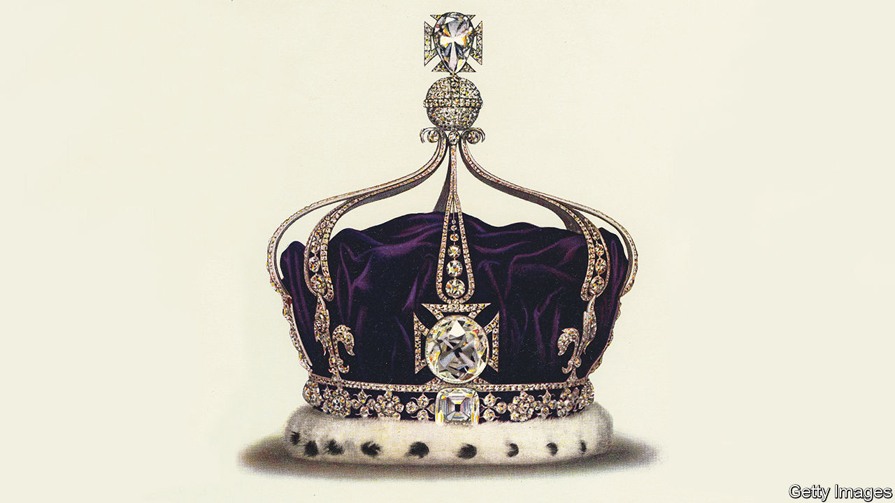

###### Carbon capture

# Indians want the Koh-i-Noor diamond back 

##### The stone is seen as a symbol of British colonial brutality 

 

> Oct 20th 2022 

The maggots didn’t help matters. Most myths about the Koh-i-Noor diamond are easy to dispel. The 106-carat stone, which currently sits in the Tower of London, was not, as some suggested, found by the god Krishna; nor was it stolen by a lion that was then slain by a bear. Nor is it the world’s largest: in international gem league tables it currently sits in 90th position. But the idea that it curses unworthy males lingers—persistent enough that only British queens, not kings, have worn it. 

Certainly many of its male owners had a rum time of it. Ahmad Shah, an 18th-century Afghan ruler, developed a facial tumour so severe he had to cover it with a jewelled mask (contemporaries considered the overall effect spoiled by the maggots that dropped from behind it). Another owner had his skull smashed so badly that his brains spilt onto his sheets; another who encountered it had molten lead poured on his freshly shaven head. The diamond, says Anita Anand, co-author of the book, “Koh-i-Noor”, “doesn’t bring out the best in people”.

It still causes strife. As soon as Elizabeth II’s death was announced, and again when Charles III’s coronation date was set, demands for its return to India began trending on Twitter (it was taken from its last Indian owner, the ten-year-old Maharaja Duleep Singh, by the East India Company in 1849). 

Britain is used to rancour over old stones. But many Britons seem to have reacted to the demands with bafflement: less the usual ”We will not” than “The what?” As a character in Salman Rushdie’s “The Satanic Verses” observes: “The trouble with the Engenglish, is that their hiss hiss history happened overseas, so they dodo don’t know what it means.” 

India does know. The country Britain once called “the Jewel in the Crown” of its empire has not forgotten this jewel. The ruling BJP party has said that a plan for Charles’s wife, Camilla, to wear the crown in which it is set at the coronation would bring back “painful memories”. 

In a sense the stone’s fame is odd. The history of colonial rule in India offers far bloodier chapters: after the Indian Uprising of 1857, British officers blew Indians from cannons. Yet it is the diamond, so small it can fit in the palm of a hand, into which much anger at Britain’s colonial history has been distilled. 

The Koh-i-Noor, as one Victorian observed when it was taken, is a “historical emblem of conquest in India. It has now found its proper resting place.” The first statement is clearly true. The second is increasingly contested. ■

