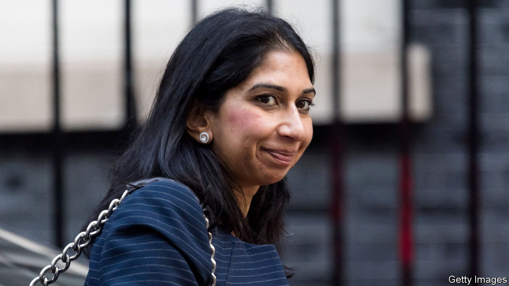

###### Immigration

# Suella Braverman resigns as home secretary 

##### She reveals a rift over immigration policy 

 

> Oct 19th 2022 


AFTER SUELLA BRAVERMAN ended her bid for the Conservative Party leadership in July, she said she would back Liz Truss as leader because she would “unleash the opportunities of Brexit”. It soon became clear that the two women had not discussed what that might involve. On October 19th, following a series of outbursts in which Ms Braverman contradicted her boss’s stance on immigration, she resigned. Grant Shapps, the transport secretary in the government of Boris Johnson, has replaced her.

Ms Braverman admitted sending a document from her personal email to a parliamentary colleague. That, she said, was a “technical infringement of the rules”, so she had to go. Yet her resignation letter went on to express  and note that it had broken “key pledges”. Ms Braverman then appeared to suggest that the prime minister should depart. “Pretending we haven’t made mistakes, carrying on as if everyone can’t see we have made them, and hoping that things will magically come right is not serious politics,” she wrote.

Her departure is yet another knock to a besieged prime minister. It is doubtless connected to Ms Braverman’s own political ambitions: she will surely be trying to position herself as a right-wing successor to Ms Truss. Yet her short, pugnacious term as home secretary also illuminates a more profound disagreement on post-Brexit immigration policy that splits the party.

Ms Truss wishes to expand immigration in some areas to boost growth. Ms Braverman repeatedly emphasised a strong desire to cut it. She said she wanted to reduce net migration, estimated at 239,000 in the year to June 2021, to “tens of thousands”—a goal set by David Cameron from 2010 that was eventually ditched by Boris Johnson after repeated misses. Whereas Ms Truss appears to be a mouthpiece for an “open Brexit”, Ms Braverman represented a “closed Brexit”, says John Dalhuisen of the European Stability Initiative, a think-tank.

Earlier this month Ms Braverman said she had “concerns” about a proposed trade deal with India because it would lower barriers to immigration from the country. That was not what Brexit voters had wanted, she maintained; besides, many Indians overstayed their visas. If her comments did not sink a deal with a notoriously difficult negotiating partner, they seem to have delayed it. Britain had hoped to sign a deal by late October, but it now seems unlikely to be concluded this year.

In truth a new era of Indian immigration is already under way. Since a post-Brexit points-based system was introduced in January 2021, the number of immigrants from outside the European Union has surged. In the year to June, 46% of those granted visas for skilled workers were from India. Their numbers have grown by 80% since 2019. Nigeria and the Philippines supplied many of the rest. Only 10% were from eu countries.

Polls suggest Britons are more comfortable with the new system, with its emphasis on skills and control, than with the free movement from Europe that preceded it. Polling by Ipsos shows that more feel that immigration has had a positive effect on Britain than a negative one. In 2015 the same survey revealed the opposite.

Ms Truss also reportedly wants to expand the government’s Shortage Occupation List, which makes it easier for firms in some understaffed industries to bring in more workers. Businesses are lobbying for the government to make it easier to bring in high-skilled immigrants in other ways, too, including by loosening the requirement to speak English and lowering salary requirements in some regions. 

To tackle some of the shortages in low-skilled labour, meanwhile, the prime minister is said to be considering raising the annual cap on visas granted under the Seasonal Agricultural Workers Scheme. It is set for this year at 40,000; the National Farmers’ Union says that is insufficient, and that fruit and vegetables are rotting in the ground. Raising the cap would be nothing new: it was tripled (to 30,000) in 2021. Ms Truss is also said to be considering expanding the scheme beyond farm workers. Last year it temporarily took in poultry butchers and lorry drivers. 

The new home secretary is likely to smile on such ideas, as will , the all-powerful new chancellor. Mr Shapps is drawn from the opposite wing of the party to Ms Braverman. He voted to remain in the eu and has made clear his distaste at the sort of culture-war rhetoric she revels in. He is relaxed about Britain’s population growing quickly if it boosts the economy. Yet he is no friend to Ms Truss: he helped orchestrate a rebellion against her budget during the Tory party conference earlier this month. And whatever the policy, the issue of immigration will keep infuriating many. ■

