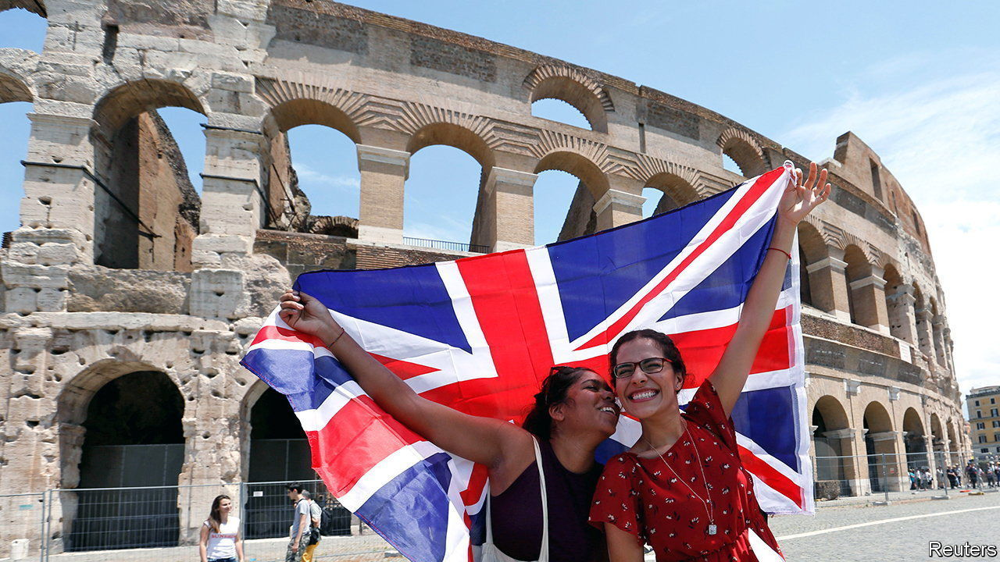
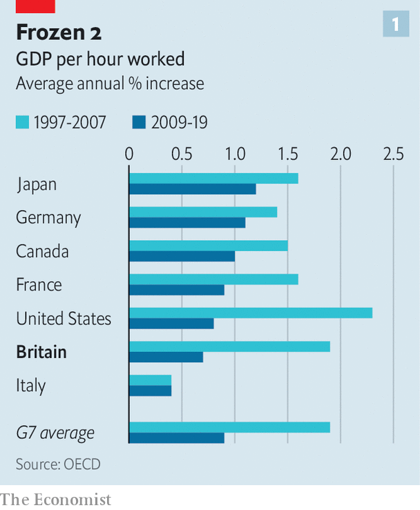
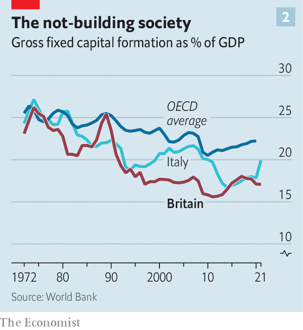

###### The low-growth gang

# What a comparison between Britain and Italy reveals 

##### Both countries have a growth problem—but to different degrees 

 

> Oct 20th 2022 

Britain has long thought of itself as being part of the same economic club as America, France or Germany. It is, after all, the third-biggest economy in the West. So it is a mark of the glum mood in the country that commentators are now drawing comparisons to Italy instead—a place that, aside from  is known for interminable political drama, economic stagnation and nervous bond markets. The two countries’ economies and fiscal positions differ considerably, not least because Italy uses the euro and does not have its own monetary policy. A comparison is revealing nonetheless.

Both Britain and Italy have an economic-growth problem that stems from underinvestment and lacklustre productivity, which in turn reflects deep-rooted structural factors. But Italy’s disease is considerably more advanced. Its living standards, measured by real gdp per person, have not risen since 2000. That in part reflects an ageing population. Italy has 37 old people for every 100 of working age, compared with 30 in Britain and 26 in America. Its courts and public administrators make decisions at glacial speed, which impedes business. A thicket of regulations is one reason why the country’s many small, often family-run firms do not expand.

 


Britain’s decline is at an earlier stage. gdp per person is still growing, although it has fallen behind America and Germany since the mid-2000s. Impeded credit flows after the financial crisis, restrictive planning rules and a poorly skilled workforce mean that investment and productivity growth is nearly as low as in Italy (see chart 1). Investment as a share of gdp was 18% in 2019, below 21-23% in America, France and Germany, but in line with that in Italy (see chart 2). All of this has dire consequences for living standards in the future. 

The malaise is apparent in stockmarkets, too. As companies elsewhere, chiefly in America and China, have innovated and swelled, Britain’s stockmarket has shrunk in importance. Its share of global market capitalisation has fallen from 8% to 3% over the past 20 years. Its importance in Europe’s total market value has declined, too. Italy’s share of the world’s stockmarket was never as big as Britain’s was, but it has shrunk at a similar pace. 

 


Both countries have serious regional imbalances. In Italy, the richer manufacturing-oriented north has long left the south in the dust. In 2019 gdp per person in the south was about half of that in the north. Britain is also unbalanced, with output per worker in London around 70% higher than that in the north-east of England. It is possible to construct lots of other measures of regional inequality, depending on the size of the region and the measure of income used. In 2019 Philip McCann, then an economist at the University of Sheffield, put together 28 of them for 30 of the mostly rich members of the oecd. He concluded that Britain was the most geographically unequal large advanced country, with Italy a close second. 

When it comes to the countries’ financing positions, however, the picture is more complex. Italy has high net public debt, of around 138% of gdp in 2021. Its slow economic growth means that those debts risk becoming unsustainable. Moreover, it is a member of a currency union with shared monetary policy, which means it cannot benefit from a weaker currency to boost its economy or prevent a run on its public debt. Its failure to implement reforms, revive growth and lighten its debt burden means that investors tend to worry about its creditworthiness. As a result, they demand a premium, or a “spread”, to hold Italian debt over safer German Bunds. Over the years, fears about spreads widening have led the European Central Bank to devise various schemes to buy government bonds in times of trouble. 

Britain has far lower public debt, of 85% of gdp. It has its own currency and a central bank that sets interest rates for the country alone. The government’s mindless mini-budget jolted investors into expecting higher inflation, and therefore higher interest rates from the Bank of England, which pushed up government-bond yields. It also prompted an emergency intervention by the bank to stop a fire-sale of assets by pension funds. The market turmoil has prompted the government to reverse its plans, rather as bond markets forced Italy’s governments to change course in 2011 and 2018. But few investors worry that . 

The kindness of strangers

Britain relies more on external financing than Italy does, however. According to the imf, it is likely to run a current-account deficit of nearly 5% of gdp this year, meaning that it is a net borrower from abroad. (Italy’s deficit is expected to be 0.2%.) That means financing conditions rely in part on the appetite of foreign investors for domestic assets. And the less the country does to fix its growth problem, the less attractive it becomes for investment. Political paralysis has consequences. ■

