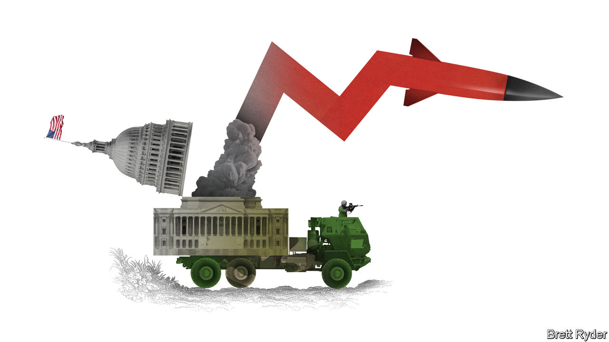

###### Schumpeter

# Despite Ukraine, these aren’t boom times for American armsmakers 

##### Where’s the war bounty? 

 

> Oct 20th 2022 

Camden, a small town in the backwoods of southern Arkansas, is having an unusual brush with the outside world. It is a quiet place. At this time of year there are more Halloween dolls tied to its lampposts than there are people in the streets. It also has a reason to keep its head down. The nearby Highland Industrial Park, which has a few manicured lawns amid thousands of acres of thick forestry, is home to the factories of some of America’s biggest weapons manufacturers, such as Lockheed Martin and Raytheon Technologies. “It’s been kind of a hidden secret,” says Michael Preston, Arkansas’s secretary of commerce. Or as a local businessman whispers, “it’s a fear thing: ‘shhhh’.” 

The war in Ukraine has made it hard for Camden to remain low-key. Behind high fences and the forest canopy the armsmakers are assembling many of the weapons made famous by Ukrainians who use them to stall the Russian invasion. Javelin missiles, HIMARS guided-missile launchers and GMLRS rockets, known as “gimmlers”, have become household names on TV and social media. Politico, a news website, recently profiled Camden as “the struggling Arkansas town that helped stop Russia in its tracks”. That has drawn more attention, including from your columnist. He was intrigued that some of these Russia-thumping munitions are stored in bunkers dating back to the second world war. More pertinent, he expected to witness America’s military-industrial complex on a full war footing. Instead he discovered just how plodding parts of the American defence juggernaut can be.

In theory, these should be heady times for makers of weapons. Russia’s assault on Ukraine, combined with strategic fears about China, have pushed up America’s proposed defence budget for next year, including for procurement of new firepower. Since February America’s NATO allies have also promised to spend more on defence, which is likely to bolster demand for American kit, such as Lockheed Martin’s F-35 fighter jets. Much of the American weaponry supplied to Ukraine has come from us military stockpiles, which will require a surge in the industry’s production capacity to be replenished. The prospect of higher demand, coupled with the view that defence companies are safe investments in times of economic turmoil, has led their stocks to handily outperform the S&amp;P 500 index since February. On October 18th Lockheed Martin’s share price jumped by the most in more than two years after its third-quarter results slightly exceeded forecasts. 

Drill down, however, and things look much less buoyant. The fillip to Lockheed’s shares owed more to its promise to return a slug of cash to shareholders than to any gung-ho predictions about orders. In fact, it expected sales growth to be flat next year and “low single digits” the year after. The view from Camden is equally downbeat. Locals report few signs of a surge in Ukraine-related production, not least because the industry is suffering from the same post-pandemic hangover of rising inflation, supply-chain strains and labour shortages as the rest of American manufacturing. Moreover, the possibility, however slim, that next month’s midterm elections could alter America’s strategic priorities is weighing on people’s minds.

The most sobering reality is that the industry is not as stagflation-proof as it appears. Yes, some contracts are “cost-plus”, where firms are guaranteed a markup to the unit cost of production. But until Congress approves the new defence budget, many programmes are funded at last year’s price levels, which fail to offset costlier material and manpower. This exacerbates the supply-chain problem. As the Centre for Strategic and International Studies, a think-tank, has highlighted, years of consolidation have made supply lines brittle. Rising prices make suppliers more reluctant to make long-term commitments. That is why companies like Lockheed have been forced to make advance payments to suppliers to set the wheels in motion for higher production—a move that requires big cojones without firm orders from the Pentagon. Furthermore, even as wages rise, it is a struggle to recruit staff. In the Camden area, job postings have long exceeded hirings. The Southern Arkansas University Tech, which trains students in skills such as welding, has recently rebranded its sports teams as “The Rockets” to tout the job opportunities in missile defence. 

Part of the problem is that the industry appears in two minds about making heavy weapons. The fastest growing part of defence spending is on snazzy programmes like space and hypersonics. Terrestrial weaponry like vehicles and long-range missiles have been lower-priority. That prompts a former general in Arkansas to gripe that armsmakers often overlook ground forces. Compared with the air force, the army has historically been seen as “just a bunch of dog-faced soldiers trudging in the mud”, he growls.

Lady MAGA

Then there is politics. Normally the likelihood that Republicans would make gains in the midterms would be a cause of optimism in the arms business, because of the party’s hawkish reputation on defence. But as signs plastered across Camden’s lawns remind everyone, the Republican candidate in the Arkansas governor’s race is Sarah Huckabee Sanders, who served as White House press secretary under Donald Trump. That underscores the potential Trumpian influence that may resurface after the elections, dividing consensus on support for Ukraine—and the NATO alliance. 

For all that the residents of Camden are hesitant to discuss defence, some believe production will pick up within a few years. The Highland Industrial Park is looking to make space available if suppliers want to move closer to their customers. The town is considering providing more housing to attract workers. A craft brewery has recently opened in Camden, partly to offer defence workers a nightlife. The town is coming to terms with its new status. That it is doing so only slowly is fine. The military-industrial machine hardly moves at rocket speed either. ■


