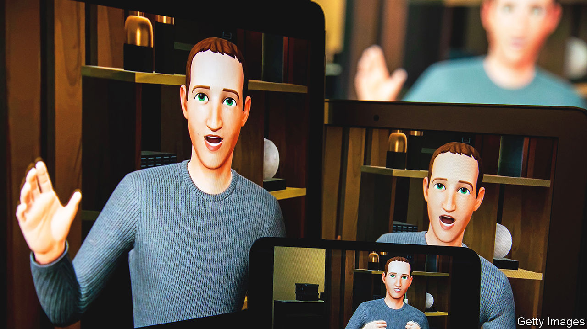
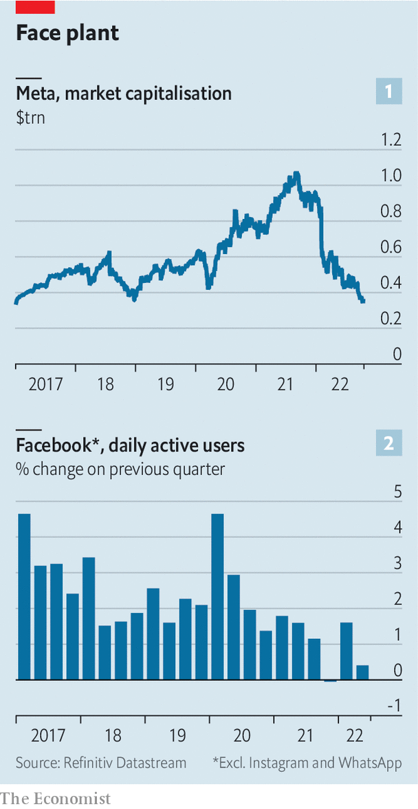
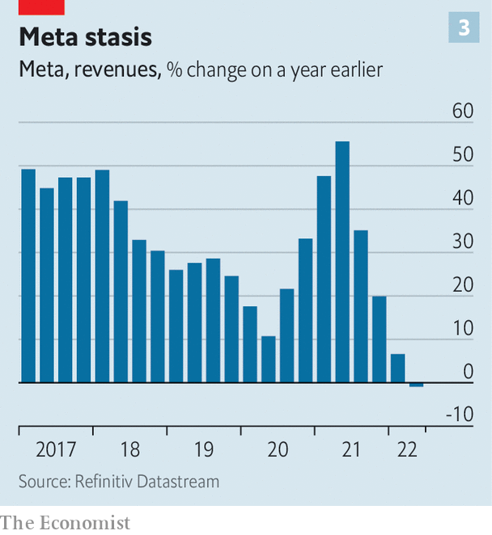

###### Reality bites

# How much trouble is Mark Zuckerberg in? 

##### As Facebook fades, Meta hopes for success in another dimension 

 

> Oct 16th 2022 

It is night-time at the Soapstone Comedy Club. In fact, it always is. The club is a space in Horizon Worlds, Meta’s flagship  app, where users can watch and perform comedy in virtual reality (vr). “It’s hard to do stand-up when you have no legs,” quips one performer, gesturing to his hovering avatar, before accidentally dropping the virtual microphone and floating offstage. A night out in vr lacks some of the atmosphere of a real bar, though it does cause authentic dizziness and nausea.

It is almost a year since Mark Zuckerberg announced that his company would  from Facebook to Meta, to reflect its commitment to the metaverse and, no doubt, to escape the firm’s . Many were unsure what the word meant, but with the company’s value at a near-all-time high of $1.1trn, and its core social-network advertising business humming away on the back of a pandemic boom, investors were willing to indulge the experiment.

 


A year on, things look different. The metaverse on which so much has been staked remains unproven and unpopular. Meanwhile there are signs that both users and advertisers are drifting away from the social networks that pay Meta’s bills. Since its rebranding the company’s share price has dropped by 60%, destroying more than half a trillion dollars of market value (see chart 1). Forecasts for profits in 2023 have fallen by about 50%, according to data from Bloomberg. Meta’s next earnings results, due on October 26th, represent an “existential quarter”, says Mark Shmulik of Bernstein, a broker.

What has gone wrong? The sell-off of Meta stock began in February, after the company reported its first-ever drop in daily users of Facebook, its first and largest social network. After 18 years of uninterrupted growth it lost 1m of them between October and December 2021 (see chart 2). It has since bounced back, adding 39m more, while users of Meta’s “family of apps”, which includes Instagram and WhatsApp, have kept growing. 

But the new users increasingly come from poor countries, and are therefore less valuable to advertisers. Last year Frances Haugen, a whistleblowing former Meta executive, claimed that in Facebook’s five most valuable markets, account registrations for under-18s had fallen by a quarter within a year. Meta has hurried out a new short-video product, Reels, to stem the bleeding to TikTok and other new rivals.

 


As users wobble, so do advertisers. In the second quarter Meta’s revenue fell year on year, for the first time in its history (see chart 3). Inflation, interest rates and war all played a part. But the ad business has been permanently changed by . These make it harder for iPhone apps to track users’ online activity, which in turn makes it harder to serve them relevant ads and see whether they work. Meta has said that Apple’s changes will cost it $10bn this year in forgone revenue. Companies are shifting their advertising to what admen call the bottom of the funnel: points at which the consumer is close to a purchase (Amazon, which serves ads to customers based on what they have just searched for, has been a big beneficiary).

As it faces these market headwinds Meta is also being harried by regulators. America’s Federal Trade Commission (ftc) is suing Facebook for abusing its supposed monopoly in social networking, an accusation which seems increasingly eccentric given recent advances by TikTok and other rivals. In July the ftc pounced on Meta’s proposed acquisition of Within, a maker of vr fitness apps. And on October 18th British regulators ordered Meta to undo its purchase of Giphy, a maker of animated images that it had bought in 2020.

Meta is better equipped than many of its rivals to overcome these obstacles. Reels already accounts for more than 20% of time spent on Instagram, and is making more money than Instagram’s successful Stories feature did at the same stage of its introduction, the company says. Heavy investment in artificial intelligence (ai) is helping Meta develop “probabilistic” ad models to replace the signal that was lost with Apple’s changes. Advantage+, a recent Meta ad product, uses ai to help advertisers develop and place ads. 

A trickier ad business serves to widen Meta’s competitive moat, points out Mr Shmulik: smaller rivals like Snap, whose share price has fallen by nearly 90% in the past 12 months, are the real casualties. Still, Meta’s advertising franchise has probably been permanently impaired. And the company is scrambling to rebuild its ad business without the architect of its previous one, Sheryl Sandberg, who left the company last month.

All this would be enough to give investors jitters. The fact that Meta is simultaneously making a colossal bet on the metaverse threatens to test their faith to breaking point. Reality Labs, the company’s metaverse division, has so far run up losses of $27bn. Meta has sold more than 17m Quest 2 vr headsets, estimates idc, a data company, mostly at or below cost. It has also been on a hiring spree, last year announcing 10,000 new metaverse jobs in Europe. The pace of hardware development continues: on October 11th Meta unveiled a more advanced Quest Pro headset, and Mr Zuckerberg showed off prototype hardware including a wrist-worn neural-input device. A Quest 3 and Quest Pro 2 are already in the works.

When—or whether—the metaverse will take off remains unclear. The Quest’s main use so far is gaming. Fitness is a growing niche, though Meta’s progress in that area could stall if its purchase of Within is blocked. The Quest Pro is aimed at businesses; on its launch this month Meta announced a partnership with Microsoft, which will provide vr versions of apps like Teams and Office. A “Quest for Business” subscription will be available next year. 

But the social uses of vr, about which Mr Zuckerberg is most enthusiastic and where Meta should have the greatest advantage, remain unpopular. In February Meta reported that just 300,000 people had used Horizon Worlds; the firm has said nothing since. On October 16th the  reported that, according to internal Meta documents, the number of regular users had declined since the spring. A leaked internal memo suggested that even company employees were having to be cajoled to use it (“If we don’t love it, how can we expect our users to love it?”). 

Mr Zuckerberg is  who sees potential in vr. In the first half of next year Apple is expected to release its debut headset, and Sony will launch its latest gaming-focused goggles for its PlayStation console. If headsets do become the new pcs, as Mr Zuckerberg has predicted, Meta will enjoy a considerable first-mover advantage. The Quest 2 accounted for 88% of global vr-headset sales in the first half of this year, idc reckons. The Quest Pro is the most advanced set of vr glasses around. Meta’s hiring binge means that it has much of the top vr talent, says Jitesh Ubrani of idc. If Meta can control and tax a successful vr platform, as Apple and Google control their mobile operating systems, it will own a gold mine (Meta already skims off as much as 47.5% from Horizon Worlds purchases).

The question is timing. Meta’s unusual structure gives Mr Zuckerberg total control. The firm’s board proved to be ineffective at dealing with Facebook’s scandals over privacy and misinformation. Now, rather than urge caution, it has allowed a flawed chief executive to gamble billions on the metaverse. In May Mr Zuckerberg admitted as much when he told Protocol, a news site: “If people invest in our company, we want to be profitable for them…But I also feel a responsibility to go for it…[Meta] is a controlled company, so I can make more of these decisions than most companies would.” 

Antisocial behaviour

Yet the more Meta’s core business wobbles, the less investors will be willing to give Mr Zuckerberg’s metaverse plans the benefit of the doubt. A company can only spend that much on a new idea if someone is prepared to fund it. They might be if “your core profitability from your core business is on solid footing”, says Mr Shmulik. That is Meta’s difficulty. “The core isn’t on a solid footing at the moment.”

To calm investors’ nerves, Meta is reining in its spending a little. It expects its total expenses this year to be about $7.5bn lower than it forecast at the end of 2021. It has scrapped some projects, including a smart watch that was in development, and bumped up the price of the Quest 2 by $100. And it expects to reduce its headcount.

Meta executives compare the company’s predicament now to ten years ago, when it was managing the transition of its social network to mobile. Shifting a billion Facebook users from desktop to phone was no mean feat, made harder by the fact that Mr Zuckerberg was late to spot the importance of mobile. That experience may have influenced his approach to the metaverse. Meta’s new vr technology, he said on October 11th, was for those “who’d rather be early than fashionably late”. The risk, as investors grow impatient, is that this time Meta has made its move too soon. ■


