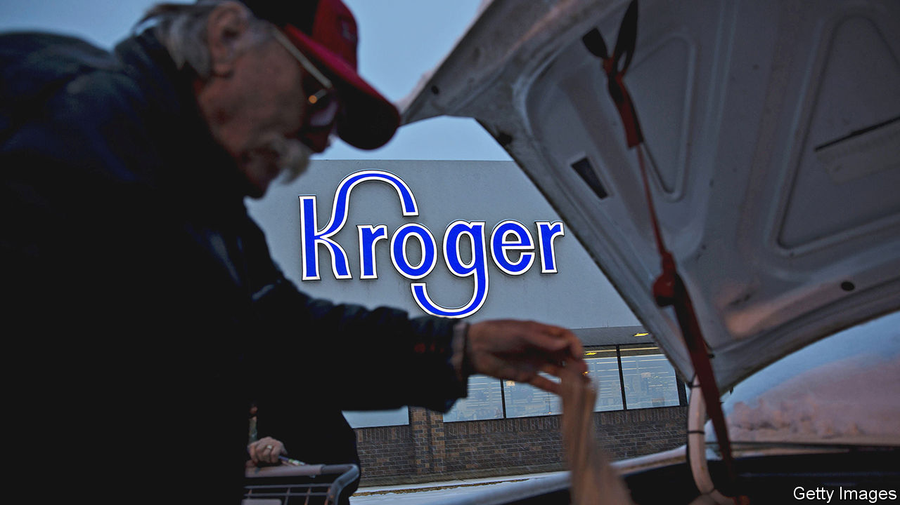

###### Fodder for the FTC

# Kroger, America’s second-biggest grocer, goes shopping 

##### Its acquisition of Albertsons faces antitrust scrutiny 

 

> Oct 20th 2022 

Grocery is a boring business. Peddling bread-and-butter products (literally) at wafer-thin margins hardly sets pulses racing. Unless, that is, you are an American politician. On October 18th Amy Klobuchar and Mike Lee, two senators, called a hearing to discuss the proposed acquisition by Kroger, America’s second-biggest grocer by revenues, of Albertsons, the fourth-largest. The top Democrat and Republican, respectively, on the Senate antitrust subcommittee also sent a letter urging the Federal Trade Commission (ftc) to size up the $25bn deal, which they say “raises considerable antitrust concerns”. 

Really? The American grocery market features a few national chains competing fiercely on price with regional rivals, fast-growing dollar stores and, increasingly, Amazon’s e-emporium. Together Kroger and Albertsons would have a market share of 19%—not exactly the stuff of monopoly and still less than Walmart, the supermarket behemoth, with 25% (or 30% if you add Sam’s Club, Walmart’s Costco-like membership-only big-box chain). The industry’s operating margins of 3-4% hardly scream robber barons. 

To allay any fears, Kroger and Albertsons have offered to spin off as many as 375 stores into a separate company. Kroger also says that it would use half the $1bn in expected annual cost savings from the merger to reduce prices for shoppers (closing some of the gap with Walmart’s “Every Day Low Prices”). And it promises to set aside $1bn in the coming years for wage rises, on top of the $1.2bn it says it has diverted to higher staff pay of late. 

Some of the rest of the windfall could usefully go to beefing up its digital offering. The pandemic has accustomed people to buying everything online, including food. Weak e-commerce chops may explain why Albertsons’ grocery revenues of $61bn did not grow at all last year and Kroger’s declined from $105bn to $104bn, according to Bank of America, while digitally savvier rivals like Costco, Target and Walmart increased theirs. If Kroger-Albertsons offers more choice online that, too, seems like a win for consumers.

Such arguments are unlikely to cut the mustard with Lina Khan, the ftc’s crusading head. Ms Khan does not conceal her dislike of big business. In her view the role of competition policy is not merely to stop companies from gouging consumers but also to protect smaller firms, workers and other “stakeholders”. She may have it in mainly for big tech—she made her academic name with a paper entitled “Amazon’s antitrust paradox”—but is none too fond of big grocers, either. 

In an article from 2017, Ms Khan and her co-author lambasted the ftc for approving Albertsons’ earlier $9bn merger with Safeway, a rival (reserving especial ire for Albertsons being allowed to reacquire some of the assets the ftc had ordered it to divest, after the buyer went bust). It is hard to see her waving through an even bigger deal—never mind that the merged company would be better able to stand up to her Amazon bugbear. A jump in Albertsons’ share price suggests that investors expect the transaction to go ahead. But Ms Khan won’t make it easy. ■


