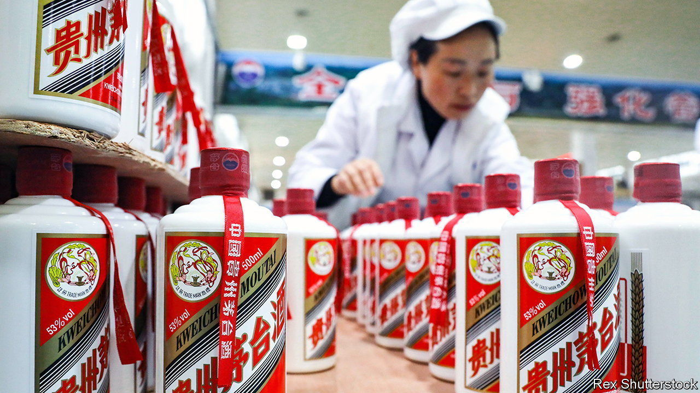

###### 100% covid-proof

# Kweichow Moutai is beating China’s covid hangover 

##### But the world’s biggest booze firm has another headache 

 

> Oct 20th 2022 

Harsh lockdowns are a fact of life in “zero-covid” China. One in September in Chengdu, a south-western city of 20m, stopped locals from visiting tea houses, a favourite pastime. In Sanya, an island-resort town, tens of thousands of tourists were kept off the white-sand beaches in August. In Guiyang, another large south-western provincial capital, it was the boozing that suffered. Apart from forcibly confining almost 6m residents to their homes for most of last month, the authorities shut more than 50 shops owned by Kweichow Moutai, a distiller of a fiery, sorghum-based liquor. And it happened right in the middle of the year’s busiest shopping season, when tourists flock to the cool, mountainous region to sample local varieties of the firewater.

Guiyangese and visiting tipplers were no doubt upset—all the more so for being unable to drown their irritation. For Kweichow Moutai, the episode barely registered. The devastating lockdown in its home province notwithstanding, on October 16th the company reported net profits of 44bn yuan ($6.2bn) in the first nine months of 2022, 19% more than in the same period last year and its best performance in a while.

National tobacco and alcohol sales are rising in spite of (or perhaps thanks to) plummeting consumer confidence. They grew by 7% between January and August, compared with a year ago, even as other retail and leisure spending has been hammered. Cosmetics sales, for example, fell by almost 3% in the first eight months of 2022, year on year. Those of garments, footwear and hats were down by 4.4%. The lockdown of Shanghai, China’s business hub and largest city, left dozens of sprawling malls and shopping districts devoid of people for two months. Official data on vehicle sales showed that not a single new car had been sold in the city of 25m in April.

Moutai’s resilience is not just the result of robust sinful consumption. Although it enjoys little name recognition and few sales abroad, the state-run firm has built one of the world’s most valuable consumer brands. In 2017 its market capitalisation surpassed that of Diageo, the London-based maker of spirits such as Johnnie Walker. In 2020 it overtook the Industrial and Commercial Bank of China, one of the world’s biggest lenders. In October it briefly became China’s largest listed company. Today it is worth 2.1trn yuan ($286bn).

Part of its secret recipe for success lies in its history. It was the favoured hooch of Mao Zedong, China’s revolutionary leader, and other top apparatchiks. Americans got a taste of it in 1972 when then-premier Zhou Enlai raised a glass to toast Richard Nixon as the countries normalised relations. Such stories have burnished its brand at home. Over the past 50 years no formal banquet has been complete without a bottle (or several). Vintage cases sell for tens of thousands of dollars.

The company also has an eye to the future. It has invested heavily in its online sales channel (called iMoutai), which probably made up for some lost sales when its Guiyang shops were shuttered in September. And it has been expanding its range by adding innovative new products such as a Moutai-infused ice cream, launched earlier this year. 

These virtues have helped Kweichow Moutai withstand China’s long covid hangover. Its bigger headache has to do with vice. State media have accused Moutai of being the booze of choice of crooked officials, who accept pricey bottles as backhanders. Many of the firm’s own bigwigs, including a former chairman, have been arrested on bribery charges in recent years. The mere mention of an anti-graft campaign can hurt liquor stocks. Billions of dollars were temporarily wiped off Kweichow Moutai’s market value on October 11th as rumours swirled that civil servants would be banned from drinking alcohol. ■


