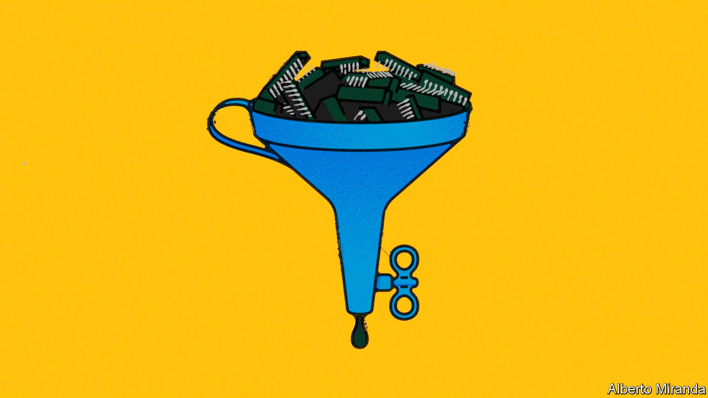
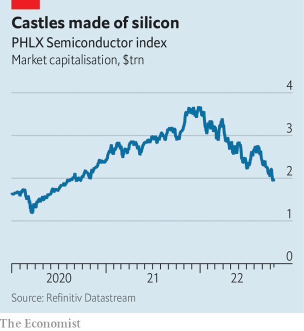

###### The silicon squeeze

# The American chip industry’s $1.5trn meltdown 

##### Thank the boom-and-bust cycle—and America’s government 

 

> Oct 17th 2022 

In licking county, Ohio, fleets of dump trucks and bulldozers are shifting earth on the future site of chip factories. Intel is building two “fabs” there at a cost of around $20bn. In March President Joe Biden called this expanse of dirt a “field of dreams” in his state-of-the-union message. It was “the ground on which America’s future will be built”, he intoned.

In the spring it was easy to be dreamy about America’s chipmakers. A global supply crunch had proved how key chips were to modern life. Demand was still rising for chip-powered technology, which nowadays is most of it. Investors were less gloomy about chips than other tech, which was taking a stockmarket beating. The CHIPS act was moving through Congress, promising subsidies worth $52bn for projects like Intel’s in Ohio, in order to reduce America’s reliance on foreign fabs.

Today the dreams look nightmarish. In late September Micron, a maker of memory chips, reported a 20% year-on-year fall in quarterly sales. A week later AMD, a chip designer, slashed its sales estimate for the third quarter by 16%. Intel reportedly plans to lay off thousands of staff, following a string of poor results that are likely to continue when it presents its latest quarterly report on October 27th, and has just slashed the valuation of the initial public offering of its self-driving unit to a third of the $50bn it had originally envisaged. Since July America’s 30 or so biggest chip firms have together cut revenue forecasts for the third quarter from $99bn to $88bn. This year more than $1.5trn has been wiped from the combined market value of American-listed chip businesses (see chart).

 


The industry is notoriously cyclical: new capacity takes a few years to build, by which time the demand may no longer be white-hot. In America this cycle is now being turbocharged by the government. The chips act, which became law in August to cheers from chip bosses, is stimulating the supply side of the semiconductor business just as the Biden administration is stepping up efforts to stop American-made chips and chipmaking equipment from going to China, dampening demand for American products in the world’s biggest semiconductor market. 

Whether or not it makes strategic sense for America to bring more chipmaking home and to hamstring its geopolitical rival with export bans, the combination of more supply and less demand is a recipe for trouble. And if America’s policies speed up China’s efforts to “resolutely win the battle in key core technologies”, as President Xi Jinping affirmed in a speech to the Communist Party congress on October 16th, they may give rise to powerful Chinese competitors. Field of dreams? Enough to keep you awake in terror at night.

The cyclical slump has so far been felt most acutely in consumer goods. PCs and smartphones make up almost half the $600bn-worth of chips sold annually. Inflation-weary shoppers are buying fewer gadgets. Gartner, a research firm, expects smartphone sales to drop by 6% this year and those of pcs by 10%. Firms like Intel, which in February told investors it expected PC demand to grow steadily for the next five years, are revising their outlooks as it becomes clear that many covid-era purchases were simply brought forward. 

Other segments could be next. Panic buying amid last year’s chip shortage has left many manufacturers with too much silicon. New Street Research, a firm of analysts, estimates that between April and June industrial firms’ stock of chips was about 40% above the historical level relative to sales. Stockpiles at makers of pcs and cars are similarly full. Intel and Micron have blamed weak results in part on customers’ high inventories. 

The supply glut and weak demand is already hitting prices. The cost of memory chips has dropped by two-fifths in the past year, according to Future Horizons, a research firm. The price of logic chips, which process data and are less commoditised than memory chips, is down by 3%.

Chip buyers will work through their inventories eventually. But afterwards they may buy less than before. In August Hewlett Packard Enterprise and Dell, two hardware-makers, hinted that demand from business customers was softening. Sales of pcs and smartphones had started to level off before covid-19, and this trend will probably resume. Phonemakers cannot stuff ever more chips onto their devices for ever. For firms such as Qualcomm, which derives half its sales from smartphone chips, and Intel, which gets a similar share from those for pcs, that is a headache.

The chipmakers’ response has been to bet on new markets. Qualcomm is diversifying into cars. In September its bosses boasted it had $30bn-worth of orders from carmakers. amd, Intel and Nvidia, another chip-designer, are battling over cloud-computing data centres, where chip demand is strong. Intel is also expanding into semiconductors for networking gear and devices for the hyperconnected future of the “internet of things”. It is also getting into the contract-manufacturing business, hoping to win market share from tsmc of Taiwan, the world’s biggest chipmaker and contract manufacturer of choice for fabless chip-designers such as amd and Nvidia.

These efforts, however, are now running into geopolitics. Like their counterparts in China and Europe, politicians in America want to lessen their country’s dependence on foreign chipmakers, in particular tsmc, which manufactures 90% of the world’s leading-edge chips. In response, America, China, the eu, Japan, South Korea and Taiwan together plan to subsidise domestic chipmaking to the tune of $85bn annually over the next three years, calculates Mark Lipacis of Jefferies, an investment bank. That would buy a fair bit of extra capacity globally. 

At the same time, prospects for offloading the resulting chips are darkening as a result of America’s restrictions on exports to China. Many American firms count the Asian giant, which imported $400bn-worth of semiconductors in 2021, as their biggest market. Intel’s Chinese sales made up $21bn of its total revenues of $79bn last year. Nvidia said that an earlier round of restrictions, which curbed sales of advanced data-centre chips to Chinese customers and to Russia after its invasion of Ukraine, would cost it $400m in third-quarter sales, equivalent to 6% of its total revenues. 

The new controls, which target Chinese supercomputing and artificial-intelligence efforts, are a particular concern for manufacturers of chipmaking tools. Three of the five biggest such firms—Applied Materials, kla and Lam Research—are American. The share of the trio’s sales going to China has shot up in recent years, to a third. Toshiya Hari of Goldman Sachs, a bank, thinks the controls may cost the world’s toolmakers $6bn in lost revenues this year, or 9% of projected sales. After the latest rules were unveiled, Applied Materials lowered its expected fourth-quarter revenue by 4% to $6.4bn. Its share price has dropped by 13%; those of kla and Lam Research have tumbled by a fifth.

Chip bosses now fear that China could retaliate, further restricting access to its market. It is already redoubling efforts to nurture domestic champions such as smic (in logic chips) and ymtc (in memory), as well as local toolmakers, which may one day challenge America’s silicon supremacy. The result could be a diminished American industry with less global clout and too much capacity—a shaky foundation on which to build America’s future. ■


