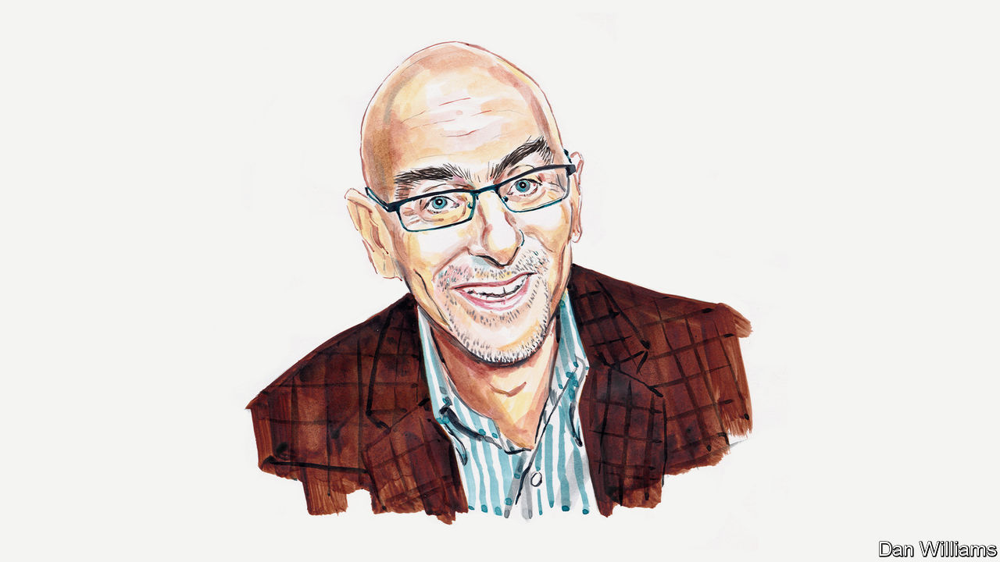

###### America’s 2022 midterms

# Ruy Teixeira asks whether America has reached “peak woke” 

##### The political demographer says institutions, not politicians, cling most tightly to the orthodoxy 

 

> Oct 19th 2022 

THE QUESTION of whether the pervasive push for wokeness in America has reached its apogee has different answers depending on where you look. My approach to answering it draws on the decades I have spent analysing American politics. Socially speaking, the peak was clearly attained during the summer of 2020, when no one outside of right-wing circles dared to dissent from the Black Lives Matter (BLM) orthodoxy that quickly consumed the country’s discourse. The murder of George Floyd at the hands of police was the catalyst, but served as just one example of how black people were killed and oppressed every day, the victims of structural racism. America was a white-supremacist society, the narrative went; every white person was complicit in maintaining and benefiting from the system, and every American’s moral duty was to endorse this view. Knees were duly taken on sports pitches, black squares and other indications of BLM support appeared in social-media profiles, and copies of Robin DiAngelo’s “White Fragility” and Ibram X. Kendi’s “How To Be an Anti-Racist” were dutifully purchased.

This was a moral panic. Progressive elites and their institutions rushed to embrace radical race essentialism—the idea that race is the primary driver of social inequality and that all whites should be viewed as privileged and all “people of colour” as oppressed—supported by millions of protesters who skewed educated, liberal and young. The violence that attended some of these protests was defended as the unavoidable cost of a righteous uprising.That it was mostly directed against property accumulated under white supremacy provided a ready-made moral justification. 

At the same time, the slogan “defund the police” became popular in protest circles, linking the two messages in the nation’s consciousness. The woke view soon expanded far beyond opposing structural racism to envelop the entirety of identity politics—targeting ableism, sexism, transphobia and other forms of “intersectional” oppression that were presumed to be everywhere in America. Language policing, and self-policing, was rampant.

But as summer moved into autumn, that fervour faded. Many realised that much of what was being done in the name of wokeness didn’t make sense. “Defund the police” collided with the reality of rising crime. The shambolic “Capitol Hill Autonomous Zone”—an anarchic occupation in the centre of Seattle, Washington—and 100 straight days of clashes with police in Portland, Oregon, struck even many BLM sympathisers as counter-productive. 

More seriously, it became increasingly obvious that the people supposed to benefit from wokeness were not actually on board with some of its related initiatives. “Defund the police” was not popular with black voters, especially those in crime-ridden communities, who simply wanted better policing. Hispanic voters rejected woke cultural radicalism. To an overwhelmingly working-class, upwardly mobile and patriotic population with kitchen-table concerns, the idea of America as a racist hellhole was absurd. 

It soon became plausible in moderate-to-liberal circles to voice sentiments that fell short of blanket endorsement of BLM ideology and woke orthodoxy. The space for heterodox liberal and moderate writers to express themselves, on platforms such as Substack, began and continues to increase. Socially, then, “peak woke” now seems in the past. 

The political sphere is different. Leading Democrats eventually distanced themselves from “defund the police”. Eric Adams, a black politician and former police captain who was elected as New York’s mayor in 2021, was rewarded at the ballot box—particularly by working-class and non-white voters—for rejecting the idea and putting public safety first.

Other Democrat-stronghold cities have seen similar shifts, and San Francisco is an instructive example. The city’s school board voted unanimously in 2021 to reverse a plan to rename 44 schools named after people with connections to historical injustices. In February three school-board members were recalled after they, in the name of wokeness, replaced a rigorous entrance test to the famed Lowell High School with a lottery. And in June voters recalled Chesa Boudin, an ostentatiously woke district attorney. He had become the poster child for a perceived wave of progressive public prosecutors in Democrat-run cities who were reluctant to keep criminals off the street, even amid a national spike in violent crime.

Is that to say politics has passed “peak woke”? Perhaps. Democratic politicians have been loth to draw sharp lines within their party. Therefore woke stances on crime, immigration, race essentialism, gender ideology and school curriculums that are still alive and well in the party’s left could easily re-emerge. All it might take is another viral video or incident involving race (or perhaps gender) to touch that off.

It is in America’s institutions where the wokeness curve seems still to be on the rise. In academia, the arts, mainstream media, advocacy groups, NGOs, foundations, school administrations, professional organisations and corporate human-resources departments, it is hard to detect an ebbing of the tide. In the past two years, there has been a proliferation of bureaucracies imbued with “diversity, equity and inclusion” principles, alongside ideological training, rules and strictures intended to compel conduct that is deemed sensitive to the marginalised. Even venerable science journals such as  are repenting for their past racism and pledging to “decolonise” scientific research. 

Wokeness is stubbornly entrenched in these institutions, and it is there that it will make its stand. Millions of people have jobs, money, positions and influence that are now bound up with wokeness, and they will not give it up easily. The world they inhabit is more insulated from the views of ordinary people than those of social discourse and political competition. We may not yet have seen “peak woke” in that world—which means many of us, unfortunately, may yet face being called out, cancelled or targeted in some other way.■


