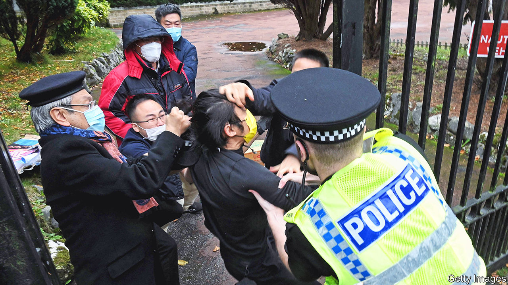

###### When “wolf warrior” diplomacy goes too far

# A protester in Britain is beaten up by Chinese diplomats 

##### Will the Chinese consul-general be declared persona non grata? 

 

> Oct 20th 2022 

Chinese diplomats scuffled with pro-democracy protesters from Hong Kong outside the Chinese consulate in Manchester on October 16th. One protester was pulled onto consular grounds and beaten, until a British policeman rescued him. British MPs have called for Zheng Xiyuan, the consul-general, to be declared persona non grata for his alleged role in the fracas. China has blamed the protesters and the British authorities.■


