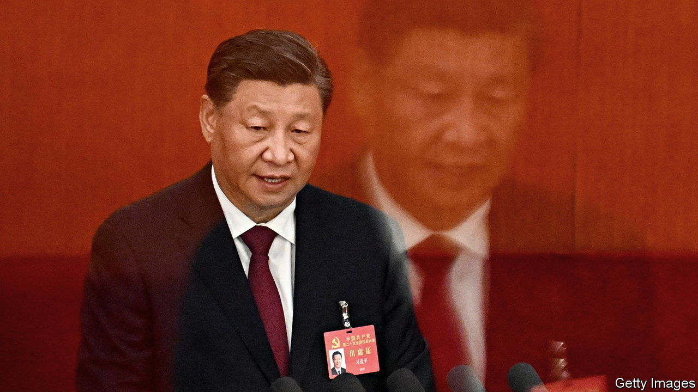
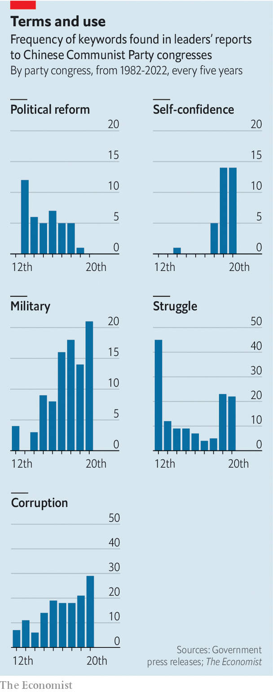

###### Xi’s word counts

# In his reports to the party, Xi Jinping signals change subtly 

##### Our analysis of the Chinese president’s evolving phraseology 

 

> Oct 20th 2022 

Chinese Communist Party congresses are rarely occasions for dramatic policy announcements. To show consistency in the party’s line, leaders submit reports that mostly praise the party’s achievements and restate broad goals, using familiar phrases. At the start of the party’s 20th congress on October 16th, . He did indulge in a small change of format, offering relief to the nearly 2,300 delegates in Beijing’s Great Hall of the People by reading an abridged version. Still, in his plodding delivery, it took nearly two hours. 

But as the party’s 97m members will be reminded during endless study sessions in the weeks ahead, these reports are important. Mr Xi’s was the product of nearly a year of work, involving research by more than 50 institutions and feedback from thousands of people. Cadres ignore at their peril any linguistic tweaks, changes of emphasis, new terms or omissions. The full version of this latest report contained about 30,000 characters (around 25,000 words in the official English translation). They will be pored over carefully. 

Readers may notice how certain words have been gaining in frequency of use from congress to congress (the events are five years apart). Some of these reflect : “drastic changes in the international landscape, especially external attempts to blackmail, contain, blockade and exert maximum pressure on China”, as his report put it. 

 


One such word is  (security). It appears 91 times in the document, compared with 35 in the farewell report delivered by Mr Xi’s predecessor, Hu Jintao, in 2012 (Mr Xi took over after that year’s congress). Another rise has been in uses of the word  (military). There were 21 this time. In 1982, at the first congress of the Deng Xiaoping era, there were just four (see chart). The word  (struggle or fight) appears 22 times in the latest report. “We have shown a fighting spirit and a firm determination to never yield to coercive power,” it says, in a clear swipe at the West. Mr Hu used  only five times in 2012.

Mr Xi offered no hint of any political relaxation. The term  (political structural reform) made a dramatic debut at the congress in 1987, with 12 mentions. This time Mr Xi did not use it, the first such omission since that time. He had much to say about traditional ideology: eg, “Marxism works” (though it should not be treated as “rigid dogma”). Harking back to communist ideals, he referred eight times to a need for “common prosperity”. 

But Mr Xi’s report reveals anxiety. “Uncertainties and unforeseen factors are rising,” it says. “We must be ready to withstand high winds, choppy waters, and even dangerous storms.” It refers to one of Mr Xi’s preoccupations: escaping the “historical cycle of rise and fall”. His remedy is “self-reform”, which involves eliminating corruption, ideological wavering and disloyalty to himself. After a ten-year fight against graft that has toppled many serving and former high-ranking officials, including political rivals, he signalled that there would be no let-up. The report mentioned  (corruption) 29 times, a record for post-Mao Zedong congresses. 

Lest anyone begin to waver in their faith in the party’s—and Mr Xi’s—ability to cope with the dangers ahead, the report kept repeating another of his cherished terms:  (self-confidence). Not everyone has got that message. After a rare protest on October 13th, involving a banner on a bridge calling Mr Xi a dictator, security in Beijing was tightened still further. ■


