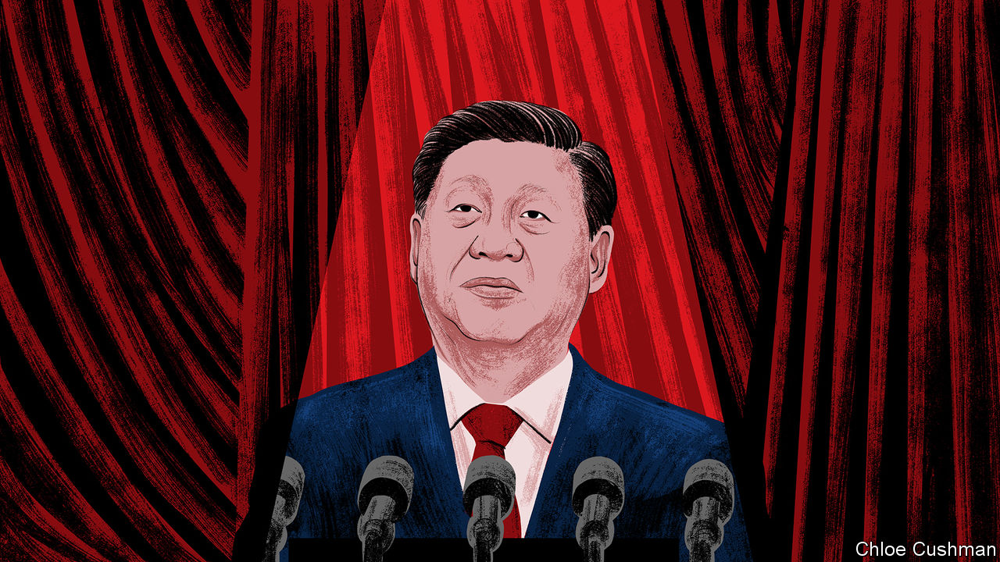

###### Chaguan

# No turning back for Xi Jinping 

##### China’s president opens a high-stakes political meeting in an uncompromising mood 

 

> Oct 17th 2022 

Hard, risk-filled times are coming to China and the world, and Xi Jinping is in his element. For nearly two hours on October 16th China’s supreme leader instructed Communist Party members to face challenges at home with a fighting spirit, and to seize strategic opportunities in a . The last part is code for the perceived decadence and decline of America, a country that hovered over the whole speech as a source of menace, though it went unnamed. Mr Xi’s uncompromising address—a political report, in party jargon—suggests that officials will stick with what he called his “all-out people’s war” against covid-19. It calls for resistance to foreign powers bent on containing China; and for members to guide the young to heed the party, study diligently, keep fit, pursue realistic goals and, in due course,  for the motherland.

Mr Xi delivered his remarks with grim relish in a solemn setting, the opening of the 20th National Party Congress in the Great Hall of the People in Beijing. Such gatherings are held twice a decade. National congresses set overarching party doctrine and select (or, in truth, rubber-stamp) a new slate of leaders for a five-year term. This time, the stakes are unusually high. That is true for Mr Xi, who is set to emerge with his mandate extended for a precedent-trampling third term and wielding more personal and ideological authority than any ruler since Mao Zedong. It is also true for his party, which faces strong headwinds, not least because of policies imposed by Mr Xi.

China’s economy is slowing, in part because of the rolling lockdowns and travel curbs that underpin Mr Xi’s strict “zero-covid” approach to pandemic control. Private-sector dynamism and confidence have been dampened in part because of his moves to impose the party’s writ on business sectors that are deemed a threat to order and national security. For ordinary Chinese aged 40 or younger, who are used to living in a country on the rise, it is a shock to have to worry about a  putting savings in peril, and to see young people, including college graduates, struggle with . Business and political elites know that China’s global image has suffered during the past few years, at least in liberal democracies. Foreign alarm at China is directly linked to its assertiveness, as pugnacious Chinese diplomats reject criticism of their country’s iron-fisted ways and the Chinese government uses economic coercion to bully or punish countries that displease it. This has stoked distrust that is changing views of China’s reliability as a trade partner and supplier. The West’s rude awakening about Russia involves new clarity about China, too, after Chinese leaders and diplomats declined to condemn , Vladimir Putin, for his invasion of Ukraine. With awkward timing, Mr Putin’s murderous incompetence and nuclear brinkmanship in Ukraine leave Mr Xi going into a party congress as the best friend of a loser.

Amid all this turbulence, Mr Xi’s report concedes no ground. It flatly defends his  for putting the lives of the Chinese people first, while delivering “tremendously encouraging” epidemiological and economic results. While paying lip-service to economic openness, it suggests that self-reliance in a hostile world is a higher priority. It calls for the party to oversee the cultivation of world-class scientists and engineers at home, and emphasises party leadership over high-tech industrial policies. As if working its way, defiantly, down a list of foreign concerns about China’s rights record, the report hails the crushing of Hong Kong’s democratic opposition for “restoring order”, and—without naming Tibet or Xinjiang—boasts of effectively containing “ethnic separatists, religious extremists and violent terrorists”.

Reports to a party congress do not discuss current events such as the Ukraine war or unveil detailed policies: they are high-level ideological texts drafted over many months. Still, this year’s restates a long-standing Chinese charge that a peaceful world order is undermined by American defence alliances in Europe and Asia, or what the report coyly calls “exclusive groups targeted against particular countries”. In something of a relief for foreign governments, its language on Taiwan includes a mix of blandishments and threats to use force if that democratic island declares independence, but no new, urgent deadlines for its conquest.

The party congress does not feel your pain

This generally defiant tone is not surprising. Mr Xi has another term to secure, and party congresses are at the best of times not moments for leaders to show weakness. These are not the best of times. But the report’s complete absence of reassurance is revealing, nonetheless, about Mr Xi’s mandate to rule. China’s population really is weary of zero-covid controls. Lots of homeowners, unemployed young people and their parents are scared about the future. Chinese entrepreneurs are sincerely anxious about statist economic policies. It is not hard to meet Chinese officials and scholars alarmed by Mr Xi’s picking of fights with the West. Yet the report offers no solace to such anxious groups, because their members have no way of holding Mr Xi to account.

Mr Xi’s constituency is not the country at large. It is not even the 2,300 delegates at the congress, who are window-dressing in a party ritual as preordained as a coronation. Tellingly, a telegenic handful of delegates were chosen to field pre-screened press questions on the opening day, including an astronaut in uniform, an Olympic athlete and an ethnic-minority official in traditional garb. Most proceeded to heap praise on Mr Xi.

Mr Xi’s mandate to rule comes from a few party bosses and elders, meeting in secret long before the congress. The brutal rules of elite Chinese politics give a leader no incentive to acknowledge the costs of his policies, let alone admit mistakes. In the Great Hall of the People, Mr Xi’s unyielding report was greeted with prolonged applause. That was the sound of deference to power. ■


