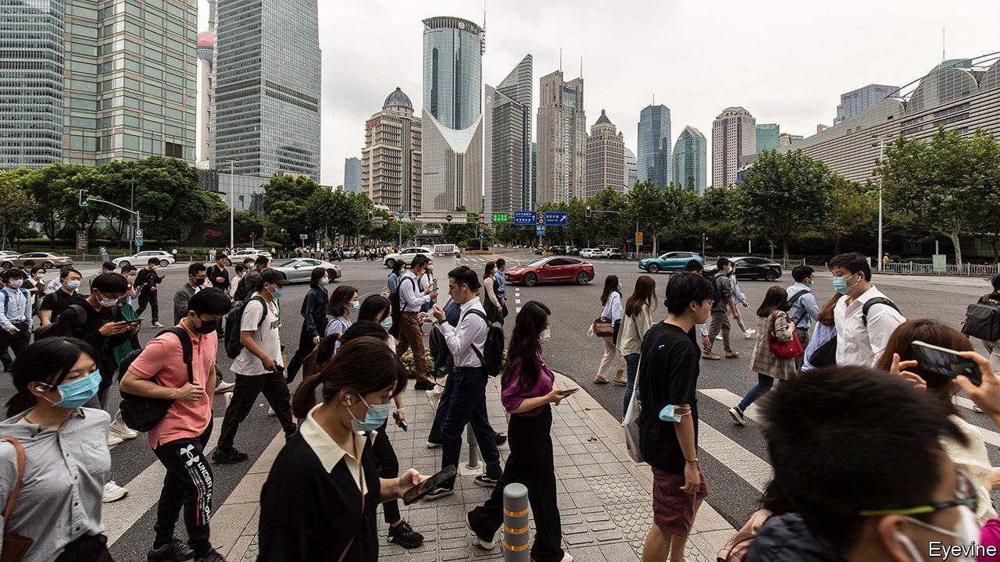

###### Moving to mid-levels

# Will the Chinese of tomorrow live like the Spaniards of today? 

##### Xi Jinping’s goal seems hard to imagine 

 

> Oct 20th 2022 

China’s Communist Party is known for its powers of political choreography and economic control. When its leaders gather at moments of pomp and portent, neither the public nor the economy is allowed to spoil the scene. Thus when the party met in 2017 for its twice-a-decade congress, the most important event in the country’s political calendar, the economic stage was expertly set. The currency was stable. Borrowing was tamed. And, as if on cue, China’s statisticians reported that the economy was growing a bit faster than the official target rate.

Five years later, as the country’s leaders began another week-long congress on October 16th, the economic backdrop was much less bright. Consumer spending has been depressed by  and its ever-present threat of lockdowns. The . And youth unemployment has risen to around 20%. In marked contrast with five years ago, Xi Jinping, China’s leader, has “botched the political business cycle”, as Barry Naughton of the University of California, San Diego, put it in a recent article.

None of these concerns loomed large in , which, as is customary, took a loftier, long-term view. He said China would aim to increase its GDP per person to that of a “mid-level developed country” by 2035, repeating a goal set in happier times two years ago. The target is ambitious but vague. It implies an income level of $30,000 or so, according to commentary last year from Liu Shijin, who used to work for a think-tank attached to the cabinet. That is close to Spain’s level of prosperity. If China’s GDP per person were to double in real terms from 2020 to 2035, and if its inflation-adjusted exchange rate rose by about 1% a year, its GDP per person would reach nearly $25,000 (in today’s dollars) in 2035. That is not too far from where Spain is now, although it is presumably far short of where Spain will be by 2035.

That the Chinese of tomorrow might live like the Spaniards of today seems hard to imagine right now. The economy this year will probably grow by less than 3%, far below the official target of 5.5%. On October 18th China postponed the release of a raft of economic figures, including growth for the third quarter. The data may have been delayed because they were off-message: economists had forecast growth of just 3.3%. Another possible reason would be less nefarious—and perhaps more telling. The officials required to sign off on the figures may have been unable to do so because they were stuck inside the strict quarantine bubble of the congress, reported Bloomberg News. Thanks to China’s zero-covid policy, the country’s policymakers have failed to produce a timely economic recovery. They cannot even produce punctual economic data. ■


