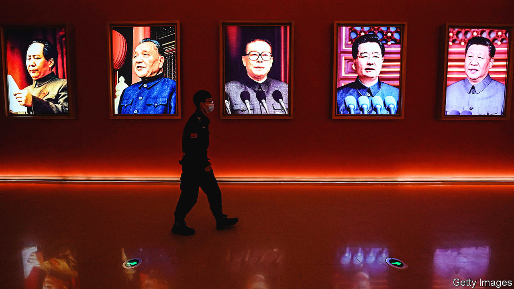

###### Heir unapparent

# Xi Jinping has no interest in succession planning 

##### The longer he clings to power, the harder it will be to engineer an orderly transition 

 

> Oct 20th 2022 

The Emperor Qin Shi Huang is celebrated for unifying China, starting its Great Wall and building himself a vast mausoleum, guarded by an army of terracotta warriors. Less widely known is what happened after he died in 210BC on a tour of eastern China. According to the historian Sima Qian, aides concealed the death until the imperial entourage reached the capital, in order to stop his eldest son and heir from taking power. They had food sent to the royal carriage and handled business from there as before. Carts of fish were placed nearby to mask the corpse’s stench. The ruse paid off at first. The eldest son committed suicide and a younger one, backed by the scheming aides, took the throne. But he proved weak. Within four years he was dead and the Qin dynasty collapsed.

Imperial Chinese history is littered with succession sagas tainted by bloodshed and skulduggery. Communist China was not much better for its first six decades. When Hu Jintao handed power to Xi Jinping in 2012 after ten years in office, it was the first complete, orderly leadership transition since the revolution in 1949. A decade later, however, Mr Xi is set to be granted a third five-year term—breaching the norms Mr Hu helped to establish—after the Communist Party’s congress ends on October 22nd. And with , China is once again confronting questions that have plagued its history. How does an all-powerful leader retire? And what happens if one suddenly dies or is incapacitated?

China’s succession norms were admittedly flimsy and mostly unwritten. Deng Xiaoping, who took power in 1978, introduced them to protect against Mao-era despotism and Soviet-style gerontocracy. That did not stop him from wielding huge power almost until his death in 1997, aged 92. His successor, Jiang Zemin, also meddled in politics long after retiring. Some see 2012 as an anomaly. Yet the partial institutionalisation of succession, combined with collective leadership, provided enough stability to underpin an extraordinary economic expansion. With the shift back to one-man rule, some scholars now foresee succession problems common to other modern-day autocracies—as well as China’s own emperors.

Among such scholars is Erica Frantz at Michigan State University, who has compiled and analysed data on 301 authoritarian regimes from 1946 to 2020. She and her colleagues conclude that as autocrats concentrate power in their own hands, they tend to extend their own tenure—often considering themselves indispensable and fearing elite recriminations if they retire. But that often comes at the expense of the regime they represent. “These choices that Xi Jinping is making are positive for him in the short term, but in terms of the longer time horizon, they are elevating the risk that the regime will see instability and perhaps an earlier collapse,” says Ms Frantz. 

One way for authoritarian regimes to enhance their resilience is to establish rigid term limits. The best example is Mexico’s Institutional Revolutionary Party, which enforced a one-term cap on the presidency while in power from 1929 to 2000. That is rare, though. Another way is to designate a successor, clearly and early. But autocrats other than monarchs often avoid that, even when old or sick. Some fear the elite will reject their choice, as when Zimbabwe’s Robert Mugabe tried to hand power to his wife in 2017. Others worry that the anointed heir will try to seize power prematurely, as Mao’s second one, Lin Biao, was accused of doing in 1971. 

Another concern for autocrats is that designating a successor implies an intention to step down imminently, limiting their options and undermining their authority. That is a more likely rationale for Mr Xi, who did not elevate a potential heir to the Politburo Standing Committee—the top leadership body—at the previous congress, as earlier norms required. Two or more next-generation Chinese leaders might be on the new Standing Committee to be unveiled on October 23rd. But none is considered a successor and Mr Xi, now 69, is widely thought to be planning another ten years in power, if not longer. 

Although that may foster stability by clearly signalling Mr Xi’s intent, it also increases the risk that he dies or becomes seriously ill while in office. Democracies can obviously face such problems too: America’s current president is 79. Unlike America, though, China has no clear line of succession or procedures for filling unplanned leadership vacancies. An autocrat’s sudden death or incapacitation seldom leads to regime collapse in the short term. The elite usually coalesces around a replacement to protect its own interests. But it can cause infighting. A bitter power struggle erupted in China even before Mao’s death in 1976. Ill health, often concealed from the public, can also cause the kind of paralysis that plagued the Kremlin under its hospital-bound leaders Yuri Andropov and Konstantin Chernenko.

Mr Xi appears in fine enough fettle. But as a portly former smoker who was a local official in a period when regular banqueting and heavy drinking were , he would be lucky to have avoided some associated ailments. And there have been occasional rumours of ill health, especially after he appeared to walk with a slight limp on a visit to Europe in 2019. The speech he gave at the congress on October 16th was about 90 minutes shorter than his three-and-a-half-hour marathon in 2017. Among the  on stage (many of whom now forgo the black hair dye they used in office), a white-haired Mr Hu (79) appeared markedly more frail than at past appearances—a reminder of how mortality could catch up with Mr Xi over the next decade.

If Mr Xi’s health endures, there is still time for him to identify one or more potential successors, possibly at the next congress in 2027 or the one after. But whoever replaces him will inevitably struggle to match his authority, especially if nominated relatively late. That is one reason why Nicolás Maduro, Venezuela’s president, has had trouble filling the shoes of Hugo Chávez, who named him as successor just three months before dying in 2013. China’s next leader will face an elite dominated by Xi loyalists and highly invested in the status quo—with no clear norms for how long to stay in power. “There will be power fragmentation and struggle after Xi’s rule,” predicts Yang Zhang of American University in Washington. “Without basic rules, succession means struggle. It’s just about when, and who will be involved.”

Research on China’s emperors reaches some similar conclusions. Yuhua Wang of Harvard University has compiled data on 282 emperors across 49 dynasties. He found that dynasties lasted for 70 years on average and the most common cause of collapse was elite rebellion. About half of all emperors died naturally. But identifying a successor made an emperor 64% less likely to be deposed. And their chances of dying naturally and preserving their dynasty increased further if they appointed an heir within five years of taking power—a similar timescale to the succession norms that Mr Xi is dismantling. 

Mr Xi may not have crunched the data in the same way. But he displays an avid interest in China’s imperial past, frequently quoting from historical texts. Mao, whom Mr Xi emulates in so many ways, was also a fan of China’s ancient history. He often referred to the “Zizhi Tongjian”, a chronicle published in 1084 that recounts the lessons learned from previous Chinese emperors. That did not help him engineer a smooth succession. Of his heirs, one died in prison, another was killed in a plane crash after a failed coup attempt, and the last was toppled after just two years in power. Perhaps Mr Xi will fare better. But the longer he clings to power, history suggests, the harder that becomes. ■


