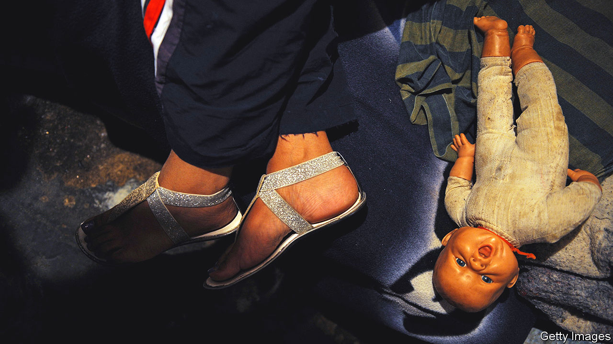

###### Home Entertainment

# Helen Garner was a pioneering chronicler of motherhood 

##### “Monkey Grip”, published in 1977, probed the tension between duty and freedom 

 

> Oct 20th 2022 

In 1972 Helen Garner lost her job as a teacher. She had led a frank discussion about sex with her young students and written an anonymous piece about it for a countercultural magazine, entitled “Why does the women have all the pain, Miss?” She was subsequently identified as the author, and the education department in the Australian state of Victoria did not take kindly to her freewheeling, expletive-laden pedagogical approach. Being sacked was the best thing that ever happened to her, Ms Garner later said, as “it forced me to start writing for a living.”

When “Monkey Grip”, Ms Garner’s first novel, was published five years later, it jolted Australia’s literary scene. It follows Nora, a young mother living in a communal household in Melbourne, who falls in love with Javo, a heroin addict with “violently blue eyes”. A parade of bohemians passes through the house, taking drugs, doing chores and co-parenting, as well as “swapping and changing partners—like a very complicated dance to which the steps had not yet been choreographed”. 

Until 1972, when the policy was scrapped, Australia had one of the world’s strictest censorship regimes. Books that were acceptable in America and Europe never made it past the customs officers who guarded the country’s ports. (A collection of 15,000 texts deemed blasphemous, indecent or obscene is now held at the National Archives in Canberra.) Readers’ tastes tended to be schmaltzy. Little wonder Ms Garner’s book caused a stir.

Some reviewers scoffed at the book, claiming she had merely turned her diaries into a novel, but others recognised that it was a trailblazing piece of what is now called autofiction, the transmuting of personal experience into stories. Both Patrick White and Raymond Carver were fans. In 1978 Ms Garner became the first woman to win the National Book Council Award, a prestigious Australian literary gong. The novel was adapted into a film, and later she displayed similar lyricism and directness in acclaimed narrative non-fiction books about a murder trial (“Joe Cinque’s Consolation”), sexual harassment at a university college (“The First Stone”) and a devastating family-violence case (“This House of Grief”). 

Inspired by Jean Rhys and Doris Lessing, Ms Garner captured some of the realities of womanhood. Her novel is particularly astute about the ambiguous feelings elicited by mothering, a theme that has been picked up anew by female writers in the 21st century. In an essay she wrote of her “speechless desolation” when contemplating the constraints of her own mother’s life. 

“Monkey Grip” encapsulates the tension between responsibility and freedom that women have always had to negotiate. Nora likes to spend her time reading books by Virginia Woolf or Henry James, writing her diaries and staying out all night at parties. She loves her child sincerely, yet there is something surreal about the role of parent. She finds it hard to shake the idea that “one day the real mother will come back, and I’ll only have been babysitting, and then I can go home.” ■

