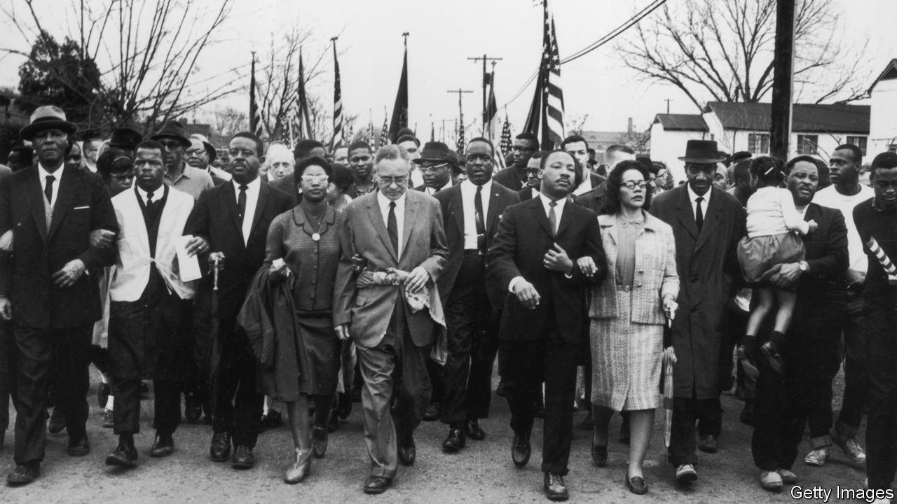

###### War without war

# How the civil-rights movement succeeded 

##### Thomas Ricks argues it had the strategic and tactical brilliance of a great military campaign 

 

> Oct 20th 2022 

By Thomas Ricks. 

Bull Connor, the commissioner of police in Birmingham, Alabama, had a message for the Ku Klux Klan: “By God, if you are going to do this thing, do it right.” That Sunday in May 1961, he promised the Klansmen 15 to 20 minutes to attack the passengers arriving on a Trailways bus before any police would show up. Using bats and clubs, they should “make them look like a bulldog got ahold of them”. The terrorists made the most of the opportunity.

How can people prepare to face such violence? The Freedom Riders—volunteers who rode on buses across the South to force the desegregation of the terminals—knew they could be killed. James Bevel, the civil-rights leader who dispatched many of them, asked each to write their eulogy so he could gauge their conviction. “If I can’t explain to your folks why you’re dead,” he told them, “I’m not going to send you.”

In “Waging a Good War”, his new history of the civil-rights movement, Thomas Ricks recognises in this episode an agonising challenge that he studied in his years as a military correspondent for the : how can commanders ready themselves to order, and their soldiers to undertake, missions that may be suicidal? Tracing the critical period from 1954 to 1968, Mr Ricks draws an elaborate parallel between the movement and a military campaign, finding common strengths in their shared emphases on training, discipline, logistics, planning and strategy.

The result is a peculiar, valuable book. Peculiar because the analogy can be strained, even inapposite (such as in comparing children who volunteered to march and be jailed to child soldiers); valuable as his focus prompts Mr Ricks to look past protests and speeches to the rigour, patience and vision that made them succeed. “The civil-rights movement was often creative, but it was rarely spontaneous,” he writes. “Its members did not just take to the streets to see what would happen.”

The movement is often misremembered as offering “passive resistance”, taking a beating like those passengers disembarking in Birmingham. It was, in fact, fiercely aggressive, much to the consternation of President John F. Kennedy, his brother Robert, the attorney-general, and white and even black moderates. A better term is “militant non-violence”, meaning any attack was to be met relentlessly by another non-violent action. Learning this discipline required workshops in the practice of non-violence which, says Mr Ricks, “the American military would call intense training and indoctrination”. 

One early trainee was John Lewis (pictured), the son of Alabama sharecroppers, who would one day become a member of Congress. “Did you hear what I said?” a racist sheriff said to Lewis, ordering him to retreat from the courthouse steps during a climactic confrontation in Selma, Alabama, in 1965. “Did you hear what I said?” Lewis reciprocated. “We are not going back.” There was, Mr Ricks observes, “nothing passive about Lewis’s response”.

In Mr Ricks’s telling, the civil-rights movement has a lot to teach the armed forces. Its openness to internal debate, its sensitivity to the sentiment of the local population, its attention to the end-game and consolidating its gains—all would have helped American commanders in (for example) Iraq. 

Yet the question of success also points up the limits of his analogy. The book would have been improved by a chapter elucidating the profound differences between war and militant non-violence. Unlike many wars, the civil-rights movement was not a zero-sum enterprise: its gains benefited everyone. One radical conviction at its core was that its adversaries were human beings deserving of empathy.

Look your attacker in the eye, volunteers were told; imagine him as a baby who has not yet learned to hate. They saw their goal not as victory but always as justice and reconciliation. That is a lesson not just for armies, or today’s online movements, but for polarised Americans in general. ■

