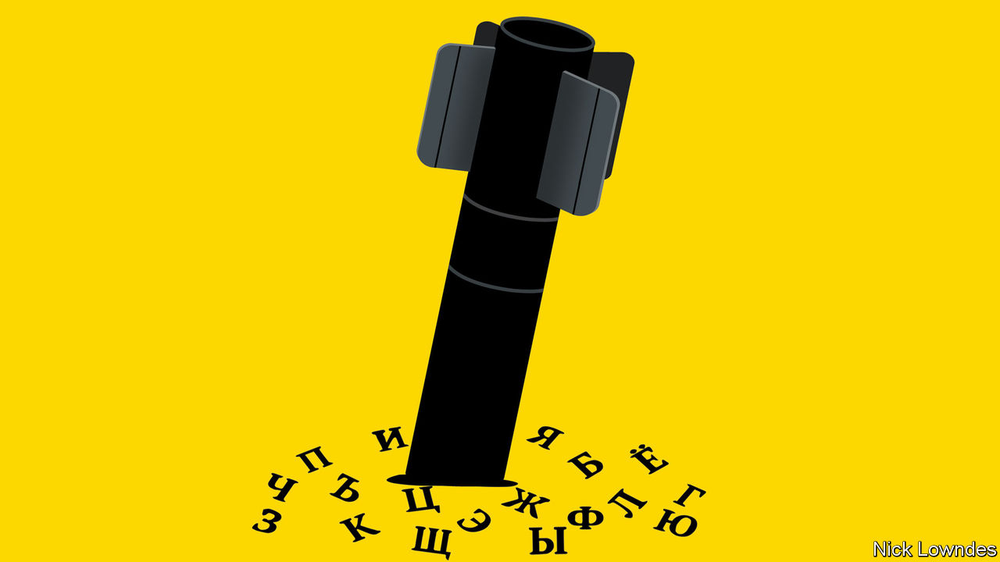

###### Johnson

# Ukrainians and Latvians are repudiating the Russian language 

##### The war, supposedly in defence of Russian culture, has been a disaster on its own terms 

 

> Oct 20th 2022 

IT WAS AS though the communities lived both on top of each other and entirely apart. Andrejs Vasiljevs, who runs a digital-translation company in Riga, recalls the divided schedule of his school in Soviet Latvia. Russian-speaking pupils studied in their mother tongue until one o’clock, then left; next Latvian students came and learned in theirs until the late afternoon. Lolita Cingane, a consultant and former politician, remembers two different schools, but one bus. It picked up the Latvian children first, then the Russians, who would taunt their counterparts by calling them orHans” (in effect, Nazis) before alighting at their separate school.

The Latvian- and Russian-language school systems were like “oil and water”, says Arvils Aseradens, the leader of Latvia’s governing party. Latvians learned Russian as part of their curriculum, but Russians hardly bothered with Latvian. After occupying Latvia in 1940, the Soviet regime brought over hundreds of thousands of Russians in a drive to militarise and industrialise the Soviet republic. It also sought to dilute Latvian culture. Russian became the lingua franca, needed for any serious work. When Latvia regained independence in 1991, the country was 48% non-Latvian.

Independent Latvia inherited the parallel Soviet school system and left it in place for a long time. Successive governments eventually passed laws requiring an increasing proportion of classes in Latvian as pupils move up through the years. In September Latvia’s parliament at last set a date for the end of the long transition. By 2025 all schooling must be in Latvian.

Latvians are frank about the reason: Russia’s brutal war on Ukraine. Latvians observe that the world now knows what it and the other Baltic republics have long been saying—that Russia will kill to get its old imperial possessions back. 

When Vladimir Putin first launched his invasion of Ukraine almost a decade ago, he claimed to be defending Russian-speakers and Russian culture from annihilation. It was a sham, of course: many proud Ukrainians under Russia’s hail of artillery and missiles have long been proud Russian-speakers, too. 

The countries that the Soviet Union most heavily Russified—Latvia, Estonia and Ukraine—were often tolerant towards their Russian-speakers after independence. Estonia and Latvia required knowledge of the national languages for citizenship; many Russian-speakers never learned them, leaving large numbers stateless. But despite efforts to encourage bilingualism, in all three countries it was possible to live a life almost entirely in Russian. The requirement to speak Latvian in classrooms was often ignored. Many teachers continued to speak Russian, and little effort was made to inspect or discipline them.

With the war, attitudes have hardened. Latvia, in addition to hastening its language transition, recently banned 20 Russian television channels. More controversial still was the tearing down of a monument in Riga celebrating the Soviet victory over Nazism. Some say that they notice Russian-speakers more readily switching to Latvian in public conversations. At a gathering in Riga for Ukrainians who wanted to thank Latvia for its support, says Ms Cingane, the two groups smiled shyly, exchanging few words. The Ukrainians did not speak much English, she notes, and nobody wanted to use the language they had in common: Russian.

In the very country where Mr Putin’s soldiers are killing Russian-speakers on a daily basis, the trauma has led Ukrainians, even those brought up in Russian, to switch languages en masse. Friendship groups are increasingly opting to converse in Ukrainian. Poets and academics have changed the language they use professionally. Refugee children in Russian-speaking families are making the extra effort to play in Ukrainian. Companies are changing, too. Oleg Gorokhovsky, a co-founder of Monobank, announced that the app would be switching to Ukrainian, saying: “The Russian language is associated with those who murder, rape, steal.”

Mr Putin famously bemoaned the end of the Soviet Union three decades ago as a great geopolitical catastrophe. But his effort to restore Russia’s empire and the dominance of its culture has been a calamity of his own making. Even if Mr Putin’s war really were for the sake of Russian, it has been a dramatically counterproductive one. Few men in human history have done as much harm to the Russian language. ■


