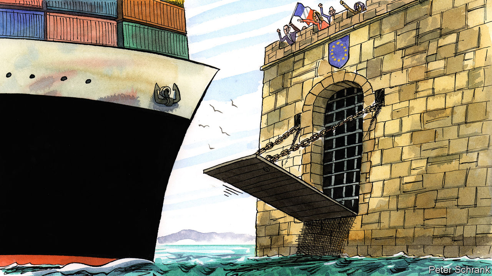

###### Charlemagne

# Europe’s ambivalence over globalisation veers towards scepticism 

##### The EU is turning French 

 

> Oct 20th 2022 

Pity the European policymaker trying to make sense of how voters feel about the outside world. Over three-quarters of EU citizens from Ireland to Greece say they are in favour of free trade. Globalisation is welcomed by an impressive six in ten Europeans, despite being vilified by lefties as a sinister American plot. It should follow that protectionism—essentially the opposite of free trade and the very thing to derail globalisation—would have few fans. And yet in the same series of opinion polls organised by the EU, far more Europeans say they feel warmly towards protectionism than oppose it. Not since Boris Johnson left Downing Street has anyone tried so brazenly to eat a cake and have it too.

The indecisiveness of the public is reflected in Europe’s approach to its economic arrangements. For the most part the EU is open to trade and welcomes foreign investment, part of a squishy consensus that free markets work (with a few corrective measures). At the same time, a protectionist instinct remains, and it has been gaining ground of late. Europe has been looking at the outside world, and is not sure it wants to be overly reliant on it. War on the continent’s doorstep, exploding Russian gas pipelines and endless trade fights between China and America—Europe’s two largest trading partners—have boosted those who would like to raise the drawbridge a touch. 

Think of it as Europe going French. For years Emmanuel Macron, France’s president, has talked up the idea of “strategic autonomy”. The concept is all-encompassing, but includes the idea that Europe’s economy should not be dependent on foreigners for critical inputs such as semiconductors or electric-car batteries. Underlining the point in thick marker-pen, France’s finance minister these days is also minister for “industrial sovereignty”; its agriculture honcho is minister for “food sovereignty”. To sceptics France’s pitch for economic self-determination is simply a way of re-upping its penchant for : becoming less reliant on American or Chinese imports offers a path to mollycoddling French firms, perhaps turning them into European “champions” in the process. 

This approach used to have enough critics for Parisian ploys to be foiled. Small countries, including the Netherlands, Ireland and Scandinavians, made their fortunes on foreign trade and pushed the EU towards more openness. Germany has similar interests, given its world-beating exporting firms. It also has its own liberal tradition, in which the state set the rules but (usually) did not interfere to decide which companies thrived. Crucially, Britain tipped the scales towards open markets, and liked rules that prevented France and others from doling out subsidies to favoured firms. The bits of the European Commission in Brussels in charge of negotiating trade deals or keeping a lid on state aid formed a liberal deep state, on hand to enforce the free-market mantra.

One by one, the opponents to have fallen by the wayside. Britain left the EU. That defanged the smaller northern European cluster that had long been its allies; a free-trading “Hanseatic league” they set up to lobby for a pro-globalisation approach disbanded after a time. The rise and rise of China spooked Germany, whose  of small firms went from being suppliers to Chinese companies to competing with them. Donald Trump’s election in America in 2016, and an ensuing trade spat with Europe, further highlighted the perils of relying even on age-old allies. Then the pandemic seemed to prove Mr Macron’s fears were well founded as Europe discovered how dependent it was on outsiders for everything from face masks to paracetamol. 

French claims that Europe was being naive when it came to trade—seemingly the only one playing by global rules—started to resonate. How could European firms bound by tough carbon-emission targets compete with Chinese ones left free to pollute? The Dutch, once ardent free-traders, began speaking of “open strategic autonomy”, sounding like Mr Macron with a different accent. French-infused remedies gained traction. The EU is now putting together plans for a carbon border tax, which liberal critics once decried as a form of green protectionism. Forget limits to state aid: under the aegis of a French commissioner, Thierry Breton, microchips and car batteries are receiving dollops of European cash. Investments by foreign firms into the EU are increasingly screened, better to keep corporate wrong’uns out of Europe. 

Et tu, Manu?

Hopes that the pendulum might swing back towards open markets have been dashed by the war in Ukraine. “The energy crisis, like the pandemic before it, shows that the state has worked,” says Jacob Kirkegaard of the German Marshall Fund, a think-tank. Subsidies to industry are flowing again. Germany’s self-serving belief that trading with autocracies would in time turn them into good liberals blew up in its face. Many people are asking whether German reliance on China for industrial exports might one day prove as foolish as its past reliance on Russia for gas imports. Joe Biden only partly removed Mr Trump’s tariffs, and is pushing “Buy American” measures with just as much vim (if a bit less bluster) than his predecessor. Governments featuring populists, as in Italy or Sweden, tend rather to like state capitalism 

What looked like a healthy tension between free-traders and their opponents may turn into a rout. After America infused its recent “Inflation Reduction Act” with green subsidies that only applied to stuff made at home, the EU at first aired a quiet protest. Allowing European firms to participate in America’s decarbonisation efforts would make the measures even more effective, suggested Margrethe Vestager, one of the remaining liberal stalwarts in the European Commission. If nothing else, that might avoid a new trade war. Mr Macron has picked a different tack, demanding Europe “wake up” and start favouring its own industries. In the past even sceptics of free trade only muttered such things in private. Now they are being said out loud. ■


