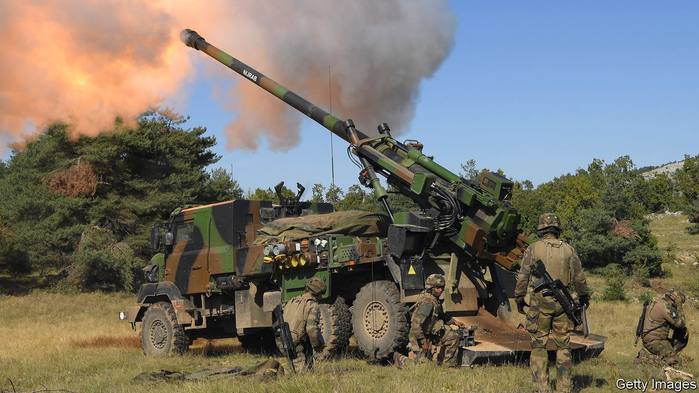

###### Say it with metal

# France is sending weapons and air-defence systems to Ukraine 

##### New transparency over arms deliveries also exposes their limits 

 

> Oct 18th 2022 

“ROMANTIC gestures take many forms,” began a witty clip posted by the Ukrainian defence ministry on October 12th, with images of red roses, chocolates and sunset over the city of Paris. “But if you really want to win our hearts,” it went on, “nothing beats 155mm highly mobile self-propelled artillery.” Designed as both a cute and serious message to the French government, the video concluded “. Please send us more.”

The Ukrainians could scarcely have hoped for a swifter response. That evening President Emmanuel Macron announced that France would send six more Caesar howitzers, in addition to the 18 already delivered, as well as anti-aircraft systems, radars and more. On October 15th Sébastien Lecornu, his defence minister, spelt out the details. France would send Crotale air-defence systems, to be operational within two months, and train 2,000 Ukrainian soldiers. It is also looking at sending LRU multiple-launch rocket systems (MLRS), similar to the . Some reports suggest that three of the French systems are already on the ground.

This shift in the French approach to arming Ukraine is doubly arresting. First, the country is talking more about what it is doing. Although France exported arms to Ukraine long before Russia’s invasion in February, it has since insisted that such information is classified, and that disclosing it would compromise Ukraine’s battle plans. France contests the , for instance, by Germany’s Kiel Institute. Those suggest that, between January 24th and October 3rd, France offered just €220m ($216m) in military aid, or under 2% of the total pledged to Ukraine, less than Britain, Germany, Poland and Norway. 

Mr Macron’s critics put this meagre effort down to his ambition to act as a  between Russia’s Vladimir Putin and Ukraine’s Volodymyr Zelensky. French officials argue instead that the numbers simply understate their contribution, which includes classified quantities of anti-tank missiles, shoulder-launched anti-aircraft missiles, armoured vehicles, ammunition, intelligence and other aid. They add that France, unlike some others, delivers what it promises, and sends only what Ukraine specifically asks for. Stung by criticism, though, France seems to have decided that it is now time for a bit more disclosure.

Second, the French contribution has come under increasing scrutiny at home. After a visit in September to the main military-aid hub in Poland, François Heisbourg, a military specialist, agreed that French weaponry did indeed constitute under 2%, in tonnage, of all deliveries to Ukraine. Upstaged by smaller European countries with far less military might, France has started to debate whether this share is enough. “Every day Ukrainians are dying for freedom in Europe,” Benjamin Haddad, one of Mr Macron’s deputies, told parliament on October 3rd. Sending more weaponry, he said, would show that France can “live up to their sacrifice”.


The new French announcements “look like a step change”, says Mr Heisbourg. The expected delivery of MLRS, he notes, “puts the French on a par with similar transfers by Britain and Germany”. Three such systems could be operational within three to four weeks. Ukraine has also ordered motorised floating bridges. That is financed by a new French fund, worth €100m, for the country to buy kit directly from France.

The tougher question may be how much further France could go. France and Britain each spend about 2% of GDP on defence. Yet so far a gung-ho Britain seems to have had fewer qualms about eating quite deeply into stocks of some of its key weapons in order to supply Ukraine. The 18 Caesar cannons represent nearly a quarter of the French army’s entire stock. The extra six will come off a production line from Nexter, a French firm, as part of an order originally destined for Denmark. Three French MLRS would represent nearly a quarter of what the army possesses. 

Mr Zelensky has also asked France for its SAMP/T anti-aircraft defence system. But the country owns just eight. The French are keenly aware of the risks of depletion. “The right balance”, General Pierre Schill, head of the French army, told a parliamentary hearing in July, “would be not to give up too much of our equipment.”

“In French strategic thinking, liberty of action is everything,” says Michael Shurkin, a senior fellow at the Atlantic Council, an American think-tank. The French want to be able to engage independently in the full range of warfare, and want the tools to give them those options. So they are cautious about depleting stocks in a way that might impede this. Moreover, the French army has over time become focused on expeditionary and counter-terrorist operations, rather than the sort of high-intensity land warfare that requires massive reserves. As a consequence, in Mr Shurkin’s words, France is “a strong ally stretched thin”. In short, France is making its military support for Ukraine clearer than ever. But it may not have a lot more to give.■


