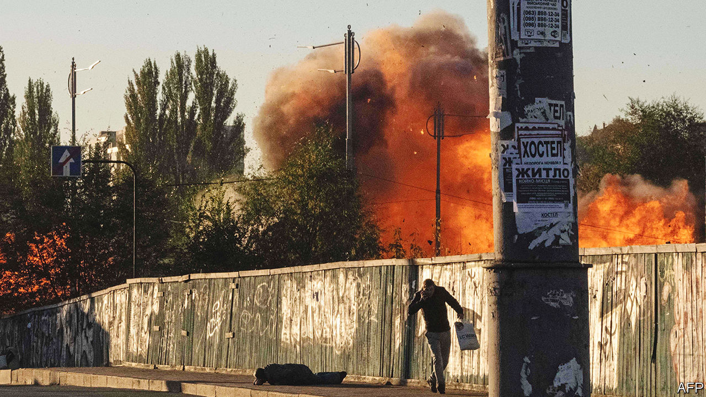
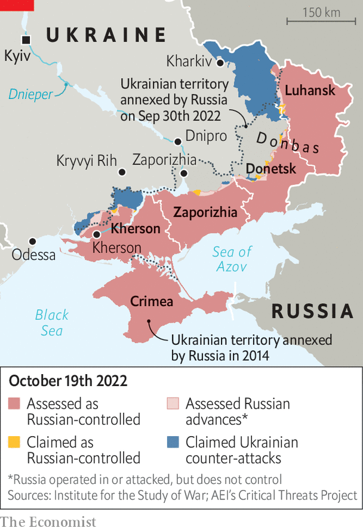

###### Shooting Shaheds

# Iranian drones pose a fiendish military problem for Ukraine 

##### Shahed-136s can be sent in large volleys from several directions, overwhelming air defences 

 

> Oct 19th 2022 

THE ALARM came around 8am. A worker at the power station on the outskirts of Dnipro was telling his crew to take cover when the windows blew out. A cruise missile struck a small building nearby. A second hit soon after. With huge plumes of smoke rising, police officers arriving at the scene were met by a stampede of stray dogs running away. 

The explosions on October 18th knocked the plant at Dnipro off the grid, though most power was restored within hours. On the same day Iranian-made drones blasted the town of Kryvyi Rih, about 150km to the west, where a few days earlier a drone had hit an electrical substation, risking a blackout at a hospital. There were more drone and missile attacks across the country. In Kyiv they cut power to an eastern part of the city.

 


Russia’s strikes on Ukraine’s cities—more than 400 since October 10th—mark  The aim is to cripple the country’s infrastructure and demoralise the population as winter approaches. Ukraine’s president, Volodymyr Zelensky, says the country has lost 30% of its power stations. The government is starting to restrict electricity supplies, accusing Russia of “killing by freezing”.

Russian strikes often simply aim to sow terror. But they do not appear to have affected Ukraine’s ability to fight. As of October 19th Russian-installed officials were evacuating civilians from the occupied city of Kherson, which forms a pocket on the western bank of the Dnieper river, in anticipation of a Ukrainian assault. General Sergei Surovikin, the new commander of Russian forces in Ukraine, admitted he may have to make “difficult decisions”, which may refer to a withdrawal. Also on October 19th a nervous Russia imposed martial law in the Ukrainian lands it had recently annexed.

Western countries say deliberate attacks on civilian targets amount to war crimes. They have promised to  to Ukraine, especially air-defence kit, and are debating new sanctions against Iran. Western officials say Russia is short of high-end ballistic and cruise missiles, and its arms factories, hit by Western sanctions, are struggling to make enough new ones. As a consequence Russia must rely on Iranian weapons. 

Assembled from commercially available components, the delta-winged Shahed-136 drone flies slowly and carries a small warhead—about 50kg, instead of the more usual 450kg or more for ballistic and cruise missiles. Its distinctive buzz has earned it nicknames such as “moped” and “farter”. Unlike the fancy loitering munitions America has been supplying to Ukraine, it is more of a flying bomb, aimed at fixed sites through a combination of mechanical guidance and commercial satellite-navigation. It can be shot down by anti-aircraft missiles, aircraft or sometimes even with a rifle. Its navigation signal is vulnerable to jamming.

Quantity trumps quality

But it is small and flies low, so is hard to spot. More important, it is cheap—a fraction of the cost of more sophisticated weapons, and often less expensive than an air-defence missile. So Shahed-136s can be sent in large volleys from several directions, overwhelming air defences. 

Ukraine says it has destroyed 60% of the Shahed-136s Russia has fired so far, but lots still get through. Their warheads may be too small to destroy fortress-like power stations. But they “do not attack thermal power plants themselves; they attack substations that supply the grids with electricity,” says Antonina Antosha, spokeswoman for DTEK, which owns the Dnipro plant. 

Ukrenergo, which runs Ukraine’s grid, says it has thus far been able to restore at least some power within a day in areas blacked out by missile strikes. It has maintained its links to the , which it established soon after the invasion so that European countries could supply it with power in an emergency. But if the bombing campaign is protracted, as seems likely, repairing the system will get harder. DTEK says it is critically short of many components, including mobile substations and specific types of circuit breakers, power transformers and cables.

That makes defending against drones all the more urgent. But how? Use too many missiles against the drones, or pull air defences back to protect cities, and front-line troops become more vulnerable to attack by Russian aircraft. Western armed forces are themselves short of air-defence systems.

A better answer, says Philip Breedlove, a former commander of NATO, is to improve the integration of existing sensors (eg, radars) with shooters (eg, missiles). A portable Stinger anti-aircraft missile can easily knock out a Shahed-136, but the soldier’s only “sensors” are his eyes and ears. If he had better warning of what was coming from which direction, he could position himself to have a much better shot, says General Breedlove. 

Integrating military systems is a headache for Western forces in peacetime. Doing it in the midst of a war, with donated weapons of many vintages, will be fiendishly difficult. Once again, Ukraine is the testing ground for 21st-century warfare. ■


