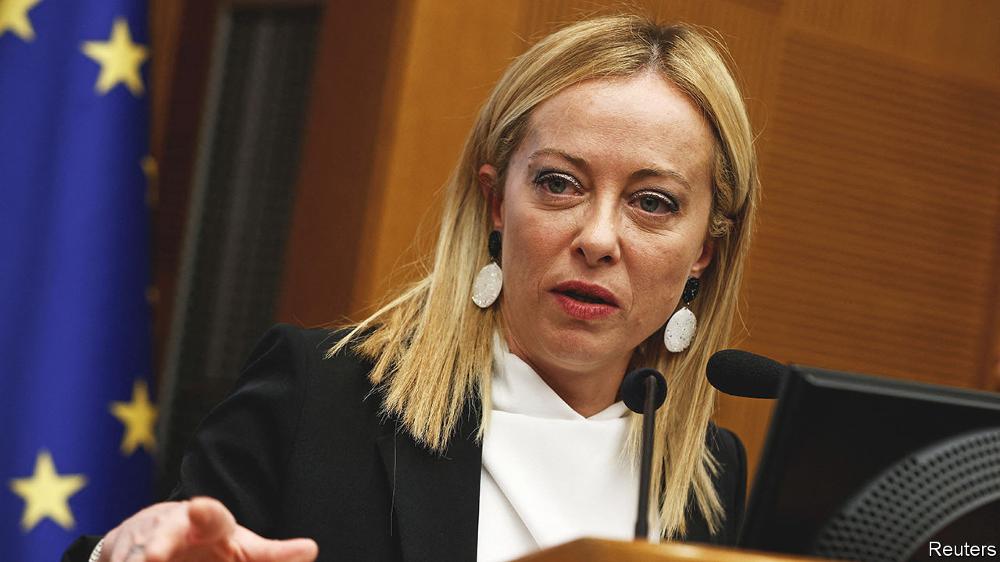

###### Not so easy

# Italy’s coalition-building runs into trouble 

##### Silvio Berlusconi, as ever, is a problem 

 

> Oct 20th 2022 

It looked as if it was going to be simple. Voters last month handed the right its first clear parliamentary majority since 2008. And since the Brothers of Italy (FdI) party won far more votes and seats than the other parties in the conservatives’ alliance, it was clear that its leader, Giorgia Meloni, would be prime minister. All they had to do was share the spoils of victory: the cabinet posts and speakerships.

Yet by October 20th, when President Sergio Mattarella was due to start the consultations that precede the formation of a new government, doubts were rife about the stability of the next administration and its readiness to join Italy’s traditional allies in standing up to Russia. The reason? One that has bedevilled Italian politics for almost 30 years: Silvio Berlusconi’s legal problems. The 86-year-old Mr Berlusconi—yet again on trial, this time for allegedly bribing witnesses—wants the justice portfolio for his party, Forza Italia. Ms Meloni would prefer that it went to a retired prosecutor.

The first sign of trouble came when Forza Italia tried and failed to block Ms Meloni’s choice for speaker of the Senate, Ignazio La Russa. From his seat in the upper house, a furious Mr Berlusconi dispatched the victorious candidate with an obscenity and was later photographed with what was apparently an unflattering pen portrait of Ms Meloni: “opinionated, domineering, arrogant and offensive”, he had written. Ms Meloni tetchily replied that he had forgotten another trait: “I can’t be blackmailed.”

A meeting between the two appeared to yield a truce. They agreed the right should present a united front to Mr Mattarella, and Mr Berlusconi later insisted the defects he had listed were not Ms Meloni’s. But the next day he claimed—though Mr La Russa denied it—that Ms Meloni had accepted his choice of justice minister. Then a recording of Mr Berlusconi was leaked that was deeply embarrassing for the prime minister-in-waiting. In one passage, he could be heard claiming that he had wrung from her an additional cabinet seat for Forza Italia; in another, that he had renewed his long-standing friendship with Vladimir Putin. In a longer version of the recording leaked the next day, he appeared to go further, blaming the war on Ukraine.

That is diplomatic poison for Ms Meloni, who has strived to reassure America and NATO that her government would support Ukraine, notwithstanding Mr Berlusconi’s history of friendship with Mr Putin and the admiration for the Russian leader expressed in the past by her other main ally, Matteo Salvini of the Northern League.

Mr Berlusconi’s mischief-making highlights the lengths to which he is willing to go to protect his interests. But it obscures the weakness of his position. The reason Forza Italia failed to block Mr La Russa was that at least 17 opposition senators voted for him in a secret ballot. Why, given that Mr La Russa is among the least repentant of the former neo-fascists in Ms Meloni’s party? A theory doing the rounds was that a centrist group was signalling willingness to replace Forza Italia in a future coalition. The centrists denied it. And they would anyway account for only nine of the 17 rogue votes—though that would be enough to guarantee the right a majority (albeit a slim one) in both houses. Mr Berlusconi is skating his Russian dance on thin ice. ■

