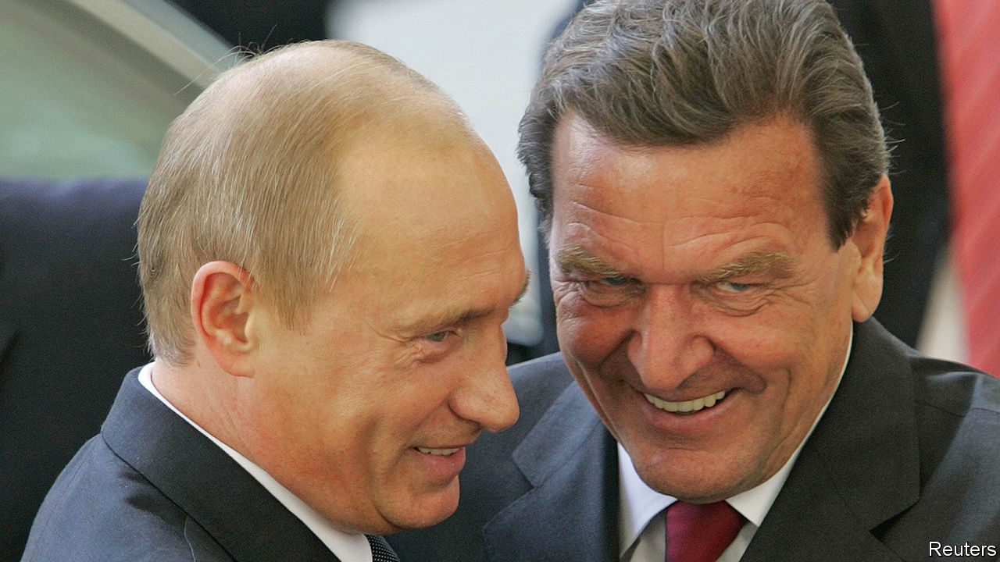

###### Russia’s waning influence in Germany

# Russia was more deeply embedded in German politics than suspected 

##### But that has changed fast 

 

> Oct 20th 2022 

At a trade congress in early October Olaf Scholz, Germany’s chancellor, declared that he “always” knew Russia would use its energy resources as a weapon. But in 2016, when he was vice-chancellor and his Social Democrats were the junior partner in a coalition led by Angela Merkel, Mr Scholz said it was simply “not correct” to suggest that Nord Stream 2, a second gas pipeline across the Baltic Sea, might make Germany too dependent on Russia. 

The chancellor’s memory may be faulty, but since Russia’s invasion of Ukraine in February his government has radically decoupled Germany from Russian energy supplies, even as it has showered diplomatic, financial and military support on Ukraine. And there is no evidence that Mr Scholz was ever an ardent —an apologist for Vladimir Putin, Russia’s president. Alas, all too many other prominent German politicians, businessmen, academics and even sports stars did indeed act as shills for Mr Putin. Hinting at the depth of Russian penetration, it was revealed on October 17th that Arne Schönbohm, the head of Germany’s cyber-security agency, is being investigated over suspicions of links to Russian intelligence.

To be fair, Mr Schönbohm’s links appear tenuous: before taking office he ran a cyber-security trade group, some of whose members appear to have had fishy pasts. Plenty of cases are more clear-cut. Consider Matthias Warnig, a former officer in the notorious Stasi, East Germany’s secret police. Later, Mr Warnig used these connections to help German companies gain a toehold in post-Soviet Russia. Mr Warnig did very well, eventually becoming CEO of the $10bn Nord Stream 2 project. In 2014, soon after Russia annexed Crimea, provoking a barrage of Western sanctions, Mr Warnig was Mr Putin’s host at a lavish party in St Petersburg. The party honoured Gerhard Schröder, a former chancellor of Germany, on his 70th birthday. One of Mr Schröder’s last acts in office had been to push through the first Nord Stream pipeline. In “retirement” Mr Schröder has served on the boards of the state-controlled Russian energy giants Gazprom and Rosneft, in addition to Nord Stream 2’s.

Thanks in part to such high-level influence, by last year Germany had grown to depend on Russia for more than half of its gas supply. German firms had also sold infrastructure, such as refineries and storage facilities, to Gazprom and Rosneft. Mr Scholz’s government has now nationalised those assets, ceased imports of Russian gas and allowed Nord Stream 2 to go bankrupt. But as the tide of Russian influence recedes, what stands exposed is more than prominent fixers such as Mr Schröder or Mr Warnig. Russian energy firms appear to have constructed an entire archipelago of influence operations.

In a recent exposé of what it calls the Gazprom Lobby, an investigative team from Correctiv, an online news portal, revealed a web of links between German politicians, German energy concerns and a clutch of seemingly innocuous NGOs. These groups energetically sponsored conferences and all-expenses-paid trips to Russia. The table-talk among their members tended to paint Western condemnation of Russia’s invasion of Georgia in 2008 and of Crimea in 2014, and of assassination attempts against Russian dissidents, as overblown and hypocritical.

Rather than focusing on the centre of Germany’s federal government, Russia’s lobbyists appear to have targeted leaders at the state level. Among the members and distinguished guests of such well-funded outfits as the German-Russian Raw Materials Forum, the German-Russian Chamber of Foreign Trade and a short-lived Dialogue of Civilisations Research Institute were numerous former and serving minister-presidents of Germany’s 16 federal states. 

At one typical event in the eastern state of Mecklenburg-Vorpommern in 2018, more than 800 guests celebrated Russia Day. Manuela Schwesig, the state’s minister-president, beamed as a deputy minister in Mr Putin’s government praised her state, Nord Stream 2’s terminus, as “a kind of outpost for us in Europe”. Ms Schwesig now admits that supporting the pipeline was a mistake. Her Gazprom-funded NGO has closed. Similar  have flowed from business leaders and politicians. Mr Schröder and Mr Warnig, the former Stasi spy, have disappeared from the public eye. Several Germans who acted as unofficial observers for a sham independence referendum in the Donbas in September were promptly fired. 

On the fringes, Mr Putin’s investment in influence-peddling still pays dividends. The Russian narrative of pursuing a noble struggle against Western hegemony gains traction among the far left and far right. Some fashionable intellectuals still sniff that the West fails to “understand” Russia. But between July and September, support for Mr Scholz’s Ukraine policy rose from 70% to 74%. ■


