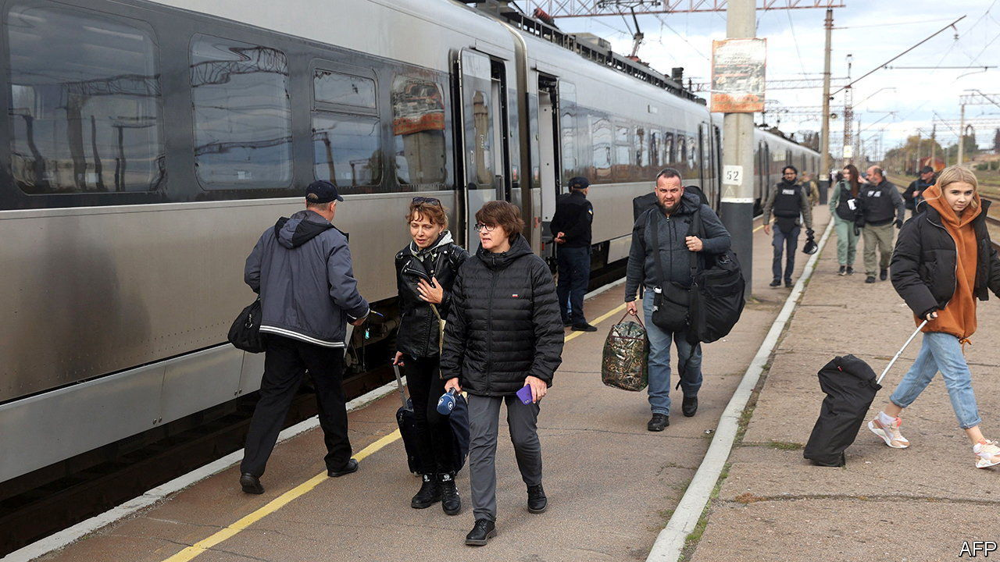
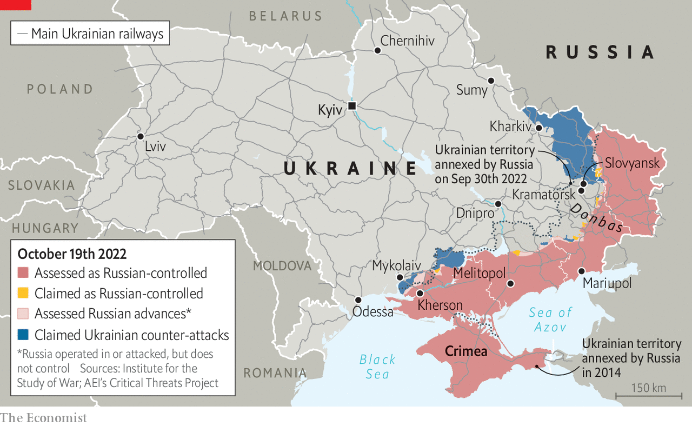

###### The Kyiv-Kramatorsk express is back

# Ukrainian Railways reconnects a city scarred by a bombing 

##### The resilience of the network is a wonder 

 

> Oct 20th 2022 

KYIV’S CENTRAL train station is a majestic example of Soviet neo-classical architecture, all soaring arches and granite tiles. In the early days of the war thousands of locals desperate to escape Russia’s invasion slept on the floor here, stumbling over each other during air-raid blackouts as they waited for the next train west. Now it hosts happier stories. On October 14th Alina, a young woman holding a bouquet of yellow and blue flowers, was in the main hall waiting to meet her sister, who had fled to Poland. “I haven’t seen her for eight months,” she said, fighting back tears.

Meanwhile on Track 1, Ukrainian Railways was preparing for the departure of the first train to Kramatorsk, a city in the country’s east, since its station was bombarded by Russia on April 8th. The missile attack struck amid crowds of civilians fleeing Russia’s advance. Sixty people were killed, including seven children. Gruesomely, Russian soldiers had painted the words “for the children” on a missile casing. Now the line was back in service, with one of Ukrainian Railways’ newest and fastest trains, capable of 140km an hour. “We made an unscheduled trip [in advance] to check that the tracks were not mined,” said Oleksandr Shevchenko, deputy head of Ukraine Railways’ passenger division. 

 


To do it, the train made a detour to avoid a bridge knocked out by the Russians. Such rerouting is possible because the 20,000km-long rail network which Ukraine inherited from Soviet times is reasonably dense. The railways carry a very large share of the country’s intercity traffic. Even before the war about half of land-passenger-kilometres were by rail, a much higher share than in Germany or France, despite having less track.

When the war began, trains became the workhorses of the refugee-evacuation effort, carrying millions of Ukrainians to the Polish and Hungarian borders. Since then, with the skies too dangerous for aircraft, they have become even more important. Dispatchers ride the lines incessantly, rerouting trains when the tracks are damaged. Nearly all of the locomotives and half of passenger carriages are over 40 years old, but buying new carriages and electrifying more track have been postponed in favour of urgent repairs. The railways have also acquired new roles, such as carrying visiting dignitaries. With Ukraine’s airports closed, trains have become the standard way for foreign cabinet ministers and presidents to reach Kyiv. The rail company calls this “iron diplomacy”. 

Viktoria and her sister were heading home to Slovyansk, a city next to Kramatorsk. In July, during the Russian advance, Slovyansk was only a few kilometres from the front lines, and it was shelled mercilessly. Ukraine has since driven the Russians back some 20km. “We stay there because we have nowhere else to go,” Viktoria said. “But you have to send your kids elsewhere, because the things you see and hear there aren’t for children.”

But the re-established route is a success, Mr Shevchenko says. By the second day passenger numbers had risen from 49 to over 300. Now he has other challenges on his mind. On October 17th Russian drones struck electrical infrastructure near Kyiv’s central station. Passengers were stuck in its bomb shelters, at risk of missing their departures. But the trains, Mr Shevchenko said, could not wait; they left on time. “There should be something that is predictable during war.” ■


