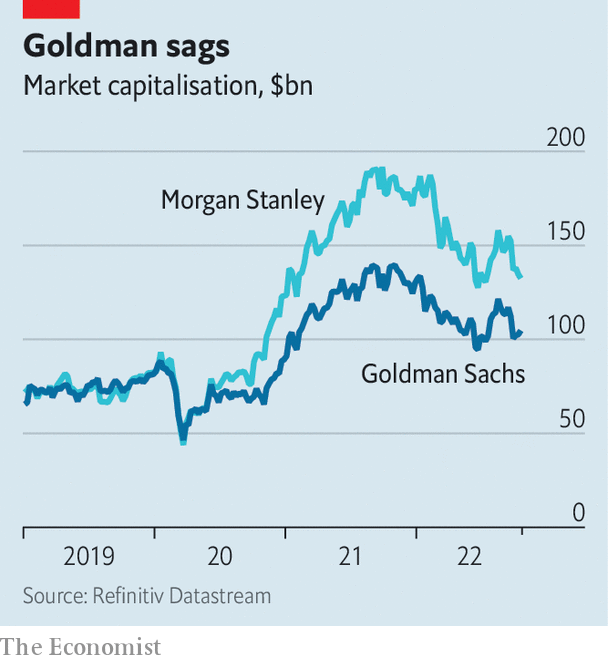

###### Stick to Wall Street

# Goldman Sachs’s disastrous Main Street gamble 

##### The firm announces a third reshuffle in almost as many years 

 

> Oct 18th 2022 

How hard can it be? Goldman Sachs is supposed to employ the sharpest minds in finance. Traders on the other side of a deal shake in fear; bosses flock to its bankers for advice; investors hang on its analysts’ every word. In 2016, when Goldman launched its consumer business, it seemed only a matter of time before these masters of the universe mastered the pedestrian business of making loans to ordinary people. But it is clear now—after the third reshuffle in almost as many years was announced on October 18th—that Goldman should have stuck to Wall Street.

Profits are falling across the big banks as the economic cycle turns. High interest rates are killing lucrative investment-bank revenues and putting pressure on consumers. In the third quarter, compared with a year ago, net income fell by 17% at JPMorgan Chase, 25% at Citi, 29% at Morgan Stanley—and by a whopping 43% at Goldman. This partly reflects its dominance of businesses that have slowed sharply, like investment banking. But it is also because, without those vast profits in trading and investment banking to distract shareholders, the turn in the credit cycle is revealing just how terrible Goldman is when it comes to consumer lending. 

 


Its consumer bank was launched in 2016 by Lloyd Blankfein, Goldman’s previous boss, with a savings account called Marcus, which was named after the firm’s founder. A more aggressive move into consumer lending then followed—led by David Solomon, the firm’s current boss—with a credit card offered in partnership with Apple. A comparison with JPMorgan’s lending business shows just how far behind Goldman is. Goldman’s loan book is a sixth of the size of its rival’s; its consumer loan book is a ninth as big. And the firm is setting aside relatively more for credit losses in the third quarter. Goldman anticipates losing 13% of its consumer credit-card and instalment loans. JPMorgan expects to lose just 6%. 

The reshuffle will split up Goldman’s consumer bank, bundling its consumer savings and wealth products into the asset-management arm, and sticking the lending ones into a new “platforms” business, where they will sit alongside wholesale and business banking. This might help to disguise some of the consumer bank’s thorniest problems. The reshuffle will also wrap together the firm’s trading and investment-bank businesses, which should make it easier for shareholders to compare Goldman’s performance in its Wall Street businesses with those of its rivals, like Morgan Stanley or JPMorgan, who organise themselves this way. 

Yet even a broader comparison does Goldman few favours nowadays. Since 2019, as Goldman has focused on its consumer bank, Morgan Stanley has doubled down on its asset-management offering. It has acquired Eaton Vance, an asset manager, and e*trade, a retail broker. A quick look at market capitalisations is all it takes to discern which strategy is preferred by investors (see chart). 

In 2019 Harit Talwar, then boss of Goldman’s consumer effort, is supposed to have “thanked” Julian Salisbury, one of the investment bank’s top earners, for “making all the money we’re spending”. The joke was hardly a rib-tickler at the time, and it is rather less funny now. But at least Goldman’s rivals are laughing. ■


