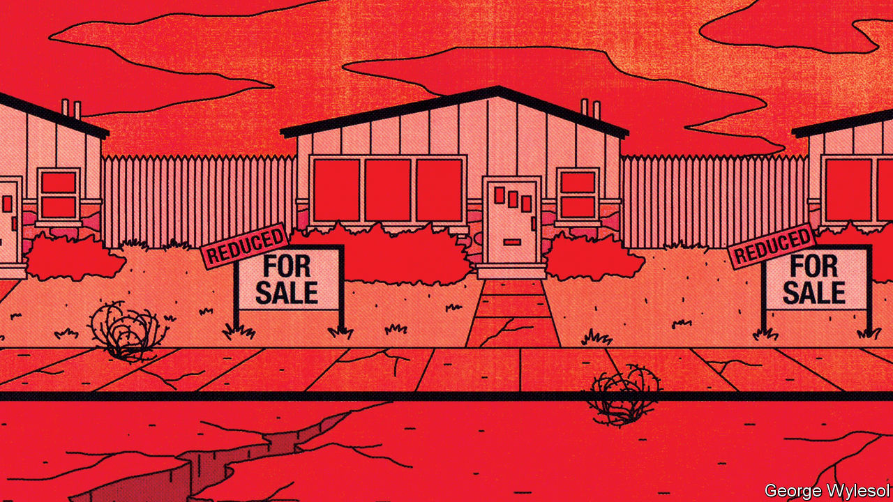
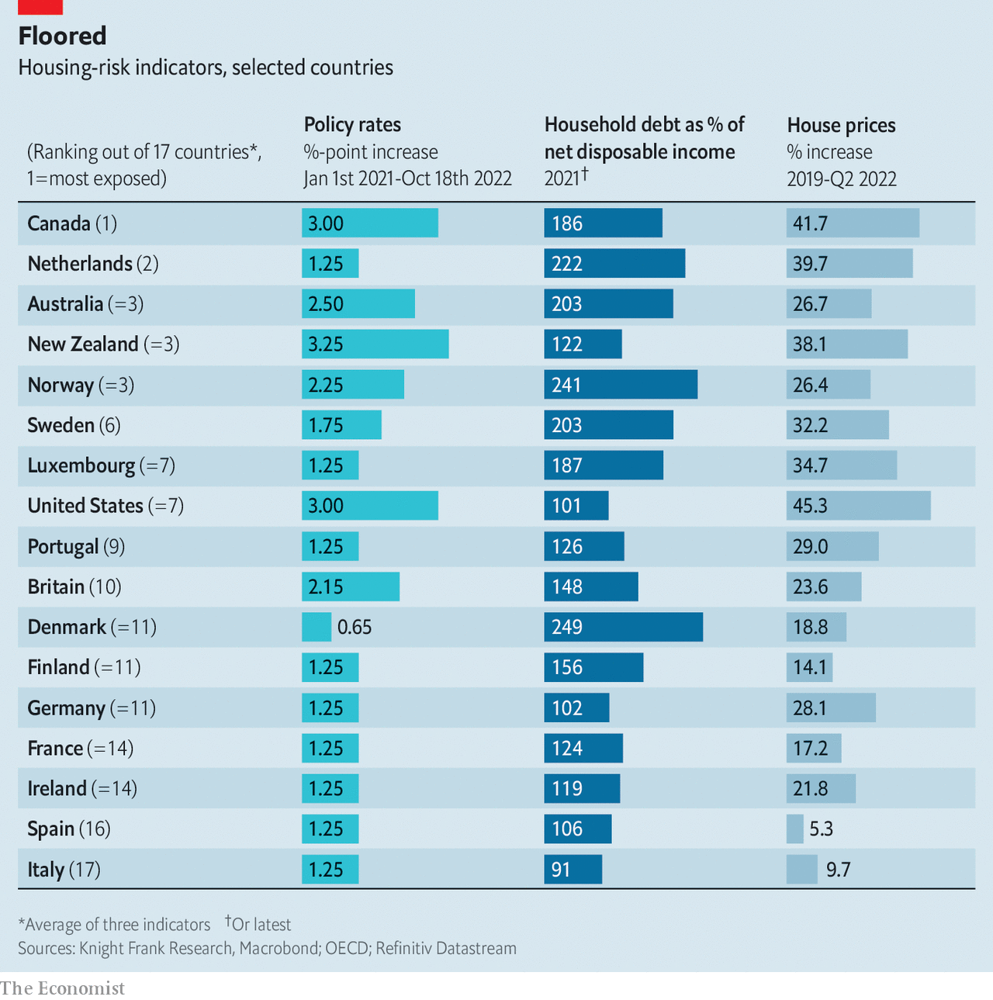

###### The boom is over

# Housing markets face a brutal squeeze 

##### How bad will things get? 

 

> Oct 20th 2022 

For two years during the covid-19 pandemic, home-sellers in Quakers Hill, a suburb in the farthest reaches of Sydney’s sprawling west, raked in fortunes. Some 60 or 70 viewers would traipse round every house up for sale, recalls Josh Tesolin of Ray White, an estate agent. Buyers jostled at auctions, bidding well above the odds. “We’d ask for, let’s say, $1m and sell at $1.4m,” says Mr Tesolin. “The market back then was crazy—a very different picture to now.” This year prices in the neighbourhood have fallen by 20%, he estimates. Owners are pulling their homes, because they cannot sell them for as much as they want. The market is gumming up.

Australian house prices have dropped for five straight months, placing Quakers Hill at the forefront of a global trend. As central banks race to tame inflation, they are raising interest rates at the fastest pace in at least four decades—which is now translating into housing-market carnage. Prices are falling in nine of the 18 countries monitored by Oxford Economics, a consultancy, and are dropping fastest in the most overheated markets. In Canada and Sweden they have fallen by more than 8% since February; in New Zealand they have fallen by more than 12% since their peak last year. Prices have begun sliding in America and Britain, too. Many other countries are heading in the same direction. 

Transactions are also down. Home sales in America fell by a fifth in August, compared with the previous year, according to the National Association of Realtors, a lobby group. In New Zealand, quarterly sales were at their weakest since 2010 in the three months to June. The share prices of large British builders, such as Barratt and Taylor Wimpey, have halved this year. Those of dr Horton and Lennar, America’s biggest, are down by more than 30%. 

This represents the end of a long boom—one which many homeowners have come to take for granted. Rock-bottom mortgage rates and constrained supply fuelled a steady rise in rich-world house prices in the decade after the global financial crisis of 2007-09. Prices in America, for instance, rose by nearly 60% from their trough in 2012 to the end of 2019. Then came the pandemic, during which prices truly rocketed. In America, Canada and the Netherlands they are up by more than 30% since 2020. Lockdowns and the shift to remote work increased demand for suburban properties with gardens or offices. Governments, worried about a housing crunch as covid spread, temporarily eased or removed mortgage regulations, making it easier to buy. Pandemic savings helped first-time buyers stump up hefty deposits. 

But interest-rate rises have now returned mortgage rates to levels not seen for decades. A year ago the 30-year fixed-rate mortgage in America was below 3%. Today it is only a little shy of 7%. In New Zealand, mortgage rates have passed 7% for the first time in eight years; in Britain, the average five-year fixed-rate loan now exceeds 6% for the first time in a dozen. This will make life more difficult for prospective buyers, and will increase the chance of distress among existing homeowners. It is a change that is likely to carry uncomfortable political and social consequences for many years to come.

Three factors will determine where the pain is most acute, and thus where these consequences are most likely. The first is recent price growth. Housing markets where prices have surged since the pandemic are especially vulnerable to cooling demand. While many rich countries slowed to annual growth rates in the single digits at the start of this year, America and Canada maintained double-digit rises, fuelled by huge demand for housing in the mountain towns and sunbelt states that attract well-heeled Californians and New Yorkers, along with cities like Toronto. 

Borrowing levels are the second factor. The higher household debt is as a share of income, the more vulnerable owners are to higher mortgage payments and defaults. Central bankers will find solace in the fact that household debt relative to income is lower than it was on the eve of the global financial crisis in countries including America, Britain and Spain. Yet some countries face a mountain of debt. This makes them sensitive to even small rises in mortgage rates. Households in Australia, Canada and Sweden, which managed to escape the full brunt of the financial crisis, have run up staggering borrowings in the years since, prompting warnings from financial watchdogs. As Stefan Ingves, governor of Sweden’s central bank, has put it: “It’s like sitting on top of a volcano.”

 


The third factor is the speed with which higher interest rates pass through to homeowners. The biggest risk is to borrowers on floating-rate mortgages, which fluctuate with changes in policy rates. They face an immediate reduction in their disposable income. In Canada variable-rate mortgages account for more than half of all loans. In Australia and Sweden, they account for nearly two-thirds. 

In other countries, fixed-term borrowing is much more common, which means that rate rises pass through with a considerable lag. The vast majority of mortgages in America are on such terms. These mortgages are also more popular than before across Europe. But not all fixed-term loans are alike. In America the bulk of them are fixed for two or three decades. In other countries, even fixed-rate borrowers will face soaring mortgage costs soon enough. In New Zealand fixed-rate mortgages make up the bulk of existing loans, but more than 70% have a maturity of less than two years. So do nearly half of those that were taken out in Britain last year. 

Bring this together, and all the ingredients for a deep housing slump are in place. This time, though, it is likely to be led not by America, but by Canada, the Netherlands, Australia, New Zealand and Norway (see table). In Australia and Canada prices could plunge by as much as 14% from their peak, a little more than is expected in America or Britain, according to forecasts from a number of property firms. Economists at the Royal Bank of Canada expect the country’s volume of sales to plummet by more than 40% in 2022-23—exceeding the 38% drop in 2008-09.

Pain thresholds

Within each country, some people will suffer more than others. The credit quality of the average borrower has improved in recent years, as tighter regulations introduced following the global financial crisis have made it more difficult for riskier borrowers to take out mortgages. But the toxic combination of a rate shock and a surge in living costs will put homeowners under severe strain. 

In Australia, for instance, three-fifths of housing credit is on variable terms. According to the central bank’s latest financial-stability report, published on October 7th, half of these borrowers would see their spare cash, or that left after mortgage and essential living expenses, fall by at least a fifth if interest rates rise in line with market expectations—and 15% would see this measure turn negative. In Britain nearly 2m households, or a quarter of those with mortgages, could see higher payments absorb an additional 10% of their household income by early 2025. In the Netherlands, the share of homeowners paying more than a quarter of their income towards their mortgage would rise from 12% to 26% if interest rates were to rise by three percentage points. 

First-time buyers and recent borrowers are especially vulnerable. Many stretched their finances to buy a home, leaving less spare cash to cover a jump in mortgage costs. In America, first-time buyers counted for one in three sales last year. Many have meagre savings. Around half of Australian buyers who took out loans between the start of 2021 and August 2022 had less than three months’ worth of mortgage payments set aside for a rainy day. Millennials who have at last managed to buy a property are in for a nasty surprise.

First-time buyers have also had less time to accumulate equity. Oxford Economics estimates that a 15% drop in house prices in America over a year would cancel out two-thirds of the housing equity they have accumulated since the start of the pandemic. By contrast, older owners are more secure. More than half of American homeowners aged 65 or over moved in before the turn of the millennium. This leaves new owners at greater risk of being pushed into negative equity, which makes it hard to move house or remortgage. In Britain, a 20% fall in house prices would leave as many as 5% of mortgages in negative equity, according to Neal Hudson of Residential Analysts, a consultancy. Around one in ten mortgage-holders in London would be affected.

The good news is that banks should be able to weather the slump. In 2007-09 a rise in unpaid debt pushed some American ones to the brink. Banks in Britain now hold nearly four times as much capital to cover losses, according to Capital Economics, another consultancy. The Bank of England’s latest stress test suggests the country’s lenders would be able to absorb a 33% fall in house prices and a rise in the unemployment rate from 3.5% to 12%. In America banks have stepped back from the mortgage market, with non-banks now providing more than half of new mortgage lending. Thus risks are no longer concentrated in systemically important lenders. 

Still, the housing squeeze will have profound consequences. “The housing cycle IS the business cycle”, wrote Edward Leamer of the University of California, Los Angeles, in a paper published in 2007. It noted that housing slowdowns had preceded eight of the past ten recessions in America. After the financial crisis, Mr Leamer followed up with a paper entitled “Housing really is the business cycle”, in case readers had failed to get the message. The link between the two cycles arises because housing confers “wealth effects” on owner occupiers. When house prices rise, people feel good about their financial situation, so borrow and spend more. When they fall, people tighten their belts. In 2019 research by the Bank of England found that a 10% increase in house prices raises consumption by 0.35–0.5%. 

Another important channel between the housing market and the rest of the economy is investment. Capital spending associated with housing, especially house building, can be extremely volatile—and is often the difference between a growing or shrinking economy. Indeed, falling residential investment accounted for a third of the fall in America’s gdp in 2007-09. Research on Britain has found similar results. House builders chase booms and scarper at bad economic news. As worries have mounted this time round, American private housing starts have fallen by 20% since April. This time strained borrowers, already cash-strapped because of inflation and hefty energy bills, will also spend less on other goods and services as they try to meet their higher mortgage payments. 

Some people see an upside to a housing crash. They hope lower prices will allow young folk to buy their first houses. These hopes are almost certain to be dashed. In housing corrections, and sometimes for years after, home ownership rates tend to fall, rather than rise. In Britain, for instance, about 65% of people own their own home, down from 70% at the start of the global financial crisis. In Ireland, which experienced an almighty crash in the late 2000s, the home ownership rate is still more than ten percentage points below its peak. Economic conditions that cause house prices to fall simultaneously imperil the chances of would-be homeowners. Unemployment rises and wages decline. If interest rates jump, people are able to borrow less and mortgage lenders tend to become more skittish about lending. In Canada, increased borrowing costs will “swamp” any savings from a lower purchase price, predicts Tsur Somerville of the University of British Columbia. 

The residential is political

The biggest effect of a housing downturn may be in politics. In countries where home ownership is seen as a rite of passage, lower prices without any increase in affordability will rub salt in already sore wounds. “Falling to what? Falling to absurdly grotesque prices instead of just unthinkable?” asks Robin Black, a community worker and bike mechanic in Montreal. “Basically I’ve accepted that dream is over. I missed the window.” A few millennials have scrimped to afford a deposit; now they will have to struggle to make much higher mortgage payments. The threat of repossession lurks. Losing your house is a possibility in a way it was not before.

For years more established homeowners took comfort in the thought that, even if real-wage growth was terrible, at least the price of their house was rising. Those days are over. Even baby-boomers, the great winners from a decade of price growth, now face the prospect of living off a smaller nest-egg in retirement, as downsizing becomes less lucrative. All this means rising interest rates will have unpredictable political repurcussions, as people who once benefited from the status quo discover what it feels like to lose out.

Do not be surprised, then, if policymakers launch enormous rescue operations. Already Hungary’s government has offered its citizens protection from rising mortgage interest rates. In its analysis of New Zealand’s housing, the imf worries that “policy support may be needed to avoid second-round effects and a pronounced downturn”. In Spain, banks are reportedly considering limiting payment increases on variable-rate mortgages. Martin Lewis, a British financial pundit who has more influence than all the country’s newspapers combined, has started to campaign for state support for mortgage-holders. As house prices fall to earth, such demands will only grow. ■


