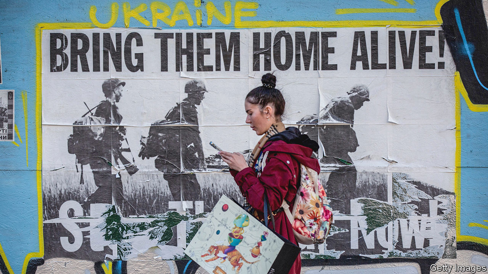

###### Bullets and balance sheets

# Ukraine’s economy seems to be growing again 

##### Battlefield success begets economic success 

 

> Oct 18th 2022 

When odessa’s ports were shut by naval threats at the start of the war, farmers were unable to ship their produce. “We were getting phone calls from Milan, crying, saying they didn’t have ingredients for their pasta,” remembers Alla Stoianova, a local official. Since  are the main export route for Ukraine—the world’s second-largest exporter of cereals and third-largest exporter of vegetable oils—.

The blockade was most painful for Ukrainians, however. Russia’s invasion has dealt  a savage blow. Battles are raging on land that last year produced a fifth of gdp. According to the Kyiv School of Economics, shelling has caused $10bn-worth of damage to firms. Workers have joined the fight or fled to safety. Of the 6.2m internally displaced people, a third are unemployed. The imf reckons gdp will shrink by 35% this year.

Yet slowly and grimly the country’s economy has adapted to war—and seems to be growing again. Take Odessa’s ports. They are operating at less than normal capacity, but they are now operating. A worker says he is called in for two or three shifts a week. From the promenades of Odessa’s stately park, freighters can be seen floating between towering yellow cranes. 

A grain deal negotiated in July under the auspices of the un allows Ukraine to export agricultural products; since then, at least 7.8m tonnes of grain have made it out. The country expects a harvest of 65m-70m tonnes this year, down a third from pre-war levels but a healthy total given the circumstances. The crop should be sufficiently profitable to enable planting for the new season. As food can leave by ship, rail capacity is freed up for the export of metals.

Ukraine’s success on the battlefield has also made a difference. In August just as many people entered Ukraine from the eu as went the other way. The share of firms working at more than half capacity reached around 80% in September, up from 57% in May. This reflects both growing security and official support. A government programme has helped 745 businesses relocate to safer parts of the country. 

Meanwhile, smart policymaking has prevented the country from entering a financial crisis. When the war began, the budget deficit leapt to $5bn a month (against pre-war expectations of $600m). Despite the central bank’s best efforts, in July it had little choice but to devalue the currency. Another devaluation now seems likely given the gap between the cash exchange rate and the official one, says Olha Pindyuk of the Vienna Institute for International Economic Studies, a think-tank. 

Yet these problems have proved to be navigable ones. Banks entered the war well capitalised, thanks to consolidation and a clean-up after Russia’s land grab in 2014. Digital skills honed in the covid-19 pandemic have kept their doors open. The independence of the central bank, established in the post-2014 reforms, has helped prevent panic. “None of this would have been possible eight years ago,” says Natalie Jaresko, finance minister in 2014-16.

International donors have stepped up with much-needed cash. At first, the offerings were just enough to keep the government afloat. But as the war has dragged on, the need for bigger commitments has become clearer. America has sent $8.5bn and will shortly add another $4.5bn. The eu and its member states have promised a similar amount, but have failed to stump up. In September, after much back and forth, they agreed to send €5bn in loans. Perhaps unsurprisingly, America’s patience with Europe is running low. 

So is Ukraine’s. The government reckons it will run a budget deficit of $38bn next year, equivalent to 19% of pre-war gdp. It needs an estimated $17bn to rebuild critical infrastructure and housing for returnees. Timely money is more important than its form. “But of course it matters a lot whether it’s loans or grants when considering Ukraine’s eventual return to markets,” notes Kostiantyn Kucherenko of Dragon Capital, an investment firm in Kyiv. 

The Biden administration hopes to send $1.5bn a month in grants next year, if it can overcome Republican opposition. The European Commission is working on a proposal, but its budget has been allocated. Haggling between member states is expected to continue for some time to come. 

Ukraine’s exact needs will depend in part on the fate of the grain deal. The agreement expires on November 19th. The Kremlin complains that its fertiliser exports are hampered by Western sanctions, and wants Ukraine to reopen an ammonia pipeline from Russia to the port of Yuzhne, which sits 20km (12 miles) to the north-east of Odessa. Local officials fear such demands are a pretext for cancelling the deal. 

Ukraine’s government has a role to play, too. Its spending needs to be better targeted, argues a recent report by the Centre for Economic Policy Research (cepr), an academic network. Some measures—such as price caps on gas and district heating, introduced in July—are wasteful. Aid to displaced people takes the form of a basic income, which goes to all regardless of need.

The cepr report advises taking a leaf out of America’s playbook from the second world war. During the conflict, the number of American households paying income tax grew tenfold, and the federal tax take more than doubled. Ukraine’s flat-tax system, designed to make the country an attractive place to invest in normal times, is ill-suited to supporting a war economy. The country’s economy is now growing, but its prospects remain uncertain. Extra support will be needed. If Ukrainian ministers were to take some more tough decisions, tight-fisted Europeans would have one less excuse for failing to pay up. ■


