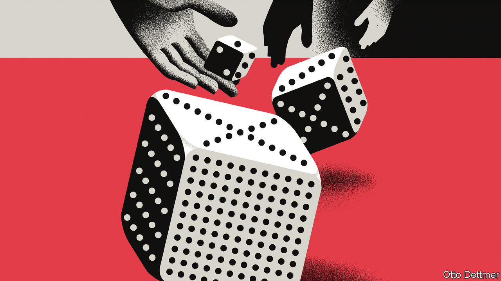

###### Free exchange

# Why inflation refuses to go away 

##### America and Britain are surprised once again by high prices 

 

> Oct 19th 2022 

If the return of high inflation caught many off guard, its refusal to leave has been more shocking still—in the past week countries including America and Britain have been surprised yet again by high prices. The Federal Reserve goofed when it forecast in December 2020 that prices would rise by less than 2% in each of the following two years. It goofed on a grander scale in December 2021, when it reckoned that inflation in 2022 would be just 2.6% even though prices were already rising by more than 5% a year. But the Fed was hardly alone in its misjudgments. imf forecasts have badly and repeatedly undershot inflation. And in late 2020 this newspaper correctly judged that prices would jump in the months ahead, but concluded that the odds of a more sustained period of inflation were low. 

Why, then, has inflation been so damnably persistent? In one sense, the answer is trivial: it has remained high because spending has remained high and because monetary policy has been too loose. But this is an unsatisfying answer. Policy has not been tighter because central banks did not think it needed to be (see the errant forecasts). And as inflation has persisted, policy has adjusted. Back in December 2020, the Fed thought its interest rate would remain near zero in 2023; now it expects it to rise to at least 4.6%. What is trickier to work out is why inflation has repeatedly defied forecasts. New work produced by a penitent imf takes a stab at the question. Its analysis points to three potential culprits: shocks, wages and expectations. 

In 2020 and 2021, as the covid-19 pandemic interfered with the production of goods and services, governments unleashed a torrent of fiscal aid. Meanwhile, the peculiar conditions faced by households led to dramatic shifts in consumption, which swung sharply towards goods and then back towards services. After an initial deflationary pulse, the net effect of this turmoil was to push up prices. Last year about 40% of the rise in American prices relative to the pre-pandemic trend, and 66% of the rise in euro-area prices, was attributable to disruptions to production and higher commodity prices, the imf calculates. Generous stimulus and shifts in household spending accounted for another 30% in both America and Europe.

The barrage of shocks continued with Russia’s invasion of Ukraine in February. With the exception of those for America and China, errors in the imf’s inflation forecasts for big economies have in fact been larger this year than last. And although problems projecting core inflation were chiefly responsible for bad forecasts last year, underestimates of contributions from food and energy have been the bigger problems this one.

The effect of Vladimir Putin’s war has been compounded by a shock rise in the value of the dollar, which is largely a product of the Fed’s aggressive campaign against domestic inflation. As other currencies weaken, their economies’ import costs rise, exacerbating inflation troubles. In a note published on October 14th Gita Gopinath, the imf’s deputy managing director, and Pierre-Olivier Gourinchas, the fund’s chief economist, calculate that a 10% appreciation in the value of the dollar raises consumer-price inflation in foreign economies by about 1% on average, with larger effects in places more dependent on imports.

Strong wage growth is the second suspect. In normal times, wage growth is mostly determined by labour productivity, inflation expectations and the presence or absence of labour-market slack. Faster productivity growth and higher expected inflation translate into more wage growth; higher unemployment translates into less. In the early stages of the pandemic, these relationships broke down. According to the imf’s analysis, fundamentals mattered less than the intense constraints on labour supply associated with lockdowns and social distancing. As the recovery kicked in, normal patterns began to assert themselves. Yet this has not helped much with wages. The supply of labour has become less of a problem, but pay packets have kept growing thanks to robust hiring and low unemployment. 

Rising wages power consumer spending and contribute directly to higher prices for labour-intensive services. Indeed, some hawks worry about a wage-price spiral, in which workers demand higher pay to cover rising prices, as firms raise prices to cover rising wage bills. Yet the imf’s work suggests some caution is in order. Although wage growth has been strong, in many countries it has not been strong enough to keep up with inflation. Sinking real wages can act as a drag on spending and inflation. A study of 22 historical episodes comparable to this one—during which nominal pay rose, and both unemployment and real wages fell—finds that wage-price spirals rarely emerge. In the median episode, inflation began to fall even as unemployment remained low, which is a near-ideal scenario for policymakers.

Nevertheless, it persisted

There are caveats. Tighter monetary policy was required to slow inflation in most cases. The unusual nature of present circumstances may mean that past experience is of dubious relevance. And crucially, much depends on what happens to inflation expectations—a third and unpredictable inflationary force. People’s beliefs about the future affect their consumption and wage bargaining. If recent experience looms large in the formation of these beliefs, that would help to explain persistent inflation, and would complicate central bankers’ jobs.

Beliefs are tricky to measure, but there is nevertheless some cause for concern. Although measures of expectations in America have been relatively well-behaved, those in Britain and the eu are less encouraging. That, as much as anything, is why interest rates will keep climbing. Having been fooled and fooled again, central banks will not relent until the only inflation surprises are those on the downside. ■


