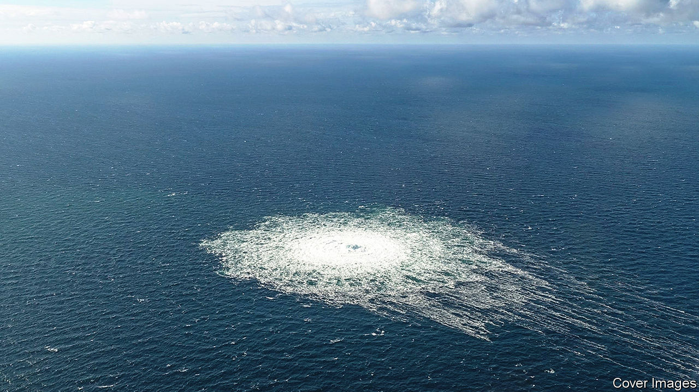
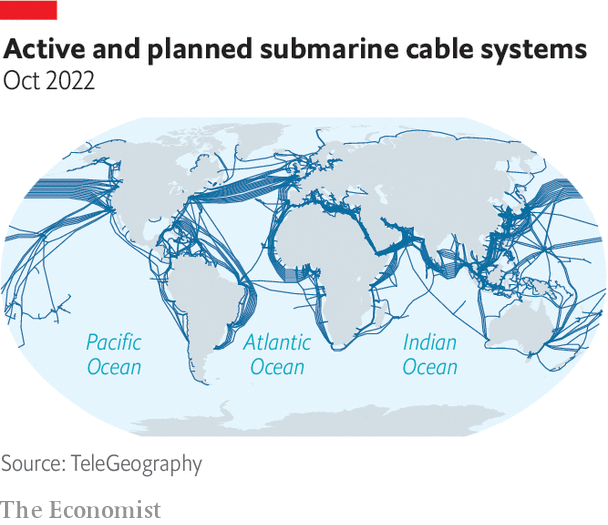
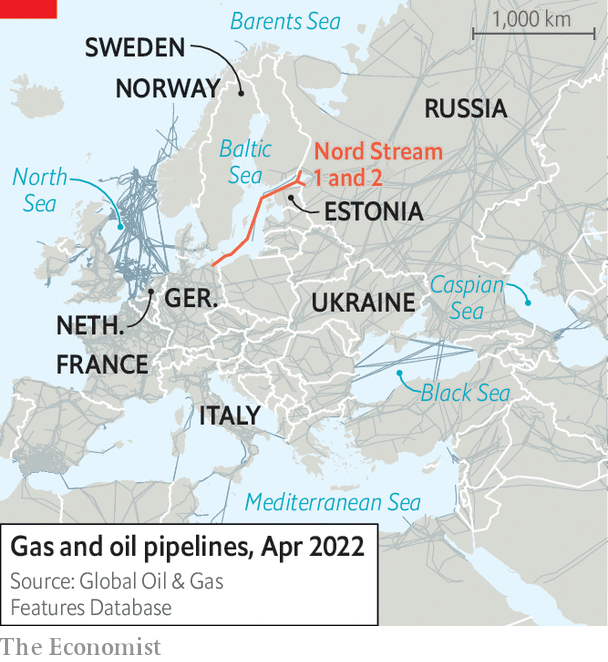

###### Sabotage at sea

# Vladimir Putin says the world’s energy infrastructure is “at risk” 

##### He would know. And internet infrastructure is vulnerable too 

 

> Oct 20th 2022 

On October 12th Vladimir Putin, Russia’s president, gave an ominous warning. Energy infrastructure around the world was now “at risk”, he said. Mr Putin’s warning came a month after explosions tore through Nord Stream 1 and 2, a pair of gas pipelines running from Russia to Europe under the Baltic Sea. The pipes were not in use at the time. But the ruptures left plumes of methane bubbling to the surface for days. 

Mr Putin’s warning was a study in chutzpah. Russia denies responsibility for the explosions. But few doubt that the Kremlin did it. It has used cuts in gas supplies, or the threat of them, to try to blackmail Europe since the early days of its invasion of Ukraine. The attacks occurred just as Russia was escalating its war, mobilising reservists, annexing territory and making nuclear threats. The incident has focused minds on both the importance of underwater infrastructure and the difficulty of protecting it.

Subsea pipelines and cables have proliferated since the first one was laid, in 1850. In Europe, pipelines are vital conduits for energy. Some, like the two Nord Stream connectors, bring gas from Russia; others take oil and gas from the North Sea ashore in Britain, the Netherlands and Norway. Subsea electricity cables allow countries to exchange power. Globally, energy conduits are dwarfed by pipelines for bits and bytes. TeleGeography, a data-analysis firm, reckons there are more than 530 active or planned submarine telecoms cables around the world. Spanning over 1.3m kilometres, they carry 95% of the world’s internet traffic (see map). 

 


Western officials worry that such infrastructure offers a juicy target, for Russia and others. Those concerns predate the war in Ukraine. “We are now seeing Russian underwater activity in the vicinity of undersea cables that I don’t believe we have ever seen,” claimed Rear-Admiral Andrew Lennon, then commander of NATO submarine forces, in 2017. In January this year Admiral Tony Radakin, Britain’s chief of defence staff, noted a “phenomenal increase” in Russia’s underwater activity over the previous 20 years. There are no proven recent examples of state-sponsored cable-cutting. But rumours abound. In November 2021, cables serving underwater acoustic sensors off the coast of northern Norway—an area frequented by Russian submarines—were cut. 

Western officials say that a particular source of concern is Russia’s Main Directorate of Deep-Sea Research, known by its Russian acronym GUGI. It has a variety of spy ships and specialist submarines—most notably the , the world’s biggest submarine, commissioned in July—which can work in unusually deep water. They can deploy divers, mini-submarines or underwater drones, which could be used to cut cables. In 2019 a fire aboard the , one of GUGI’s mini-submarines, killed 14 Russians in the Barents Sea. The fact that all were officers indicated the specialist nature of the organisation’s work.

Cable chicanery, though, is not a Russian invention. The first act of military cable-cutting occurred in 1898 during the Spanish-American war, says John Ferris, a historian at the University of Calgary. One of Britain’s first acts during the first world war was to tear up German telecoms cables laid across the Atlantic. Germany responded with attacks on Allied cables in the Pacific and Indian Oceans. 

 


More recently, espionage has been the order of the day. Ivy Bells, an American operation to place listening devices on Soviet underwater communication links, including in the Sea of Okhotsk, was exposed in 1980. In 2013 Edward Snowden, a contractor for the National Security Agency (NSA), America’s signals intelligence agency, revealed an Anglo-American project had tapped at least 200 fibre-optic cables round the world.

Other countries are getting in on the act. In a speech on October 11th, Sir Jeremy Fleming, the head of Government Communications Headquarters, Britain’s signals-intelligence agency, said that China was seeking “to bend international flows of data around the Indo-Pacific region towards interception platforms inside China”. In 2020 America’s Justice Department recommended against allowing Pacific Light Cable Network, a joint project between American and Chinese firms, to connect America to Hong Kong. China, it said, was aiming to turn Hong Kong into a “dominant hub” for tapping traffic. 

But in the aftermath of the Nord Stream explosions, sabotage is a more immediate concern than spying. The attacks have given impetus to the creation of capabilities to spot underwater threats and respond to them (or, which is less often stated, to allow attacks on a rival’s infrastructure). On October 4th Britain confirmed it would purchase two “Multi-Role Ocean Survey Ships” carrying advanced sensors and underwater drones. France published its own seabed warfare strategy in February. As a statement of intent, on February 15th it sent a lieutenant more than 2,100 metres under the sea—far deeper than conventional submarines can go—to conduct a symbolic inspection of a cable. 

Yet the seabed is not amenable to control. A paper published last year on Russian military robotics by the International Centre for Defence and Security, an Estonian think-tank, noted that Estonia and other Baltic states had only a limited grasp of what was going on under the Baltic because of quirks of hydrology, scarce surveillance platforms and limited information-sharing between countries. It concluded, perhaps presciently: “It would be difficult to prevent Russian [drones] deployed in international waters from damaging critical undersea infrastructure.”

That does not mean inflicting such damage is simple. Cables and pipelines could be damaged by cyber-attacks, say officials familiar with the issue. But in practice, most attackers will need to get physically close. The first step in a sabotage mission is finding the target. With big, heavy pipelines, which are typically made from concrete-lined metal sections, that is relatively easy. Older communication cables, being smaller and lighter, can shift with the currents. Newer ones are often buried, says Srinivas Siripurapu, head of research and development at the Prysmian Group, the world’s largest cable-manufacturer. 

It is also increasingly possible for operators to detect tampering. Mr Siripurapu says that more than half of his firm’s new projects include “distributed fibre-optic sensing”, which can detect vibrations in the cable or changes in its temperature. But that will not reveal whether the problem is a geological event or an inquisitive drone—or which country might have sent it. Underwater attribution is slow and difficult. Investigators were not able to inspect the Nord Stream pipelines until the gas leaks had subsided. They have still not been able to find a smoking gun (or at least not one that they have revealed). And sending a vessel to investigate a mishap in the middle of the Atlantic would be much trickier than doing so in the shallow waters of the Baltic. 

Determined attackers, in other words, are likely to get through. The effects of a successful attack will differ. Pipelines and subsea electricity cables are few in number. If one is blown up, gas, oil or electricity cannot easily be rerouted through another. Communication cables are different. The internet was designed to allow data to flow through alternative paths if one is blocked. 

And at least when it comes to connections between big countries, plenty of alternatives exist. At least 18 communication cables link America and Europe. Australia has 16 cable connections to other countries. Two dozen sprout from America’s west coast and cross the Pacific. These figures include known cables; armies and spy agencies lay others whose whereabouts are not publicised (though the ships laying them can occasionally be glimpsed on ship-tracking websites). 

“There is significant redundancy on these routes,” says David Belson, head of data insight at Cloudflare, a big infrastructure firm which helps distribute traffic around the internet. Traffic can be rerouted between them relatively easily. In June, when the AAE-1 and SMW-5 cables, stretching from France to Hong Kong and Singapore respectively, were disrupted, traffic was affected for just four hours before returning to normal.

Many European officials argue that the Nord Stream explosions should nevertheless serve as a wake-up call. In the aftermath of the attacks, Ursula von der Leyen, the president of the commission, proposed stress tests on offshore digital and energy infrastructure, and satellite surveillance to detect suspicious ships. “Critical infrastructure is the new frontier of warfare,” she argued a few days later. “And Europe will be prepared.”

Bart Groothius, a Dutch MEP, who has campaigned on the issue for many years, says Mrs von der Leyen’s proposals do not go far enough. Even if companies detect cable disruption, he says, they do not always report it. “There’s no collective institution that records all the incidents that are going on, and what is behind them—we don’t have any statistics behind it.” Elisabeth Braw of the American Enterprise Institute, a think-tank, agrees. She says the problem often falls into the gap between private and public sectors.

Some countries are attempting to bridge that gap. America’s energy department holds a regular dialogue with energy firms, says Ms Braw. In July Italy’s navy said it was working with Sparkle, an Italian telecommunications company, to conduct “joint reconnaissance and monitoring” of its undersea cables. understands that Britain’s security services keep in regular touch with cable operators. 

Resilience may offer the best defence. In the aftermath of Russia’s invasion of Ukraine, Europe has already rushed to develop more of the infrastructure necessary to import liquefied natural gas, which is not delivered by pipeline, but shipped by tanker from countries such as America and Qatar. And telecommunication cables, at least, can be fixed relatively quickly. Phil Walker, the boss of Pharos Offshore Group, which has laid more than 160,000km of subsea cables, reckons repair ships can usually fix broken cables within two weeks of a fault.

The problem is that profits in cable laying have exceeded those in cable maintenance, leading to a relative decline in the number of repair ships. If multiple cables were struck at once, says Mr Walker, that scarcity would be felt. Spy ships and deep-sea drones may be eye-catching. But the key to underwater resilience may be a good stock of spare cable and the ships to lay it. “It’s a bit of an art,” adds Mr Walker, “but not much has changed in the 30-odd years I’ve been doing it.” ■

