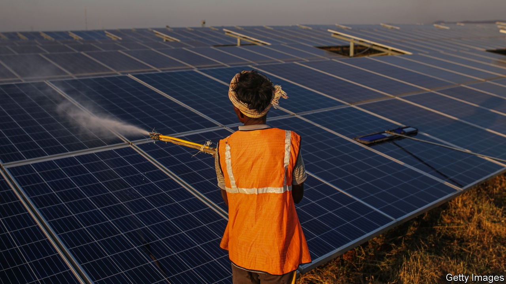

###### Renewable energy

# India’s next green revolution 

##### India’s clean-energy push shows a way to escape the coal addiction 

 

> Oct 20th 2022 

If you care about the climate a crucial question is how emerging economies, which accounted for 67% of carbon-dioxide emissions from energy last year, can shift to a cleaner approach. They derive a third of their primary energy from coal, and must meet the aspirations of poor citizens who lack cheap electricity.

China offers one template: its energy industry is shifting towards renewables. Yet it is still moving far too slowly to reduce its emissions and many countries may be wary of replicating its state-led approach. An alternative model is now visible in the other Asian giant, India, which is in the  led by the private sector. Although it has obvious flaws, it provides hope that India can make the green leap. 

India has immense energy needs. It is forecast to be one of the fastest-growing big economies this decade and will need to add capacity equivalent to the size of the European Union’s power system by 2040. After a flirtation with hydro in the 1950s and 1960s it came to rely heavily on coal, which met 58% of its primary-energy needs in 2021. Like many governments, India’s has committed to reaching net-zero emissions (by 2070). 

The big surprise is that major changes are happening on the ground. In the past decade India has seen a 50-fold increase in installed solar power. In 2021 its renewables accounted for 5% of its primary-energy consumption, and 5% of global renewable primary-energy consumption. Private firms have plans to invest perhaps $200bn in the coming years in everything from generation facilities to green hydrogen plants (by comparison, global investment in wind and solar last year was about $300bn, and India’s was roughly $15bn). The government wants to triple non-fossil-fuel capacity by 2030. 

Behind the boom are a number of forces. One is the country’s underlying attributes: sun-drenched India has some of the cheapest solar power in the world, and the life-cycle cost of new plants is lower than for coal ones. The government has helped by introducing guarantee mechanisms so that firms forced to deal with rickety power distributors can still secure funding. The prime minister, Narendra Modi, views clean energy as a catalyst for an industrial boom based on cheap power, batteries and electric vehicles that may shift manufacturing supply chains away from China. Clean power will help cut a large import bill for fossil fuels and, by lowering pollution, save millions of lives. 

The final force is that India’s big local conglomerates (including Reliance Industries, Adani Group and ) are deploying capital at scale. Whereas previously they would have been wary of such investments, now they think they have the certainty, financial clout and expertise to plough ahead. One gauge of the boom is that some investors and firms are getting more nervous about long-run coal projects, as cheap renewable power starts to undercut coal-fired power on price. Between 2010 and 2022, proposals for over 600gw of coal-fired power in India (about three times its installed base of coal plants) have either been put on hold or scrapped, with another 15gw-worth of coal generation retired from service.

Yet for all its successes India’s surge faces several hurdles. One is financing. Experts reckon it will take over $500bn of investment by 2030 in clean energy, transmission lines, grid-scale batteries and related kit to achieve the government’s 500gw. That is at least twice the present investment plans of the big firms, so India will have to attract new sources of capital at a time when interest rates are rising. The financial strain of huge capital projects could yet weaken the appetite of the big conglomerates: Adani Group, for example, is significantly indebted.

Power struggle

The biggest hurdle of all relates to government policy, which needs to be predictable enough to provide certainty to investors. It also needs to anticipate challenges—redesigning electricity grids, for example, as the share of intermittent power rises. India’s officials have a good sense of what to do. But they face resistance from a coal lobby which controls vast budgets and employs millions. A state-run firm, ntpc, has just gone ahead with its first new coal plant for about six years; a government advisory body has called for more coal capacity. India’s green boom is a test of the private sector’s ability to marshal resources—and also of the government’s ability to overcome vested interests.■


