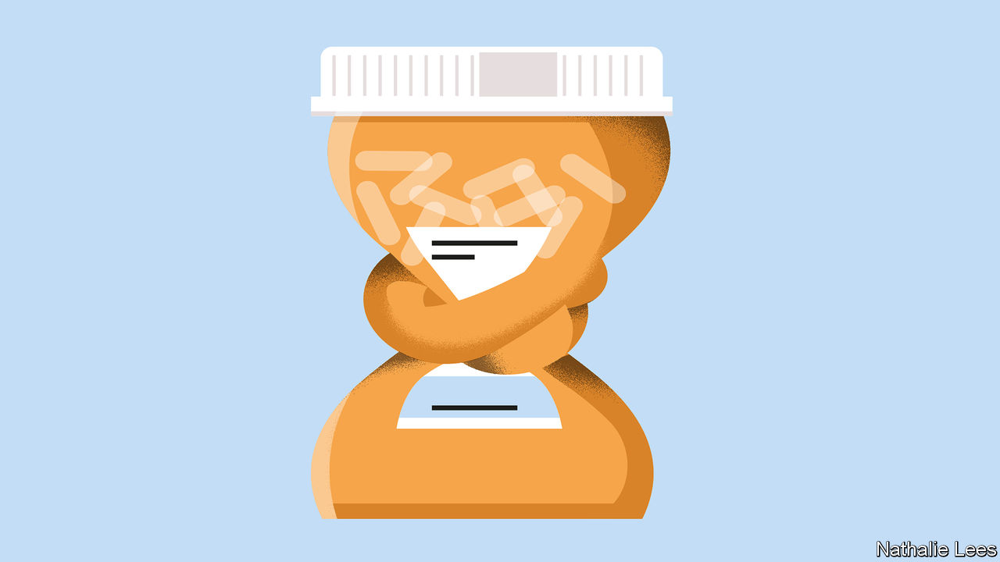

###### Set them free

# Most people on antidepressants don’t need them 

##### Time to wean them off 

 

> Oct 19th 2022 

Almost 35 years ago American drug regulators approved Prozac, the first in a series of blockbuster antidepressants known as selective serotonin re-uptake inhibitors (SSRIs). Prozac and its cousins were lauded by patients and doctors as miracle drugs. They lifted low moods quickly and seemed to have no drawbacks. Divorce, bereavement, problems at work—a daily pill was there to help with that, and anything else which made you sad. Many people have stayed on these drugs for life. In Western countries today between one person in seven and one in ten takes antidepressants.

The shine of SSRIs has worn off. A growing number of studies show that . Drug companies often publish the results of clinical trials selectively, withholding those in which the drugs turn out not to work well. When the results of all trials submitted to America’s medicines regulator between 1979 and 2016 were scrutinised by independent scientists, it turned out that antidepressants had a substantial benefit beyond a placebo effect in only 15% of patients.

Clinical guidelines have been revised accordingly in recent years. No longer are drugs the recommended first line of treatment for less severe cases of . For these, self-help guidance, behavioural therapy and recommendations for things like exercise and sleep are preferable. For work burnout, a sick note for time off may suffice. The drugs are to be reserved only for more severe depression, where they can be truly life-saving. 

The problem is that lots of people who do not need antidepressants are already on them, refilling prescriptions written years or even decades ago. They should be helped to get off the drugs. The side-effects are often life-limiting and, as people age, become life-threatening. They include sexual dysfunction (which sufferers describe as “genital anaesthesia”), lethargy, emotional numbness, increased risk of birth defects when taken during pregnancy, and, in older people, strokes, falls, seizures, heart problems and bleeding after surgery. This is a threat to health-care systems as long-term users age.

Doctors rarely talk to patients about stopping the drugs because they fear this could lead to a return of . But for many people it may be safe to stop. Even among long-term users with several past episodes of depression, a recent trial in Britain showed that 44% of patients could stop taking pills safely. For milder cases, the success rate is probably higher still. 

Several things are needed for change to happen. Doctors need guidelines on how to de-prescribe the drugs. Health-care insurers and providers such as Britain’s various national health services should start paying for ways of delivering the drugs that help those who wish to stop taking them but who need to taper off them in order to avoid severe withdrawal effects. These include liquid formulations, tapering strips which contain pills with progressively smaller drug concentrations, and the services of compounding pharmacies, which prepare bespoke doses. In the Netherlands, 70% of people using tapering strips have managed to quit successfully. 

All this could cost more than refilling prescriptions today. But with so many people on the drugs, the costs of side-effects will soon pile up. Add to that the misery of the millions whose lives have been robbed of their common joys by useless prescriptions, and the case for change is unanswerable. ■

