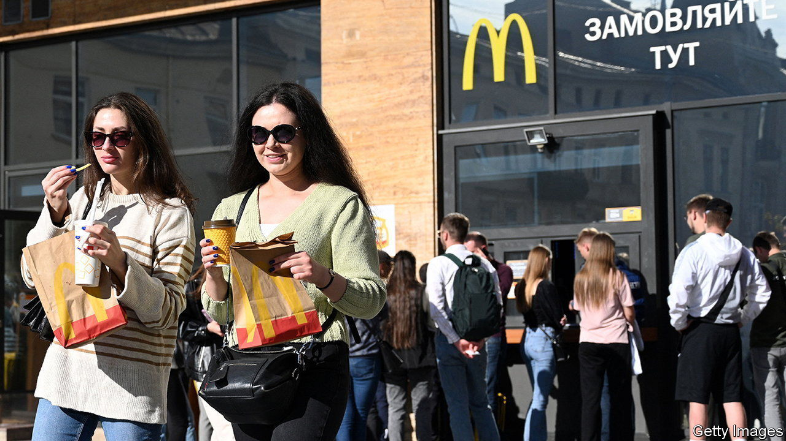
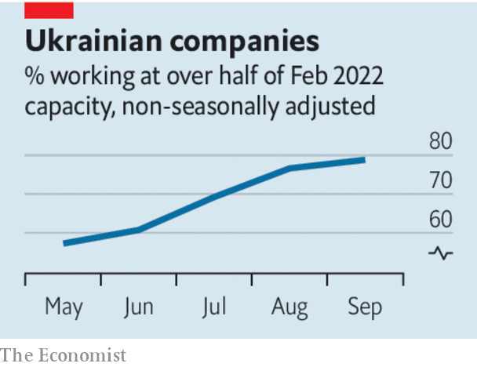

###### Defying the odds

# Ukraine’s economy is defying the odds. But it needs help 

##### America has been generous. The EU is dithering 

 

> Oct 20th 2022 

Swarms of missiles and  are attacking Ukraine, damaging the country’s power plants and causing rolling blackouts, as Russia seeks retaliation for the destruction of a crucial bridge to Crimea. Ukraine has in most cases been able to restore power quickly. That testifies to a broader resilience. Ukraine’s economy is stabilising, even tentatively recovering. But if it is to continue doing so, it will need help. 

As the military tide has turned, more than 6m Ukrainians have returned home. Businesses are getting back to work. Now that a un-supervised grain deal allows the country to export agricultural produce via the Black Sea, farmers are cultivating their next batch of crops. McDonald’s is reopening its restaurants in Lviv, though it will close them during air raids. 

 


This adjustment to life under war conditions has been possible because the  throughout. The country’s banks, which were cleaned up before the war, have continued to operate, out of bunkers if necessary. The central bank has introduced capital controls and sought to keep the exchange rate stable, although in July it was forced to devalue the hryvnia by 25% against the dollar. Inflation, at 24%, is running at the same rate as in the Baltic countries. Most important, Western cash has kept the government afloat and helped preserve the central bank’s currency reserves. 

Ukraine has received $23bn (12% of its pre-war gdp) in budget help, in addition to military and humanitarian aid. America has provided grants in a timely fashion, and has committed itself to offering $1.5bn a month next year. The European Union, however, has done neither. Its funding so far has been late, with billions still outstanding. The money comes in the form of loans, not grants. And member states are still squabbling over how to pay for next year’s support. 

This is shortsighted. For a start, Russia’s economic war is intensifying again. Not only is Russia bombing power stations; it may also refuse to renew the grain deal next month. If Ukraine is to withstand these shocks it will need stable, predictable funding. Moreover, leaving Ukraine’s central bank to bear the burden is risky. Already some firms are worried about further devaluations of the hryvnia and higher inflation. The uncertainty will deter the private investment that Ukraine needs as it rebuilds. 

Insisting on loans rather than grants is also a mistake. Ukraine is unlikely to be able to afford to pay the money back. And it sends a depressing signal to a country that is fighting for a European ideal of freedom. The eu insists that these loans are on such favourable terms that they are grant-like. Nonetheless, the small print says they need to be repaid, meaning that they will add to Ukraine’s official debt figures. The higher debt burden will make the country’s eventual return to the bond market even harder. 

And the eu’s stinginess could undermine American support for Ukraine—support that is crucial for it to win the war and secure peace. Aid for Ukraine has gathered bipartisan backing in Washington. But the more Europe dithers, the more strained that consensus becomes. This week Kevin McCarthy, the minority leader of the House of Representatives, warned there would be no “blank cheque” for Ukraine if recession struck in America. The eu says it wants to be a more forceful geopolitical actor. All the more reason for it to pay up. ■


