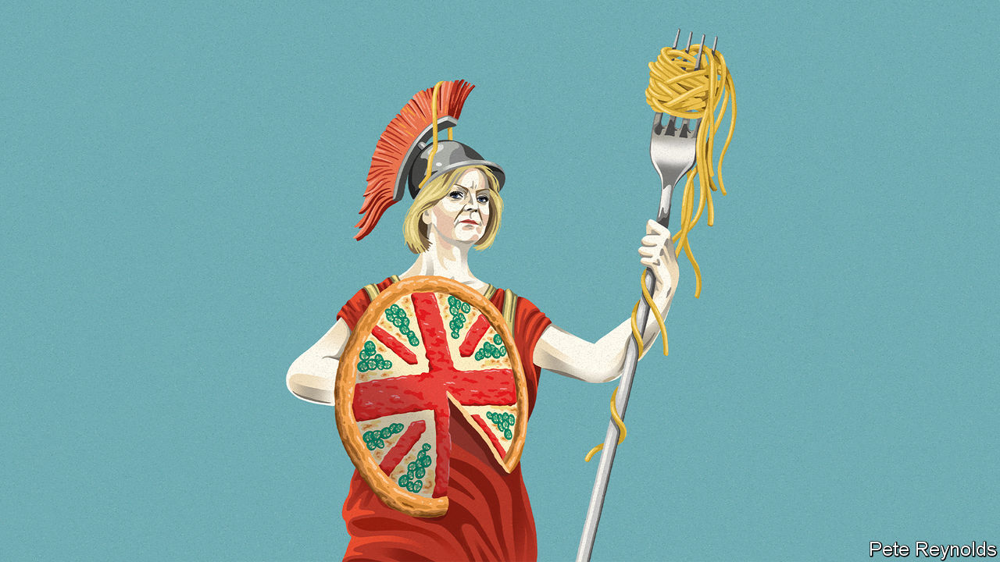

###### Turmoil in Britain

# Welcome to Britaly 

##### A country of political instability, low growth and subordination to the bond markets 

 

> Oct 19th 2022 


In 2012 Liz Truss and Kwasi Kwarteng, two of the authors of a pamphlet called “Britannia Unchained”, used Italy as a warning. Bloated public services, low growth, poor productivity: the problems of Italy and other southern European countries were also present in Britain. Ten years later, in their , Ms Truss and Mr Kwarteng have helped make the comparison inescapable. Britain is still blighted by disappointing growth and regional inequality. But it is also hobbled by chronic political instability and . Welcome to Britaly. 

The comparison between the two countries is inexact. Between 2009 and 2019 Britain’s productivity growth rate was the second-slowest in the G7, but Italy’s was far worse. Britain is younger and has a more competitive economy. Italy’s problems stem, in part, from being inside the European club; Britain’s, in part, from being outside. Comparing the bond yields of the two countries is misleading. Britain has lower debt, its own currency and its own central bank; the market thinks it has much less chance of defaulting than Italy. But if Britaly is not a statistical truth, it captures something real. Britain has moved much closer to Italy in recent years in three ways. 

First, and most obviously, the political instability that used to mark Italy out has fully infected Britain. Since the end of the coalition government in May 2015, Britain has had four prime ministers (David Cameron, Theresa May, Boris Johnson and Ms Truss), as has Italy. The countries are likely to stay in lockstep in the near future.  is expected to be sworn in as the new prime minister in Rome; Ms Truss’s future could not be . Ministerial longevity is now counted in months: since July Britain has had ; the  this week after just 43 days in office. Trust in politics has declined as chaos has increased: 50% of Britons trusted the government in 2010 and less than 40% do now. The gap with Italy on this measure has shrunk from 17 percentage points to four. 

Second, just as Italy became the plaything of the bond markets during the euro-zone crisis, so they are now . The Conservatives have spent the past six years chasing the dream of enhanced British sovereignty; instead they have lost control. Silvio Berlusconi was removed from power in Italy in 2011 after falling foul of Brussels and Berlin; Mr Kwarteng was kicked out of his job as chancellor of the exchequer because of the market reaction to his package of unfunded tax cuts. Traders in gilts are the arbiters of British government policy at the moment. Jeremy Hunt, the new chancellor, has eviscerated most of the tax cuts and rightly decided to redesign the government’s energy-price guarantee scheme from April 2023. The decisions he must take to fill the remaining hole in the public finances are being designed with markets in mind. 

Just as Italians fret about  between benchmark government bonds and Bunds, so Britons have had a crash course in how gilt yields affect everything from the cost of their mortgage to the safety of their pensions. In Italy institutions like the presidency and the central bank have long acted as bulwarks against politicians. So it is now in Britain. By ending its emergency bond-buying on October 14th, the Bank of England forced the government to reverse course faster. There is no room for Mr Hunt to disagree with the Office for Budget Responsibility, a fiscal watchdog. These institutions were constraints on elected MPs before, but now the chains bind tightly and visibly. 

Third, Britain’s low-growth problem has become more entrenched. Political stability is a precondition of growth, not a nice-to-have. Italian governments struggle to get anything done; the same is true of brief administrations in Britain. When changes of leader and government are always round the corner, pantomime and personality replace policy. Mr Johnson was nicknamed “Borisconi” by some; by continuing to hover on the political scene, he may make this comparison sharper still. 

And although fiscal discipline should calm the bond markets, it will not by itself increase growth. Mr Hunt is racing to balance the books as part of a medium-term fiscal plan to be unveiled on October 31st. Saving money by spending less on infrastructure would be fine for gilt yields but is not going to help the economy grow. There is little room for swingeing cuts to public services. Better to phase out the “triple lock”, a generous formula for raising state pensions, and raise money in more sensible ways: scrapping , for instance, or raising inheritance taxes. A rise in income tax would be better than reinstating the increase in national-insurance contributions, which fall solely on workers. 

For now, things are turning ever more Britalian. Tory MPs are in disarray—evident in a chaotic vote on fracking and rumours of more resignations—and again consumed by intrigue about how long their prime minister can last. Ms Truss has become the human equivalent of Larry the cat, living in Downing Street but wielding no power. If (or rather, when) Tory MPs decide to bin her, they need to find a replacement themselves rather than outsourcing it to Conservative Party members. The odds of their feuding factions alighting on a unifying figure are low. 

Spaghetti junction

The case for an early general election is becoming stronger as a result. It is unlikely to happen: why would Tory MPs vote for their own demise? The argument that Ms Truss or any successor lacks a mandate is flawed in a parliamentary system. But if Parliament is unable to produce a functioning government then it is time to go to the voters. That moment is drawing closer. 

Holding elections has not resolved Italy’s problems. But there is reason to feel more hopeful about Britain, where political instability is now a one-party disease. The Tories have become nigh-on ungovernable, due to the corrosion from Brexit and the sheer exhaustion of 12 years in power. Ms Truss is right to identify growth as Britain’s biggest problem. Yet growth depends not on fantastical plans and big bangs, but on stable government, thoughtful policy and political unity. In their current incarnation the Tories cannot provide it. ■


