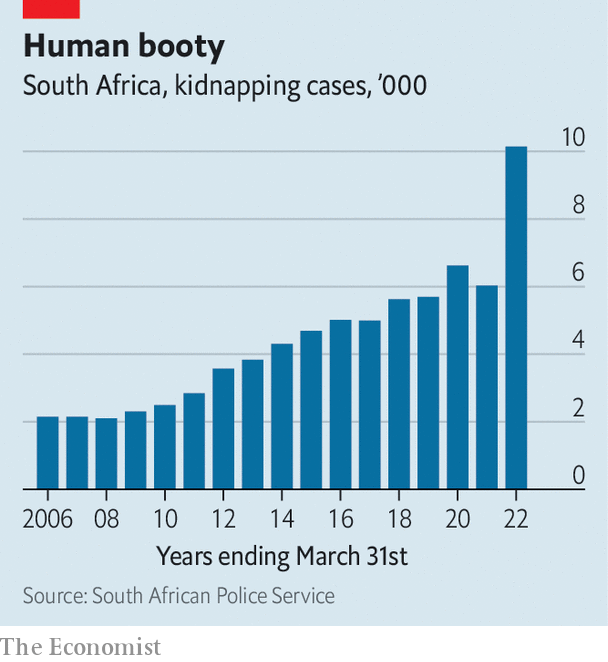

###### The rainbow nation’s mafia

# How organised crime is blighting South Africa’s economy 

##### The withering of the state has led to the blossoming of the underworld—and vice versa 

 

> Oct 20th 2022 

Last year Gold Fields announced it would start building a solar plant to help power South Deep, one of the largest gold mines in the world. Soon afterwards, the South African mining firm got messages from several self-styled “business forums”, a euphemism belying their real interest: extortion. The forums demanded a cut of the contract to construct the plant. They followed up with texts to employees and unauthorised visits to the mine, which lies just outside Johannesburg.

The consequences of non-compliance were not spelt out. But they could be assumed. Since 2015 forums have spread from the province of KwaZulu-Natal to the rest of the country, invading construction sites and demanding a share of any deal. In 2019 forums affected at least 183 projects, worth more than 63bn rand ($4bn). That year gun-toting forum members led to two firms pulling out of a project to build what would have been the highest bridge in Africa. After the incident the boss of the South African firm said of its German partner: “They have worked in 80 countries, including Afghanistan and Iraq, but have never experienced anything like this.”

From bad to worse

There is a lot of crime in South Africa. In the past few months alone there has been a spate of shootings in taverns, a mass rape in a mining town and multiple kidnappings. These are not random incidents, notes Mark Shaw, director of the Global Initiative Against Transnational Organised Crime (GI-TOC), a think-tank headquartered in Geneva. They are a result of flourishing organised crime that is “an existential threat to South Africa’s democratic institutions, economy and people”.

In a report last month GI-TOC described 15 illicit “markets”, ten of which it said are growing. (The other five are “stable”.) In an earlier paper it ranked South Africa 19th in the world for organised criminality, ahead of Libya and Russia. “Few [countries] host so many illicit markets across such a broad spectrum of criminal activity.” 

 


South Africa is a transit point for heroin going from Afghanistan to Europe and cocaine leaving Latin America for Asia and Australasia. It is also a hive of wildlife crime: the familiar scourges of rhino and elephant poaching as well as the trafficking of rock lobster, abalone (marine snails) and succulent plants. Kidnapping cases rose from 6,000 in the year to March 2021 to more than 10,000 12 months later, in part because of the rise of syndicates who demand ransoms (see chart). The gun-runners who deal in the more than 2m unregistered firearms in the country make everything worse. 

Yet many criminal enterprises target more prosaic parts of the economy. The sharp rise in the copper price in 2020 led to a surge in cable theft. South Africa’s telecommunications firms have formed a special unit partly to combat the crime. Eskom, the state power utility, says cable worth about 2bn rand is stolen every year. Transnet, the public freight-rail operator, said in October 2021 that more than 1,000km of cable had been stolen so far that year. During the pandemic criminals stripped PRASA, the state passenger-rail company. The network carries 4% of the passenger volume it did from 1999 to 2008. 

One source of vandalism is the so-called “taxi industry”, which runs the minibuses used by two-thirds of commuters. Earlier this year a taxi firm’s employee was jailed for torching a PRASA train and station; the prosecutor noted that “only the taxi industry benefits when trains are put out of service.” GI-TOC says taxis are run by “mafia-like associations”. About half of South Africa’s assassinations are linked to the taxi business. Its cash-only model makes it a potential money-laundry.

South African mining is besieged by criminality. Tens of thousands of or illegal miners, work for criminal outfits. An industry body reckons they cost the sector 7bn rand a year. Illustrating the scale of illegal operations, in April the military and a private-security firm retook control of a chrome mine that had been extracting metal worth more than 1m rand a day. Around 10% of South Africa’s annual chrome production is exported illegally. A recent survey reckoned there were about 20 illegal chrome-processing plants.

Major figures in the South African underworld operate in myriad markets. Consider, for instance, Petros Sydney Mabuza, a kingpin assassinated last year. As well as running a rhino-poaching syndicate, he was reportedly involved in the taxi industry, extortion and robbery of vans carrying cash. At his funeral a helicopter brought his casket to the venue, with the box draped in leopard skin. 

South Africa’s organised-crime boom has many causes. But the chief one is that the state has been enfeebled by a corrupt ruling party, the African National Congress (ANC). The police, too, are regularly implicated. Officers have been convicted, among other offences, of drug-dealing, gun-running and aiding illegal mining. In North West province police are said to help deliver food and guns to , and serve as hitmen for a mining kingpin.

The rot starts at the top

Though organised crime predated and outlasted Jacob Zuma, president from 2009 to 2018, it exploded under his reign. Law-enforcement agencies were hollowed out and stuffed with cronies. Crime data show the impact. In the first half of the 2010s there was a 60% drop in the number of arrests and an 83% fall in convictions. The murder rate fell by more than half from 1994, when Nelson Mandela was elected, to 2011. Since then it has risen by 38%.

“State capture” under Mr Zuma has been well documented. But criminality runs deeper than government graft. Many business forums, for example, are said to have links to the ANC’s “radical economic transformation” faction, which is aligned to Mr Zuma. These groups say they are not gangsters but vehicles for black empowerment; when they invade sites they demand 30% of the construction contract’s value, citing a law that reserves that fraction for “local” firms in public procurement. One group was even called the Federation for Radical Economic Transformation. 

Cyril Ramaphosa, Mr Zuma’s successor, promised to overhaul law enforcement. But as usual there is a chasm between his rhetoric and reality. Rather than rely on the state, those who can afford it opt for private security. In 1997 there was roughly one private security guard for every policeman. Today the ratio is almost four to one. 

Gold Fields stood its ground—but only after it built fences at the site and procured private security for employees. Ultimately the extortionists went away. But they will be back somewhere else, soon enough. ■

