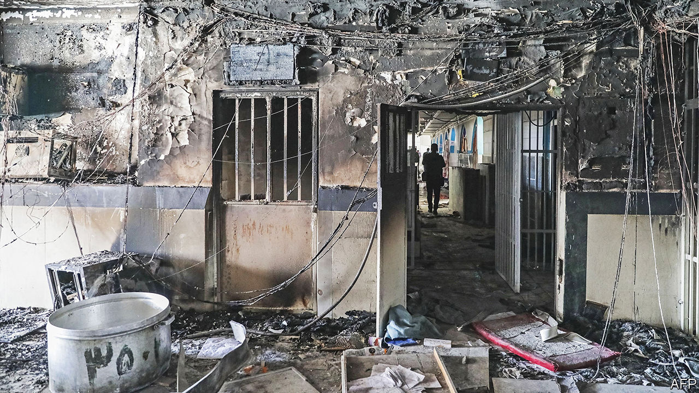

###### A symbolic fire catches on

# Iran’s protests spread, as a notorious prison burns 

##### The clerics’ regime dithers as opposition to it widens 

 

> Oct 18th 2022 

The terror was worst for those trapped in solitary cells the size of tables. The fire began in a basement sewing workshop and spread through Evin prison, crammed with protesters detained in the . Guards fired tear-gas and bullets into the smoke to force back those trying to escape. They shot at prisoners who had climbed onto the roof to breathe—and to chant against their jailers. Beyond Evin’s walls,  echoed their cries and honked their car horns.

No Iranian prison is as notorious as Evin. For 50 years it has been the holding pen, interrogation centre and gallows of the state’s political prisoners. It lies at the base of the Alborz mountains, casting a shadow over the capital below. The fire billowing inside it lit up the city and evoked the torching of the Rex Cinema, back in the summer of 1978, when the death of more than 470 people as a result of an arson attack triggered the Islamic revolution that overthrew the shah.

Today’s authorities quenched the fire, quelled the protests and insisted that “the Bastille project had failed”, a reference to the storming of the Parisian prison at the start of the French revolution of 1789. Officially only eight died in Evin. But clerics and regime loyalists, who at first ignored the protests, now openly denounce them as a movement bent on sweeping the regime aside. The mayhem in their citadel left many wondering about the strength of their hold on power.  initially  with cold disdain. That has given way to fevered warnings of American and Israeli plots. And the protesters, as their confidence grows, are issuing communiqués demanding a transitional government to replace .

Big events in the Middle East often have small beginnings. The Arab spring erupted after a policeman confiscated a Tunisian peddler’s cart. Last month Mahsa Amini, a 22-year-old Kurdish woman, died after police detained her for improperly wearing her hijab on a trip to Tehran, the capital. “No one thought there would be anything more than limited protests,” says Sadegh Zibakalam, a politics professor at Tehran university. “But the dissent hasn’t calmed down. It’s becoming like a volcano.”

The protest is led by a generation that many had assumed was too young to care, hooked on its screens and seemingly disconnected from society. Students had largely stayed out of previous bouts of unrest. But Ms Amini’s death roused a generation fuming at a fresh tightening of the dress code. This time the protesters are versed in the social norms of their peers worldwide; many are hungry for a night out clubbing (not of the police-baton sort). Tired of the clerics’ insistence on gender segregation, women burn their veils, publicly cut their hair and lunch in men-only canteens in universities. They shout “Death to the dictator” during school-assembly renditions of loyalist hymns like “Greetings, commander”. And in contrast to previous protests, after which many activists fled abroad, they refuse to stop in the face of water cannon, gunfire and mass arrests. “No retreat from the government, so no retreat from the people,” says a female student at a university in Tehran.

Increasingly, traditionalists in chadors and full headscarves, who used to comprise the regime’s base, are joining the protests. Scenes of state violence against women have offended religious women steeped in Shia Islam’s narrative of martyrdom and holy struggle, says Shirin Saeidi, an expert on Iranian gender politics. Protests have spread from cosmopolitan cities to provincial towns which the clerics considered their heartland. “We don’t want a regime that kills children,” cried protesters in Ardabil, a quiet city 580km north-west of Tehran, after a local 16-year-old girl was reportedly beaten to death for refusing to sing a pro-regime song in her classroom. All-female universities designed to recruit the next generation of ideologues have come out in protest, too. “Get lost!” shouted girls at al-Zahra, a women’s university favoured by the regime’s elite, when Iran’s hardline president, Ebrahim Raisi, visited.

The regime seems divided over how to respond. “One school of thought says we should have dealt with the protests more ruthlessly from the beginning to prevent them gathering pace. The other says if we’d crushed them they would only have come back more severely three months later,” says Mr Zibakalam. “Neither side has the upper hand.” The supreme leader, Ayatollah Ali Khamenei, has called on establishment figures to support the security forces more whole-heartedly. 

But many regime insiders, including businessmen and politicians, have kept a studied silence. Some, including Ali Larijani, an influential and long-standing former speaker of parliament, have openly called for the police and the security forces to stop enforcing the mandatory veil. “It should have a cultural solution,” he told the official newspaper, . Some are even siding with the protesters. “They kicked my head and my face…They pushed me into a van…and punched me in the face,” Javad Mogoi, a hitherto loyalist documentary film-maker, wrote on his Instagram page, after he tried to stop the security forces beating a girl.

The regime is also divided over how to respond to growing international support, albeit rhetorical, for the protests. Some favour dangling the prospect of an agreement on Iran’s nuclear programme in the hope of persuading Western governments to ease off. Others want to play up the supposed threat of foreign interference to unify the ranks at home. Mr Khamenei rails at foreign plots. His officials rattle sabres at Iran’s oil-rich neighbours, further unsettling global energy markets. The regime’s praetorian guard, the Islamic Revolutionary Guard Corps, has staged war games on the border with Azerbaijan, threatens to fire more missiles into Iraqi Kurdistan and claims to have struck the Omar oilfield, controlled by American forces in eastern Syria. “I warn the al-Saud regime to control their media or the smoke will get into your eyes,” said Hossein Salami, the Revolutionary Guards’ chief.

As the fog grows inside the regime, the curtain of fear that has cowed the opposition seems to be lifting. Normally reticent academics are voicing acerbic criticism. A female Iranian climber has broken with state policy by competing internationally without a veil. And on October 14th a manifesto for a peaceful transition to a democratic, secular government went viral on social media. In the words of the Tehran university student, “This time it’s the government that seems so scared.” ■

