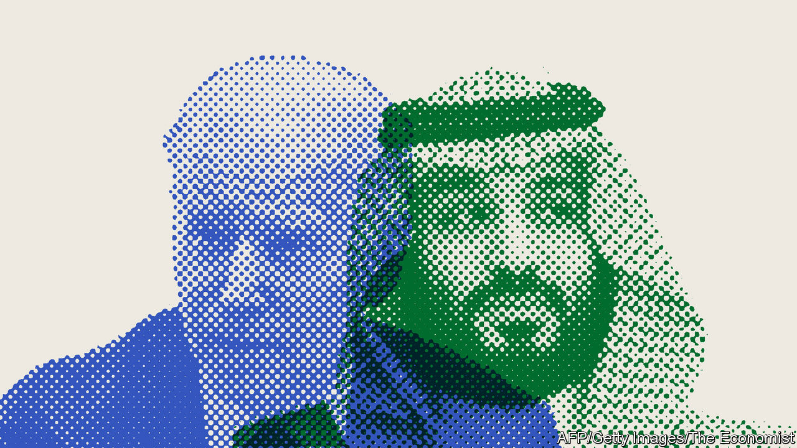

###### The long goodbye?

# Why America and Saudi Arabia are still inseparable 

##### They look locked in an unhappy marriage for years to come 

 

> Oct 20th 2022 

IN SAUDI ARABIA, leaving one’s wife is a simple matter of repeating (“divorce”) three times. Perhaps thankfully, breaking up is harder to do in diplomacy. Since October 5th, when the OPEC+ oil cartel decided to cut production by 2m barrels per day (bpd), relations between America and Saudi Arabia have plunged to their lowest point in decades. Democrats in Washington seem determined to  of 77 years. Gulf states are enraged by what they see as America’s sneering, disrespectful tone.

As in any relationship, some of the angry talk is just that. If a total rupture is unlikely, however, so too is any hope of America and its Gulf partners agreeing to kiss and make up. The oil-for-security bargain that has underpinned their relationship for decades has frayed, but no one knows what will replace it. The unhappy marriage looks likely to last for years yet.

To hear it from Saudi Arabia, the OPEC+ cut was a technical decision. Oil markets are a mess. Prices have been on a rollercoaster. Many OPEC members were falling short of their assigned quotas. A looming rich-country recession could depress demand. The Saudis describe the cut as a pragmatic move to avoid a supply glut and keep some spare capacity in reserve.

To America, however, this was an unconscionable betrayal. Joe Biden, the president, had vowed to treat the kingdom as a “pariah” over its murder in 2018 of Jamal Khashoggi, a journalist. He reversed himself this summer, with crude at $120 a barrel, and flew to meet Muhammad bin Salman, the Saudi crown prince and de facto ruler, in his homeland. Now, less than three months later, the Saudis have orchestrated a move that could mean costlier oil. Mr Biden accused the kingdom of siding with Russia, since higher prices will pad Vladimir Putin’s treasury. “There’s going to be some consequences,” he growled.

The claim aired by many fellow Democrats that the Saudis want to help Republicans in the coming midterms, since higher prices at the pump will hurt the administration, seems implausible in Gulf circles. Oil ministers do not make decisions about world energy markets to sway the outcome of a Senate race in Pennsylvania. 

Fellow oil producers have closed ranks. Bahrain and Kuwait, both OPEC+ members and American partners, said they agreed with the production cut. Even the United Arab Emirates (UAE) made a public show of support. The UAE often disagrees with Saudi Arabia on oil policy: it wants to sell as much as it can, even on the cheap, lest its oil become a stranded asset. Yet it too insists OPEC+ made the right call.

On the sidelines of a conference in Abu Dhabi earlier this month, one Emirati energy executive was furious about America’s response. It smacked of colonial-era rhetoric, he said. “Who is he? Who is Joe Biden?” he grumbled. “These are our resources.” Abdulkhaleq Abdulla, an Emirati political scientist, thinks Democrats must “wake up” and accept that the Gulf is “ready to say no to America”. Ali Shihabi, a less abrasive commentator close to the Saudi royal court, wondered if the kingdom might quit OPEC and form a more elite cartel. “Saudi could easily operate without OPEC and co-ordinate production with the two or three key players privately,” he mused.

The UAE seemed to send yet another message on October 11th, when Muhammad bin Zayed, its president, flew to St Petersburg to meet Mr Putin. Emiratis say he was there to discuss a peace plan for Ukraine. Nothing solid emerged from the meeting, but that he went in person instead of making a call or sending his foreign minister was a stark reminder that the Arab world, unlike the West, refuses to take sides over Russia’s invasion of Ukraine.

Since 1945, when Franklin Roosevelt met King Abdelaziz bin Saud aboard the , the Saudi-American relationship has been rooted in a simple bargain. The kingdom keeps the oil flowing; America keeps the kingdom safe. Both sides now accuse the other of reneging on the deal.

Yet this falling-out is rooted in mutual misunderstanding. Democrats no longer want only a reliable supply of oil; they also want it at a comfortably low price. The Gulf states, meanwhile, want a more active protector. The Carter Doctrine held that America must protect its energy interests in the Middle East. For today’s Gulf monarchs, that does not mean simply policing the Strait of Hormuz. It also means leaping into action when they are threatened by Iran or its proxies. America’s dismal failure in Iraq and Afghanistan has not inspired confidence, to put it mildly.

Neither side is willing to indulge the other. The Saudis and their neighbours have no wish to forgo billions in revenue to help Mr Biden’s party win a few extra votes. And most Americans, after two decades of disastrous wars in the region, would like to turn away from it. Some Gulf officials hope a second Donald Trump presidency in 2025 would tighten ties with America. Yet his wing of the Republican party is not keen to protect the Gulf petrostates.

Despite its frustrations with America, the Gulf has no good alternative. Russia cannot fill a role as protector and arms supplier. With his army bogged down in Ukraine, Mr Putin needs whatever weapons his sanctions-hobbled economy can produce for his own battles. And Russia offers few prospects for trade and investment. China is a more useful partner. It does not nag about human rights. It is a big source of investment. But it has no interest in guaranteeing the Gulf’s security. Like Russia, it maintains friendly ties with the Gulf’s arch-rival, Iran.

So America and the Gulf states are unhappily stuck with each other—for now. They may disagree sharply over oil prices, the war in Ukraine and many other issues. The oil-for-security bargain is no longer a solid foundation for their relationship. But no one in Washington or Riyadh seems keen to find something that is. ■

