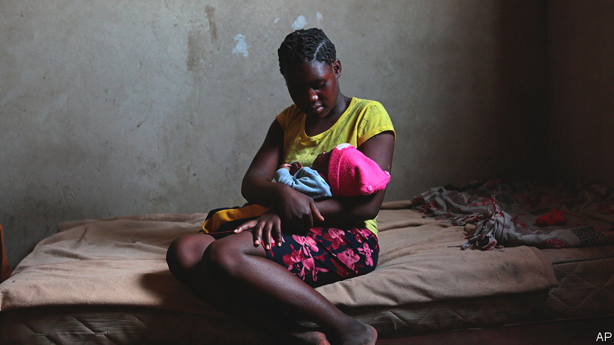

###### Have baby, stay in school

# Why teenage mothers in Zimbabwe struggle to get educated 

##### Stigma and cost matter more than liberal laws 

 

> Oct 20th 2022 

Brilliant Ndlovu has never really known childhood. Since the age of seven she has headed her household in Tsholotsho, a town in rural western Zimbabwe, after her parents went to work abroad. The oldest of five, she scraped a living growing crops while trying to keep up with her schoolwork. But in 2020 the covid-19 pandemic struck, coming shortly after a devastating drought. Farmers could not afford to pay child labourers like Ms Ndlovu. “So I looked for a man to help support my family,” she recalls. She found one who demanded sex in exchange for money. Aged 17, she got pregnant.

Ms Ndlovu was one of 4,770 Zimbabwean girls to drop out of school in 2020 because of pregnancy, up from about 3,000 the year before, according to government statistics. The true number may be higher. Siqinisweyinkosi Mhlanga, who runs Orphan’s Friend, a community centre in Tsholotsho where Ms Ndlovu now spends her days, says that there may be ten times more school dropouts in her province than the official tally. In August 2020 Zimbabwe’s government amended the Education Act to prohibit schools from expelling pregnant girls, joining a growing club of African countries that are letting pregnant teenagers continue with their education. A third of Zimbabwean women marry before they are 18. 

Previously Zimbabwe’s education minister had described student pregnancy as a “misdemeanour of a serious nature”, punishable by expulsion. But the amendment “didn’t make any difference”, says Ms Mhlanga. In 2021, after teenage pregnancies rose during the covid lockdown, the number of pregnancy-related dropouts rose to 5,985, according to official statistics. 

Stigma and cost, rather than laws, push girls out of school. When they fall pregnant their families often “don’t accept that girls can excel”, says Samkeliso Tshuma, the founder of The Girls Table, an NGO in Bulawayo, Zimbabwe’s second city, that promotes girls’ rights. Most girls drop out of school before teachers even know they are pregnant. 

The minority who persevere soon run into other barriers. When a girl called Happiness became pregnant at 15, she told her parents: “I’m not stopping school.” They supported her until she failed her exams, a month after giving birth. They didn’t have enough money to pay for her to resit them, so she lost the chance to get the highest school-leaving certificate which would have qualified her for entry to a university. 

The average rural household spends $3.23 a month on education. For Zimbabweans living below the poverty line (38% of them in 2019, up from 23% in 2011), that is quite a chunk of their income. In the first half of this year more than half of children were turned away from school because of non-payment of fees. Pregnant girls are often the first to lose out. And school can be a hostile place for them. Some complain that boys tease them, saying they smell of milk.■

