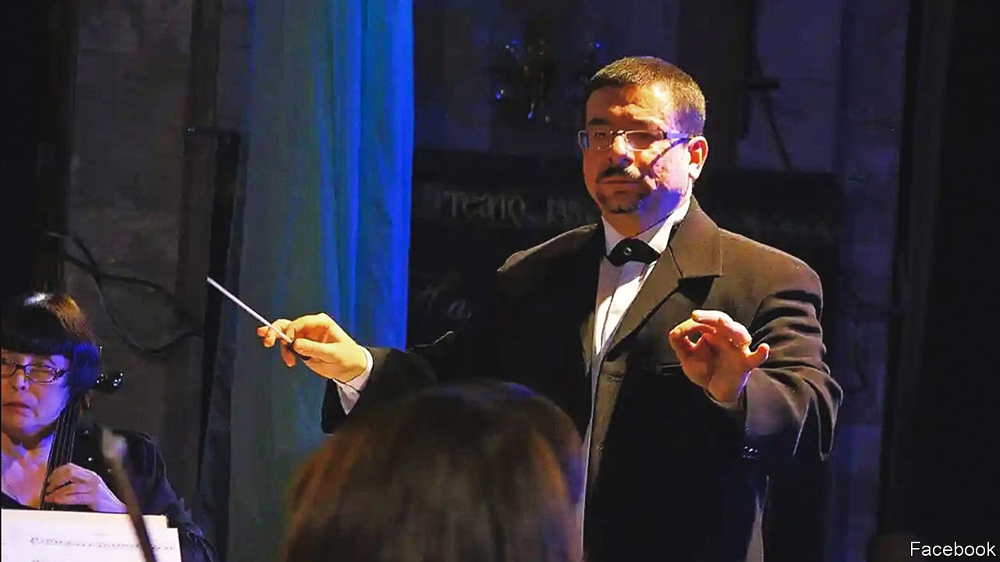

###### The man who said no

# Yurii Kerpatenko refused to bow to Russian orders 

##### The conductor from Kherson was probably murdered sometime in September, aged 46 

 

> Oct 20th 2022 

When the invitation came, it was flattery of a sort. Yurii Kerpatenko was being asked to conduct a concert in Kherson, his native city, to mark International Music Day on October 1st this year. As usual he was to conduct his Gilea chamber ensemble, 15 or so of the best players from the Kherson Regional Philharmonic. 

He, and they, were favourites in the city. They played everything: classical selections, opera highlights, “modern and ancient romances”, jazz, Ukrainian folk tunes. Since 2000 he had been principal conductor, combining the job for a decade with that of chief conductor at the city’s Mykola Kulish Music and Drama Theatre, which also put on events to suit everyone’s taste. On concert nights at the theatre, as the audience came in, his musicians would play in the foyer. Yurii in black tie was the first sight concert-goers saw, the guarantee of a good evening ahead. He himself would not be showy, though. Often he simply stood among his players, a solemn and businesslike figure with his glasses and unfashionable fringe, directing them with a steady pumping of both arms or, for swing or a tango, dancing and swaying just a bit. 

His own instrument was the accordion, for which he had won prizes since high school. He had gone as far as France and Italy to play. He loved it because, with the violin, it was the sound of Ukraine. His compositions, such as “Autumn Poem”, were in the folk tradition, and he played with folk ensembles, too, standing modestly at the back despite his fame. Yet he also encouraged Ukraine to assert its nationhood by looking West. In a campaign called “We are Ukrainians” in 2019 his classical recordings (Verdi and Mozart foremost) were played in the libraries of neighbouring villages, to inspire primary-school children to want to be part of Europe. 

It was therefore not surprising that he was asked to conduct an “international” concert on October 1st. But nor was it surprising that he categorically refused. For since March 2nd Kherson, a southern city where the Dnieper river meets the Black Sea, had been under Russian occupation. The citizens had resisted, but were ground down by the enemy’s military machine. Protests were broken up with live rounds and hundreds of arrests. Many of those arrested disappeared; other resisters were abducted. In the headquarters of the military-civilian administration, screams rang through the corridors. In the city cemetery, hundreds of new graves were dug in haste. Meanwhile food, water and medicines all became scarce, and those who could do so left the place. 

He, however, stayed and spoke out. On his Facebook page his chief emotion was horrified bewilderment. He was a Ukrainian patriot, few more so. He was also a Russian-speaker, brought up on Russian music and Russian culture. The Kyiv Conservatoire, his alma mater, was named after Tchaikovsky and had been backed by Rachmaninoff, composers he adored. He had friends in Russia. But what was Russia now? All kgb and nkvd types, running a concentration camp. Putin was pointing guns at him, trying to turn Ukraine into  He couldn’t help thinking of Tamerlane, who liked to build pyramids from the skulls of those who would not obey him. 

Why did the human species go to war at all? Weren’t there better ways, like investment and co-operation? He liked to put up at least some posts that stressed the nobility of man: a list of search engines for academic journals and rare books, with a photograph of the Long Hall in the library of Trinity College Dublin; and a video of Claudio Abbado conducting Mahler’s First Symphony, a hymn to Mother Earth. But he also quoted the unflinching warrior code of the samurai: “Live as if you do not exist”. 

Under the occupation music-making had gone quiet, especially the lighter kind. That seemed right to him. In 2014 he had resigned from the Music and Drama Theatre over something similar. That February, during two days of mourning for the lives lost on the Maidan in Kyiv during the Orange revolution that got rid of Viktor Yanukovich, the theatre director insisted on going ahead with a concert called “Disco, Retro, Jazz”. It was an outrage to play such music then, even in the “mournful style” the director daftly suggested, and he refused to conduct. It earned him a reputation as an awkward customer, though also as a man of principle. Both online and off, he made a habit of warring with windmills. He did whatever he had to to protect his orchestras, and music itself. 

Clearly the October concert had been dreamt up by the military-civilian junta to promote the lie that Kherson was a peaceful, civilised place under Russian rule. Why, it even put on concerts! The Philharmonic had a new head and new artistic director, both appointed by the Russians, who persuaded the musicians to play. Some needed threatening; others happily complied. For Yurii this collaboration was the most painful, insidious thing he was witnessing in his city. Yanukovich, Moscow’s puppet, had been kicked out of Ukraine once and for all, but someone like Volodymyr Saldo, the head of the junta, was local, somehow permanent, one of their own yet not their own, now the enemy’s friend.

Sometime in September, it seems, Conductor Kerpatenko delivered his absolute refusal. It was then, around his birthday on the 9th, that his online voice fell silent, and friends and relatives outside Kherson heard no word. In mid-October it emerged that the Russian Special Services had been to his apartment to talk to him. When he gave them a dusty answer, they said they would return. Some days later they came back with a machinegun which they blasted through the front door, killing him at once. 

The act would have been just as heinous if he had been a farmer or a shopkeeper. But his status as a musician gave it a particular symbolism. In one of his Facebook arguments, his antagonist had taunted him with the notion of “the art of war”. Art and war were surely in stark opposition to each other. To quote Semyon Bychkov, the Russian-born conductor of the Czech Philharmonic and a passionate opponent of Russia’s war, “Art...is about spirituality—that means to sustain people, not bring them down. And with that comes a certain responsibility.” ■

