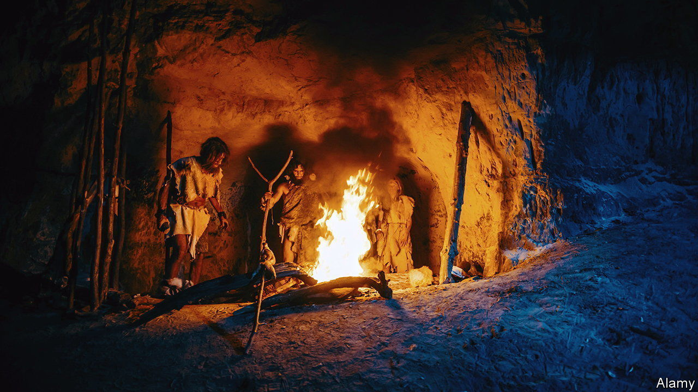

###### Neanderthal man and woman

# DNA grants a glimpse of Neanderthal family life 

##### Work from the lab of Svante Paabo doubles the number of known Neanderthal genomes 

 

> Oct 19th 2022 

Fresh from his award a couple of weeks ago of a Nobel prize for his work on the DNA of early human species, including Neanderthals, Svante Paabo (or, more accurately, he and a group of his acolytes) have just published in  one of the biggest genetic studies yet of that species.

These Neanderthals lived 50,000 years ago in the Altai mountains of Russia. The remains under study—17 bone and tooth samples belonging to 13 individuals—came from two caves about 100km apart. One, called Chagyrskaya, yielded 11 individuals (three boys, three girls, three men and two women). The other, Okladnikov, yielded two (a boy and a woman). Taken together, this work almost doubles the number of Neanderthal genomes that have been described. It also gives a tantalising glimpse into Neanderthal social lives. 

It is extremely unlikely that all of these individuals were contemporaries. But the researchers think they have found both a trio and a pair of relatives. They did this by computing a value called DNA divergence. 

DNA divergence compares nuclear genomes by choosing sections of their DNA at random and checking if, for each chosen section, the two genomes match. The more similar the DNA sequences are, the more closely, it can be presumed, the two individuals are related. Applying this approach to the Chagyrskaya remains revealed a father, his daughter and a close maternal relative who probably shared a grandmother with the father. Separately, it matched a young boy to an adult female relative, potentially a cousin, aunt or grandmother. 

The individuals in the Okladnikov cave were related closely neither to each other nor to anyone from Chagyrskaya. Yet the researchers found an intriguing connection. The woman’s mitochondrial DNA matched that of a man from Chagyrskaya. 

Mitochondrial DNA is passed intact from mother to offspring. It is not involved in sexual mixing, so it changes only by the random process of mutation. The lack of mutations that might have distinguished the DNA of the individuals in question from each other suggests not only a common ancestor, but a relatively recent one.

Further analysis showed also that two of the mitochondrial DNA samples from Chagyrskaya were closer to the Okladnikov boy than to any of the other Chagyrskayans. And when the team looked at data on Y-chromosomes, which pass intact from father to son, as well as their mitochondrial data, they were able to draw some tentative conclusions about Neanderthal communities.

If members of a population mate more or less at random with those of the opposite sex, the so-called coalescence time—how far in the past their most recent common ancestor lived—should be the same for mitochondrial (matrilineal) and Y-chromosome (patrilineal) DNA. The researchers found, however, that the average coalescence time for the Y-chromosome was 500 years, while that for the mitochondrial genome was around 5,000 years. 

To explain this order-of-magnitude difference, they modelled various possibilities. The one which best fitted the data was that the Neanderthals of the Altai lived in groups of around 20 individuals, with at least 60% of the females in a group having migrated there from elsewhere. The size of such groups is similar to that deduced for Palaeolithic bands of , which probably had around 25 members. 

When dealing with humanity’s ancestors and cousins it is easy and tempting to over-interpret the scarce data available—and practitioners of the subject have indeed been guilty of doing this in the past. So these conclusions should be treated with care. But if nothing else, this study shows that the methods which brought Dr Paabo his prize have increased the pool of data available for such speculations in an extraordinary way. ■


