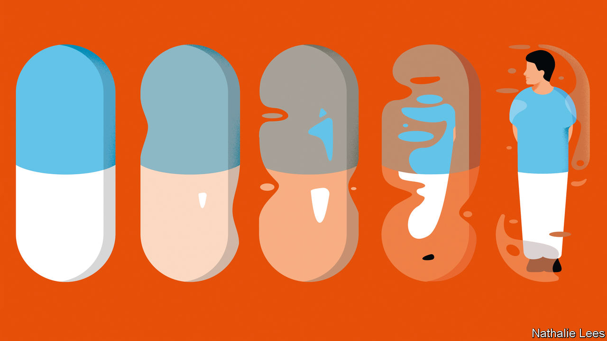
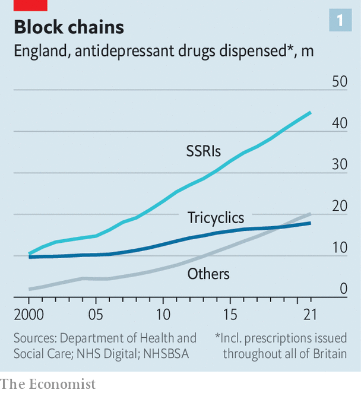
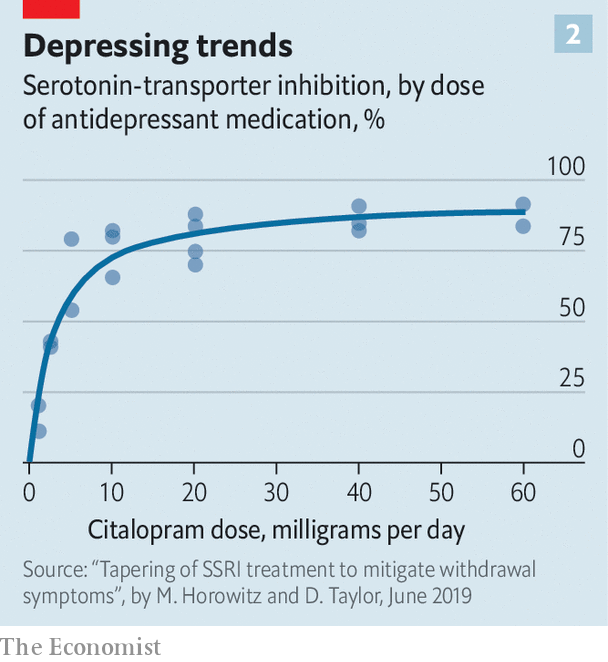
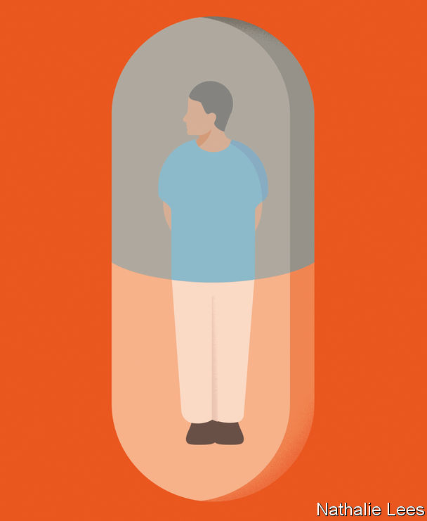

###### Drugs for depression

# How to make better use of antidepressants 

##### Identify those who really need them, and wean other people off them 

 

> Oct 19th 2022 

A five-minute chat with her doctor is how Adele Framer’s 11-year ordeal began. She complained about work-related stress. For that, she was prescribed paroxetine, a common antidepressant. There was no conversation about alternatives, such as psychotherapy, nor a discussion of the drug’s side-effects or when to stop taking it. “I had a very typical patient experience and a very typical patient attitude at the time,” says Ms Framer. “I was a believer that it would be a great idea to just solve my problem with an antidepressant.”

Her libido vanished when she started on the drug. Then, after a few years of taking the medication, she became extremely apathetic and lethargic, a common effect of the antidepressant that deepened over time. So, now no longer in the stressful job she had once held down, she saw little reason to persevere. But trying to stop was a disaster. She became hyperactive and agitated. She had “brain zaps”: electric-shock-like sensations. Her sexual dysfunction became worse (“completely no feeling down there”). And these were just some of her withdrawal symptoms. 

Ms Framer began reading scientific papers about what was happening, and set up SurvivingAntidepressants.org, a website on which people could share tips on how to taper their use of the drugs. In 2021 she published a paper summing up the collective wisdom from this project in . 

News from the trenches

That paper has been viewed more than 95,000 times. It is the most-read article published in the journal in the past six months. Its main message, backed up by other recent publications, is that, for many people, getting off antidepressants can take months or even years of painstaking reduction of the drugs to smaller and smaller doses—not just a couple of weeks, as doctors had long believed. 

This observation is starting to make its way into medical guidelines, such as those revised in June by England’s National Institute for Health and Care Excellence, which recommends good medical practice in the country’s National Health Service (NHS). Britain’s Royal College of Psychiatrists has also penned new guidelines. 

For paroxetine, Ms Framer’s antidepressant, they prescribe what is known as the Horowitz-Taylor method—lowering the dose by 10% every two to four weeks until it has tapered off completely. Each step involves a specific combination of the solid and liquid forms of the drug. But many doctors in Western countries still follow the older recommendation that patients halve the amount in two or three quick steps and stop—a method that works for some patients but can cause severe withdrawal symptoms in others.

This inconsistency of advice is just one sign of how much more there is to learn about how antidepressants work. Despite $22bn being spent on  in the past 20 years by America’s National Institutes of Health alone, there are still big questions for science to answer about these drugs. But new lines of inquiry that have emerged in recent years are already leading to changes in decades-long prescribing practices. 

Antidepressants came onto the medical scene in the 1960s in response to the —a belief that a lack of a signalling molecule called serotonin was a leading cause of depression. Tricyclics, an early generation of them, blocked protein channels called serotonin transporters through which serotonin is reabsorbed by a neuron after it has done its job. That kept the serotonin molecules in play, and so amplified their signal. 

Unfortunately, tricyclics also interfere with a lot of other signalling mechanisms, which meant people could easily kill themselves by overdosing. But new drugs called selective serotonin reuptake inhibitors (SSRIs), which appeared in the 1980s, specifically block the serotonin transporters, so are much safer—so much so that by the 1990s they had become a lifestyle drug, prescribed widely for normal emotional reactions to events such as bereavement or work burnout. 

Better living through chemistry?

Their use is still rising (see chart 1). In Western countries 10-15% of adults take antidepressants, usually SSRIs. And people are taking them for longer than they used to. A quarter of Americans using antidepressants have been doing so for at least a decade. As people age, that becomes increasingly hazardous. They raise the risk of falls, gastrointestinal bleeding, strokes and bleeding after surgery. And when taken during pregnancy, some antidepressants have been linked to a doubling or tripling of the risk of certain birth defects.

 


At the same time, the benefits have turned out to be less than once believed. For many years drug companies, the main source of research on SSRIs, tended not to publish in scientific journals the results of clinical trials that cast doubt on their products’ utility. That practice biased scientific reviews of the field in the drugs’ favour. But companies are nevertheless required by America’s medicines regulator, the Food and Drug Administration (FDA), to submit to that agency all the data collected during their trials, making them available for others to examine. 

The most recent such analysis, published in the  in June, combined the results of all trials of antidepressants filed to the FDA between 1979 and 2016. It found that the drugs had a substantial effect on depression beyond that of a placebo for only 15% of patients, mainly those whose cases were severe. 

Moreover, while all this has been going on the serotonin hypothesis has come crashing down. Researchers have looked from many directions for a relationship between serotonin and depression. They have found little or no evidence to link the two. So, though antidepressants unquestionably do help some people with depression, exactly how they do so is unknown, and exactly how many people truly benefit is a matter for serious investigation. 

Though many patients’ symptoms do, indeed, ameliorate when they start taking antidepressants, for those with less severe depression this is mainly a consequence of the placebo effect of taking a pill. A study published in 2010, which examined research on two common SSRIs, estimated that for people with less severe depression the odds of improving by taking the drugs were just 6% higher than they were for taking a placebo. For those with more severe depression they were 25% higher. 

Less severe depression is often “situational”—linked to stressful events such as divorce, bereavement or job loss—so self-help guidance that teaches patients how to cope, or more formal psychological therapy, are now considered better initial options. “If you are less severely depressed, anything you do is going to work better than its absence. It doesn’t matter what you do,” says Steven Hollon, a researcher at Vanderbilt University, in Tennessee. 

The challenge, therefore, is to identify those who would truly benefit from using an antidepressant. One research line, still in its infancy, employs statistical models that combine and analyse lots of disparate information, from status at work to personality traits, about individual patients. 

These studies have identified a handful of things that distinguish those for whom drugs can be helpful from those who might do better on some form of psychotherapy. They confirm what might, to many, seem intuitive—that such therapy is the better option for people who are unemployed, who are going through stressful events, who are married or cohabiting (perhaps because it helps people resolve relationship problems or encourages them to talk to their partner about their depression) or who have already tried antidepressants without success. Contrariwise, people predicted to do better on medication include those scoring highly for a fundamental personality trait called neuroticism. The hope is that combining such information about individual patients could be used to develop personalised predictions about whether they would do better on therapy or on medication. 

A new project by Wellcome Leap, a medical-research charity, goes much further with this idea. It uses a “big-data” approach to crunch information collected from a dozen sites about thousands of patients with treatment-resistant depression. Such data include genetic and blood tests, neuroimaging scans and records of movement and sleep patterns derived from wearable devices and smartphones. 

“We want to be able to take from different treatments that may apply to a specific patient’s biology,” says Regina Dugan, Wellcome Leap’s boss. Ultimately, she says, the research could identify particular categories of patients who require specific combinations of treatments. These could involve things like light therapy (to adjust a person’s circadian rhythm and improve their sleep), psychotherapy, transcranial magnetic stimulation, medication and supplementing some metabolites that may be implicated in depression.

If this line of research bears fruit, doctors would eventually throw a patient’s data into a scoring system which would tell them how likely it was that an antidepressant would be helpful—and if so, which one. At the moment, drug choice works by trial and error, with the initial SSRI being selected more or less at random and a replacement chosen a few weeks later if it does not do the business. 

Getting the balance right

How and when people should stop the drugs once they recover is the subject of another extensive line of research. Two things have so far emerged about how to time such cessation, one positive and one negative. The positive is that if patients stay on the drugs, they are less likely to have a relapse of depression. The negative, some data suggest, is that the longer they are on the drugs, the greater the risk becomes of their experiencing withdrawal symptoms. “We have to try very carefully to strike the right balance, which is to treat people with antidepressants for just the right amount of time—which is probably something like nine months,” says David Taylor from the Maudsley Hospital in London. Erick Turner from the Oregon Health and Science University agrees. “You want six to 12 months in the bag as far as treatment response goes before you consider stopping”, he says.

In practice, that decision must also consider the patient’s circumstances. “If the person was about to begin a new job that would probably be a bad time to go off the medication,” observes Robert DeRubeis from the University of Pennsylvania. This is because nobody knows for sure which patient will have withdrawal symptoms or a relapse of depression. 

To investigate the matter, a group called the ANTLER project looked at nearly 500 patients in Britain who had taken one of four common antidepressants for at least nine months. Half continued their medication. The others received placebo pills which looked identical to those they had previously been taking. Over a period of a month or two the dose of drugs in the placebos was reduced until there was none left. This study, which was published in March, found that, a year later, 56% of the placebo group had relapsed, compared with 39% of the group that stayed on antidepressants. 

Worsening of anxiety and depression was particularly common in the placebo group at 12 to 16 weeks—a finding that can guide doctors and patients on how to plan the timing of tapering the drugs. Notably, the patients in this study had already had two previous relapses of depression. For those who are on their first prescription the outcomes may be better.

For a long time, stopping taking SSRIs was thought not to provoke withdrawal symptoms. Any symptom which did appear was seen, instead, as a sign of relapse into depression. However, this belief in the ease of ending SSRI treatment was based on studies in which the patients had been on it for just a few weeks. That, it turns out, is usually too little time for the body to develop dependency on them. Eventually, researchers began listening more carefully to patients who had stopped taking them. The consensus was that the resulting symptoms were different from those they had had when in the grip of depression. 

This has led to a recognition that the symptoms of withdrawal and those of relapse are, indeed, separate. For one thing, withdrawal symptoms usually arrive suddenly and immediately. Relapse tends to take more time to come on.

A dose of dissent

How common withdrawal symptoms are remains unclear. A review of the research published on that topic, carried out in 2019, found that between 27% and 86% of people attempting to come off antidepressants experienced withdrawal symptoms, and that nearly half of them described those symptoms as severe. The variation in these results may have several causes. How long people took the drugs for, and the dose they took, are two. Quitting is also harder for drugs with shorter half-lives (a measure of how long they take to clear from the bloodstream). 

 


It was in light of these sorts of data that Dr Taylor and Mark Horowitz, of University College, London, began the research that led to what has become known as the Horowitz-Taylor method. Drawing on brain images of serotonin-transporter blockage by SSRIs, they proposed a biological explanation for this difference in withdrawal symptoms. Their study found that the effect of the drug on the brain increases steeply at small doses but levels off at higher ones (see chart 2). In other words, reducing SSRIs more slowly at lower doses is needed to produce a gradual decline in their effect—and thus minimise withdrawal symptoms. 

That led to the idea of stepped reductions which now bears their joint names. “It’s a bit like when you give up cigarettes, the last few cigarettes can be the hardest to give up,” says Tony Kendrick from the University of Southampton, who is running a trial on stopping the use of antidepressants in primary care in Britain.

 


Putting into practice all that has been discovered recently about antidepressants is a challenge. A predictive algorithm may say that therapy is best. That may not, though, be covered by a patient’s health insurance—and therapists are, in any case, generally in short supply. Some people may not have the time to undergo therapy. Under pressure to do something to help their struggling patients, many doctors prescribe an antidepressant even when official guidelines tell them that therapy should be the first line of treatment.

As things stand, doctors rarely suggest to patients that they should stop taking the drugs. “It’s a systems issue. We just don’t have systems to start de-prescribing,” says Dee Mangin of McMaster University, in Canada. Such cessation is usually initiated by patients who, like Ms Framer, decide that the side-effects are no longer worth it. The sexual-dysfunction problem is one of the reasons most commonly cited, particularly when people meet a new partner. “There is really no way of combating the sexual side-effects other than stopping the drug,” says Dr Turner. Another is people realising, because of the scary effects on their brain after they have accidentally missed a dose (by forgetting to order a refill, for example), that they have developed a strong physical dependency on them. 

But patients perceive the side-effects differently, says Dr Mangin. Some find the emotional numbing helpful, because it makes them feel less reactive, she says “and that can be a helpful thing for a while or if they feel anxious”. “But that is also the reason why some people want to come off,” she adds. “They don’t like being like that.” 

Nor do the economic incentives stack in favour of cessation. Most SSRIs are off-patent and therefore cheap. In Britain, a year’s supply of the pills may cost around £40-50 ($35-44). “Getting people off them doesn’t save the NHS much in terms of the cost of the drugs,” says Dr Kendrick. “The problem is that when people try to come off if you get only one or two people to have a severe relapse and end up in hospital, that would cost an awful lot,” he says. This leads to a reluctance to promote quitting. 

Moreover, the liquid formulations of antidepressants needed for the preparation of small doses are expensive—a month’s worth may cost as much as an annual supply of the pills. And not all antidepressants are available in liquid form, because there are no incentives for drug companies to produce something that will help people stop taking their drugs. 

“Tapering strips”—prescriptions of pills that contain smaller and smaller amounts of a drug—are available in the Netherlands and have been shown to result in a 70% quit rate. But the Netherlands is an exception, and the strips are too expensive for a lot of those in other countries who try to import the Dutch versions. An alternative is to obtain tapering doses from a compounding pharmacy (a business which can measure out minuscule amounts of the pills). But that, too, is expensive—and not usually covered by health insurance. So patients are stuck. 

This unwillingness to ante-up is, though, short-sighted. Health-care systems face a risk of there being growing numbers of ageing patients who start to experience the worst side-effects of the long-term use of antidepressants. There will be extra falls, strokes, seizures, heart problems, surgery complications and more. Pay now. Or pay double later. ■


