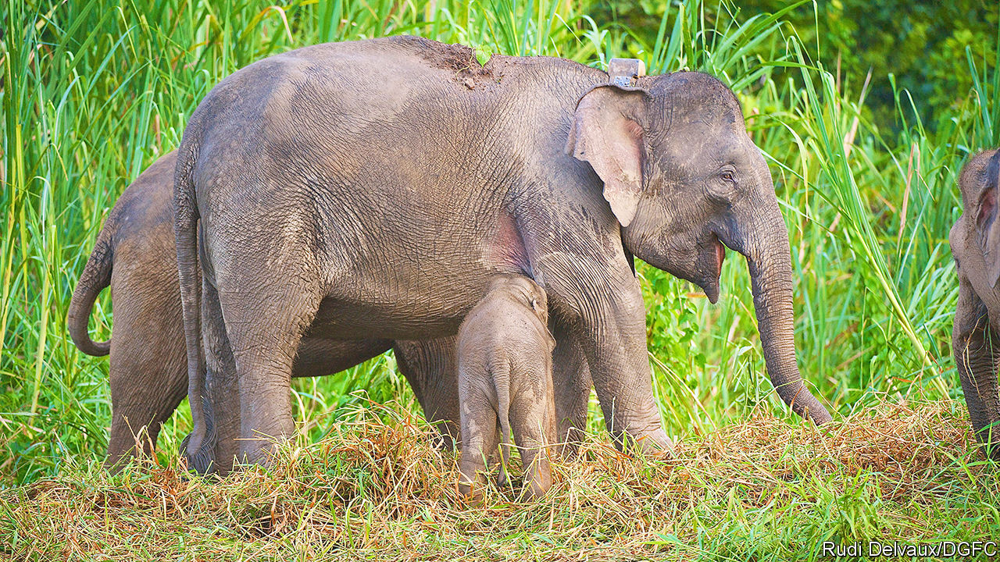

###### Conserving elephants

# Malaysia’s elephants stay more outside protected areas than in 

##### The grub is better there 

 

> Oct 19th 2022 

Way back in 1999, Iain Douglas-Hamilton, a doyen of research into African , made an intriguing . Using the Global Positioning System (gps) to track them—a first—he found that they knew exactly where the boundaries of protected areas were. They ranged freely within these areas, but when crossing between them, through apparently similar but unprotected habitat, they did so at night and at what was (for an elephant) a gallop.

At first sight, it looks as though Asian elephants did not get the memo. They seem to travel outside protected areas with gay abandon. But a study by Ahimsa Campos-Arceiz of Xishuangbanna Tropical Botanical Garden, in Yunnan province, China, and Benoit Goossens of Danau Girang Field Centre, in Sabah, Malaysia, suggests that this abandon is not quite as gay as it seems.

Dr Campos-Arceiz, Dr Goossens and their colleagues synthesised the work of three research groups who were following in Dr Douglas-Hamilton’s footsteps by tracking their quarry with gps. Collectively, these groups studied, over the course of more than a decade, 102 elephants in both west and east Malaysia. Altogether, they recorded more than 600,000 gps locations.

As they report in the , they found that these elephants, though concentrated in Malaysia’s protected areas, spent more than half of their time outside them. The reason, which did not pertain to Dr Douglas-Hamilton’s study, was that habitats inside and outside those areas differed. In Malaysia, protection tends to be afforded to primary forests. Elephants prefer more disturbed areas, with palms and saplings to snack on, and also grasses, among them bamboo. Mature forest trees offer fewer opportunities to feed.

Which is not to say that the protected areas offered no protection. Most forays went less than 3km from those areas. Home ranges, by contrast, were measured in hundreds, or thousands, of square kilometres. The upshot is that Dr Campos-Arceiz and Dr Goossens suggest a change in conservation policy to recognise the value of these areas of secondary growth, which are often neglected because of an understandable desire to preserve what primary forest is left.■


