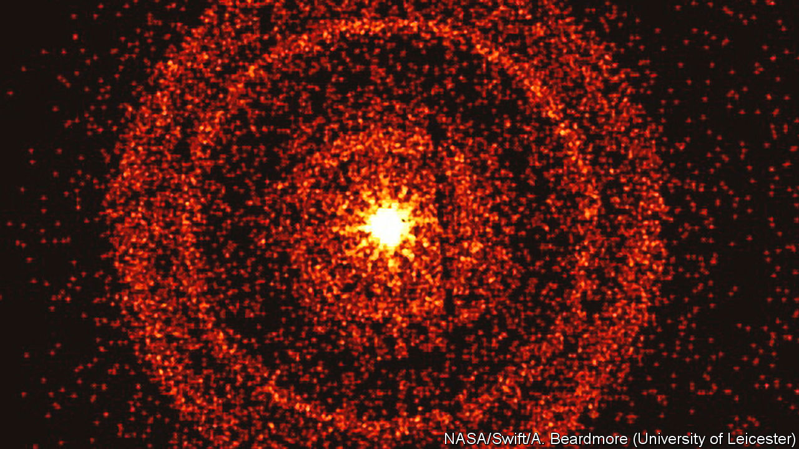

###### Gamma-ray bursts

# The most powerful flash yet seen in the sky was recorded on October 9th 

##### Analysing it may aid understand of how heavy elements form 

 

> Oct 19th 2022 

This picture, taken by the Swift X-ray Telescope, an orbiting observatory, is of the afterglow of the brightest flash yet observed by astronomers—a so-called gamma-ray burst, dubbed GRB 221009A. It was caused by the explosion and subsequent collapse to form a black hole of a star about 30 times as massive as the Sun. It happened 2.4bn light-years away. Even so, its radiation, which arrived on October 9th, disrupted the ionosphere, and thus some radio communications. Events like this excite those interested in how the heavier elements of the periodic table form. They are the alchemical crucibles in which nuclear reactions create things like cobalt, titanium, vanadium and zinc. Studying GRB 221009A’s afterglow should help determine the details.■


